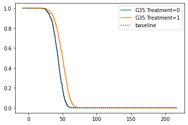
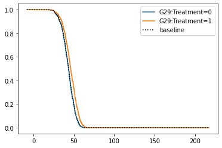
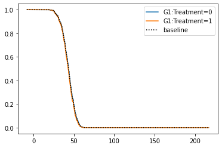

# Cox Regression


```python
import pandas as pd
import numpy as np
import matplotlib.pyplot as plt
from lifelines import KaplanMeierFitter, CoxPHFitter
```

## 1. Data Load
- total_mix1 : add Gene:Treatment (Current)
- total_mix2 : add Gene:Treatment, Gene:Var, Var:Treatment, Gene:Var:Treatment (Further Exploration)


```python
data=pd.read_csv('./data_processed/total_mix1.csv')
data=data.loc[0:,'time':]
data.head()
```


<div>
<style scoped>
    .dataframe tbody tr th:only-of-type {
        vertical-align: middle;
    }

    .dataframe tbody tr th {
        vertical-align: top;
    }

    .dataframe thead th {
        text-align: right;
    }
</style>
<table border="1" class="dataframe">
  <thead>
    <tr style="text-align: right;">
      <th></th>
      <th>Unnamed: 0</th>
      <th>time</th>
      <th>event</th>
      <th>Treatment</th>
      <th>G1</th>
      <th>G2</th>
      <th>G3</th>
      <th>G4</th>
      <th>G5</th>
      <th>G6</th>
      <th>G7</th>
      <th>G8</th>
      <th>G9</th>
      <th>G10</th>
      <th>G11</th>
      <th>G12</th>
      <th>G13</th>
      <th>G14</th>
      <th>G15</th>
      <th>G16</th>
      <th>G17</th>
      <th>G18</th>
      <th>G19</th>
      <th>G20</th>
      <th>G21</th>
      <th>G22</th>
      <th>G23</th>
      <th>G24</th>
      <th>G25</th>
      <th>G26</th>
      <th>G27</th>
      <th>G28</th>
      <th>G29</th>
      <th>G30</th>
      <th>G31</th>
      <th>G32</th>
      <th>G33</th>
      <th>G34</th>
      <th>G35</th>
      <th>G36</th>
      <th>...</th>
      <th>G271:Treatment</th>
      <th>G272:Treatment</th>
      <th>G273:Treatment</th>
      <th>G274:Treatment</th>
      <th>G275:Treatment</th>
      <th>G276:Treatment</th>
      <th>G277:Treatment</th>
      <th>G278:Treatment</th>
      <th>G279:Treatment</th>
      <th>G280:Treatment</th>
      <th>G281:Treatment</th>
      <th>G282:Treatment</th>
      <th>G283:Treatment</th>
      <th>G284:Treatment</th>
      <th>G285:Treatment</th>
      <th>G286:Treatment</th>
      <th>G287:Treatment</th>
      <th>G288:Treatment</th>
      <th>G289:Treatment</th>
      <th>G290:Treatment</th>
      <th>G291:Treatment</th>
      <th>G292:Treatment</th>
      <th>G293:Treatment</th>
      <th>G294:Treatment</th>
      <th>G295:Treatment</th>
      <th>G296:Treatment</th>
      <th>G297:Treatment</th>
      <th>G298:Treatment</th>
      <th>G299:Treatment</th>
      <th>G300:Treatment</th>
      <th>Var1</th>
      <th>Var2</th>
      <th>Var3</th>
      <th>Var4</th>
      <th>Var5</th>
      <th>Var6</th>
      <th>Var7</th>
      <th>Var8</th>
      <th>Var9</th>
      <th>Var10</th>
    </tr>
  </thead>
  <tbody>
    <tr>
      <th>0</th>
      <td>0</td>
      <td>57.448331</td>
      <td>1</td>
      <td>0</td>
      <td>0</td>
      <td>1</td>
      <td>0</td>
      <td>0</td>
      <td>0</td>
      <td>0</td>
      <td>0</td>
      <td>0</td>
      <td>0</td>
      <td>0</td>
      <td>0</td>
      <td>0</td>
      <td>0</td>
      <td>0</td>
      <td>0</td>
      <td>0</td>
      <td>0</td>
      <td>0</td>
      <td>0</td>
      <td>0</td>
      <td>0</td>
      <td>0</td>
      <td>0</td>
      <td>0</td>
      <td>0</td>
      <td>0</td>
      <td>0</td>
      <td>0</td>
      <td>0</td>
      <td>0</td>
      <td>0</td>
      <td>0</td>
      <td>0</td>
      <td>0</td>
      <td>0</td>
      <td>0</td>
      <td>...</td>
      <td>0</td>
      <td>0</td>
      <td>0</td>
      <td>0</td>
      <td>0</td>
      <td>0</td>
      <td>0</td>
      <td>0</td>
      <td>0</td>
      <td>0</td>
      <td>0</td>
      <td>0</td>
      <td>0</td>
      <td>0</td>
      <td>0</td>
      <td>0</td>
      <td>0</td>
      <td>0</td>
      <td>0</td>
      <td>0</td>
      <td>0</td>
      <td>0</td>
      <td>0</td>
      <td>0</td>
      <td>0</td>
      <td>0</td>
      <td>0</td>
      <td>0</td>
      <td>0</td>
      <td>0</td>
      <td>5</td>
      <td>1</td>
      <td>1</td>
      <td>4</td>
      <td>6</td>
      <td>5</td>
      <td>2</td>
      <td>1</td>
      <td>0</td>
      <td>1</td>
    </tr>
    <tr>
      <th>1</th>
      <td>1</td>
      <td>27.004439</td>
      <td>1</td>
      <td>0</td>
      <td>0</td>
      <td>1</td>
      <td>0</td>
      <td>0</td>
      <td>0</td>
      <td>0</td>
      <td>0</td>
      <td>0</td>
      <td>0</td>
      <td>0</td>
      <td>0</td>
      <td>0</td>
      <td>0</td>
      <td>0</td>
      <td>0</td>
      <td>0</td>
      <td>0</td>
      <td>0</td>
      <td>0</td>
      <td>0</td>
      <td>0</td>
      <td>0</td>
      <td>0</td>
      <td>0</td>
      <td>0</td>
      <td>0</td>
      <td>0</td>
      <td>0</td>
      <td>1</td>
      <td>0</td>
      <td>0</td>
      <td>0</td>
      <td>0</td>
      <td>0</td>
      <td>0</td>
      <td>0</td>
      <td>...</td>
      <td>0</td>
      <td>0</td>
      <td>0</td>
      <td>0</td>
      <td>0</td>
      <td>0</td>
      <td>0</td>
      <td>0</td>
      <td>0</td>
      <td>0</td>
      <td>0</td>
      <td>0</td>
      <td>0</td>
      <td>0</td>
      <td>0</td>
      <td>0</td>
      <td>0</td>
      <td>0</td>
      <td>0</td>
      <td>0</td>
      <td>0</td>
      <td>0</td>
      <td>0</td>
      <td>0</td>
      <td>0</td>
      <td>0</td>
      <td>0</td>
      <td>0</td>
      <td>0</td>
      <td>0</td>
      <td>3</td>
      <td>1</td>
      <td>3</td>
      <td>9</td>
      <td>1</td>
      <td>1</td>
      <td>2</td>
      <td>4</td>
      <td>0</td>
      <td>1</td>
    </tr>
    <tr>
      <th>2</th>
      <td>2</td>
      <td>43.770511</td>
      <td>1</td>
      <td>1</td>
      <td>0</td>
      <td>0</td>
      <td>0</td>
      <td>0</td>
      <td>0</td>
      <td>0</td>
      <td>0</td>
      <td>0</td>
      <td>0</td>
      <td>0</td>
      <td>0</td>
      <td>0</td>
      <td>0</td>
      <td>0</td>
      <td>0</td>
      <td>0</td>
      <td>0</td>
      <td>1</td>
      <td>0</td>
      <td>1</td>
      <td>0</td>
      <td>0</td>
      <td>0</td>
      <td>0</td>
      <td>0</td>
      <td>0</td>
      <td>0</td>
      <td>0</td>
      <td>1</td>
      <td>0</td>
      <td>0</td>
      <td>1</td>
      <td>0</td>
      <td>0</td>
      <td>0</td>
      <td>0</td>
      <td>...</td>
      <td>0</td>
      <td>0</td>
      <td>0</td>
      <td>0</td>
      <td>1</td>
      <td>1</td>
      <td>0</td>
      <td>0</td>
      <td>0</td>
      <td>0</td>
      <td>0</td>
      <td>0</td>
      <td>0</td>
      <td>0</td>
      <td>0</td>
      <td>0</td>
      <td>0</td>
      <td>0</td>
      <td>0</td>
      <td>1</td>
      <td>0</td>
      <td>0</td>
      <td>0</td>
      <td>0</td>
      <td>0</td>
      <td>0</td>
      <td>0</td>
      <td>0</td>
      <td>0</td>
      <td>0</td>
      <td>2</td>
      <td>5</td>
      <td>3</td>
      <td>4</td>
      <td>3</td>
      <td>3</td>
      <td>3</td>
      <td>2</td>
      <td>2</td>
      <td>3</td>
    </tr>
    <tr>
      <th>3</th>
      <td>3</td>
      <td>32.281018</td>
      <td>1</td>
      <td>1</td>
      <td>0</td>
      <td>0</td>
      <td>0</td>
      <td>0</td>
      <td>0</td>
      <td>0</td>
      <td>0</td>
      <td>1</td>
      <td>0</td>
      <td>1</td>
      <td>0</td>
      <td>0</td>
      <td>0</td>
      <td>0</td>
      <td>1</td>
      <td>0</td>
      <td>0</td>
      <td>0</td>
      <td>0</td>
      <td>0</td>
      <td>1</td>
      <td>0</td>
      <td>0</td>
      <td>0</td>
      <td>0</td>
      <td>0</td>
      <td>0</td>
      <td>0</td>
      <td>0</td>
      <td>0</td>
      <td>0</td>
      <td>0</td>
      <td>0</td>
      <td>0</td>
      <td>0</td>
      <td>0</td>
      <td>...</td>
      <td>1</td>
      <td>0</td>
      <td>0</td>
      <td>0</td>
      <td>0</td>
      <td>0</td>
      <td>0</td>
      <td>1</td>
      <td>0</td>
      <td>0</td>
      <td>0</td>
      <td>0</td>
      <td>0</td>
      <td>0</td>
      <td>0</td>
      <td>0</td>
      <td>0</td>
      <td>0</td>
      <td>0</td>
      <td>0</td>
      <td>0</td>
      <td>1</td>
      <td>0</td>
      <td>1</td>
      <td>0</td>
      <td>0</td>
      <td>0</td>
      <td>0</td>
      <td>0</td>
      <td>0</td>
      <td>2</td>
      <td>7</td>
      <td>2</td>
      <td>3</td>
      <td>5</td>
      <td>0</td>
      <td>1</td>
      <td>4</td>
      <td>5</td>
      <td>3</td>
    </tr>
    <tr>
      <th>4</th>
      <td>4</td>
      <td>44.559284</td>
      <td>0</td>
      <td>0</td>
      <td>0</td>
      <td>0</td>
      <td>0</td>
      <td>0</td>
      <td>0</td>
      <td>0</td>
      <td>0</td>
      <td>0</td>
      <td>0</td>
      <td>0</td>
      <td>0</td>
      <td>0</td>
      <td>0</td>
      <td>0</td>
      <td>0</td>
      <td>0</td>
      <td>0</td>
      <td>0</td>
      <td>0</td>
      <td>0</td>
      <td>0</td>
      <td>0</td>
      <td>0</td>
      <td>0</td>
      <td>0</td>
      <td>0</td>
      <td>0</td>
      <td>0</td>
      <td>0</td>
      <td>0</td>
      <td>0</td>
      <td>0</td>
      <td>0</td>
      <td>1</td>
      <td>0</td>
      <td>0</td>
      <td>...</td>
      <td>0</td>
      <td>0</td>
      <td>0</td>
      <td>0</td>
      <td>0</td>
      <td>0</td>
      <td>0</td>
      <td>0</td>
      <td>0</td>
      <td>0</td>
      <td>0</td>
      <td>0</td>
      <td>0</td>
      <td>0</td>
      <td>0</td>
      <td>0</td>
      <td>0</td>
      <td>0</td>
      <td>0</td>
      <td>0</td>
      <td>0</td>
      <td>0</td>
      <td>0</td>
      <td>0</td>
      <td>0</td>
      <td>0</td>
      <td>0</td>
      <td>0</td>
      <td>0</td>
      <td>0</td>
      <td>1</td>
      <td>3</td>
      <td>0</td>
      <td>0</td>
      <td>2</td>
      <td>2</td>
      <td>6</td>
      <td>3</td>
      <td>3</td>
      <td>1</td>
    </tr>
  </tbody>
</table>
<p>5 rows × 614 columns</p>
</div>


## 2. Cox Regression


```python
cph1=CoxPHFitter(penalizer=0.2)
cph1.fit(data,'time',event_col='event')
cph1.print_summary()
```


<div>
<style scoped>
    .dataframe tbody tr th:only-of-type {
        vertical-align: middle;
    }

    .dataframe tbody tr th {
        vertical-align: top;
    }

    .dataframe thead th {
        text-align: right;
    }
</style>
<table border="1" class="dataframe">
  <tbody>
    <tr>
      <th>model</th>
      <td>lifelines.CoxPHFitter</td>
    </tr>
    <tr>
      <th>duration col</th>
      <td>'time'</td>
    </tr>
    <tr>
      <th>event col</th>
      <td>'event'</td>
    </tr>
    <tr>
      <th>penalizer</th>
      <td>0.2</td>
    </tr>
    <tr>
      <th>l1 ratio</th>
      <td>0</td>
    </tr>
    <tr>
      <th>baseline estimation</th>
      <td>breslow</td>
    </tr>
    <tr>
      <th>number of observations</th>
      <td>1000</td>
    </tr>
    <tr>
      <th>number of events observed</th>
      <td>891</td>
    </tr>
    <tr>
      <th>partial log-likelihood</th>
      <td>-4565.16</td>
    </tr>
    <tr>
      <th>time fit was run</th>
      <td>2021-10-07 11:40:40 UTC</td>
    </tr>
  </tbody>
</table>
</div><table border="1" class="dataframe">
  <thead>
    <tr style="text-align: right;">
      <th style="min-width: 12px;"></th>
      <th style="min-width: 12px;">coef</th>
      <th style="min-width: 12px;">exp(coef)</th>
      <th style="min-width: 12px;">se(coef)</th>
      <th style="min-width: 12px;">coef lower 95%</th>
      <th style="min-width: 12px;">coef upper 95%</th>
      <th style="min-width: 12px;">exp(coef) lower 95%</th>
      <th style="min-width: 12px;">exp(coef) upper 95%</th>
      <th style="min-width: 12px;">z</th>
      <th style="min-width: 12px;">p</th>
      <th style="min-width: 12px;">-log2(p)</th>
    </tr>
  </thead>
  <tbody>
    <tr>
      <th>Treatment</th>
      <td>-0.05</td>
      <td>0.95</td>
      <td>0.13</td>
      <td>-0.31</td>
      <td>0.21</td>
      <td>0.73</td>
      <td>1.23</td>
      <td>-0.37</td>
      <td>0.71</td>
      <td>0.50</td>
    </tr>
    <tr>
      <th>G1</th>
      <td>0.11</td>
      <td>1.11</td>
      <td>0.17</td>
      <td>-0.22</td>
      <td>0.43</td>
      <td>0.80</td>
      <td>1.54</td>
      <td>0.64</td>
      <td>0.52</td>
      <td>0.94</td>
    </tr>
    <tr>
      <th>G2</th>
      <td>-0.16</td>
      <td>0.85</td>
      <td>0.13</td>
      <td>-0.43</td>
      <td>0.10</td>
      <td>0.65</td>
      <td>1.11</td>
      <td>-1.20</td>
      <td>0.23</td>
      <td>2.11</td>
    </tr>
    <tr>
      <th>G3</th>
      <td>0.01</td>
      <td>1.01</td>
      <td>0.14</td>
      <td>-0.27</td>
      <td>0.29</td>
      <td>0.76</td>
      <td>1.33</td>
      <td>0.06</td>
      <td>0.95</td>
      <td>0.07</td>
    </tr>
    <tr>
      <th>G4</th>
      <td>-0.14</td>
      <td>0.87</td>
      <td>0.14</td>
      <td>-0.42</td>
      <td>0.14</td>
      <td>0.66</td>
      <td>1.15</td>
      <td>-0.95</td>
      <td>0.34</td>
      <td>1.55</td>
    </tr>
    <tr>
      <th>G5</th>
      <td>0.12</td>
      <td>1.12</td>
      <td>0.14</td>
      <td>-0.16</td>
      <td>0.39</td>
      <td>0.86</td>
      <td>1.47</td>
      <td>0.84</td>
      <td>0.40</td>
      <td>1.31</td>
    </tr>
    <tr>
      <th>G6</th>
      <td>-0.18</td>
      <td>0.83</td>
      <td>0.15</td>
      <td>-0.47</td>
      <td>0.11</td>
      <td>0.63</td>
      <td>1.11</td>
      <td>-1.23</td>
      <td>0.22</td>
      <td>2.21</td>
    </tr>
    <tr>
      <th>G7</th>
      <td>0.16</td>
      <td>1.17</td>
      <td>0.14</td>
      <td>-0.11</td>
      <td>0.43</td>
      <td>0.89</td>
      <td>1.54</td>
      <td>1.14</td>
      <td>0.25</td>
      <td>1.98</td>
    </tr>
    <tr>
      <th>G8</th>
      <td>0.04</td>
      <td>1.04</td>
      <td>0.14</td>
      <td>-0.23</td>
      <td>0.30</td>
      <td>0.79</td>
      <td>1.35</td>
      <td>0.26</td>
      <td>0.79</td>
      <td>0.33</td>
    </tr>
    <tr>
      <th>G9</th>
      <td>0.12</td>
      <td>1.13</td>
      <td>0.17</td>
      <td>-0.21</td>
      <td>0.46</td>
      <td>0.81</td>
      <td>1.58</td>
      <td>0.71</td>
      <td>0.48</td>
      <td>1.06</td>
    </tr>
    <tr>
      <th>G10</th>
      <td>0.06</td>
      <td>1.06</td>
      <td>0.15</td>
      <td>-0.23</td>
      <td>0.34</td>
      <td>0.79</td>
      <td>1.41</td>
      <td>0.38</td>
      <td>0.71</td>
      <td>0.50</td>
    </tr>
    <tr>
      <th>G11</th>
      <td>0.03</td>
      <td>1.03</td>
      <td>0.14</td>
      <td>-0.25</td>
      <td>0.31</td>
      <td>0.78</td>
      <td>1.36</td>
      <td>0.19</td>
      <td>0.85</td>
      <td>0.24</td>
    </tr>
    <tr>
      <th>G12</th>
      <td>0.08</td>
      <td>1.08</td>
      <td>0.14</td>
      <td>-0.20</td>
      <td>0.36</td>
      <td>0.82</td>
      <td>1.43</td>
      <td>0.55</td>
      <td>0.58</td>
      <td>0.79</td>
    </tr>
    <tr>
      <th>G13</th>
      <td>-0.01</td>
      <td>0.99</td>
      <td>0.14</td>
      <td>-0.29</td>
      <td>0.27</td>
      <td>0.75</td>
      <td>1.32</td>
      <td>-0.04</td>
      <td>0.97</td>
      <td>0.05</td>
    </tr>
    <tr>
      <th>G14</th>
      <td>0.12</td>
      <td>1.13</td>
      <td>0.16</td>
      <td>-0.19</td>
      <td>0.43</td>
      <td>0.83</td>
      <td>1.54</td>
      <td>0.77</td>
      <td>0.44</td>
      <td>1.18</td>
    </tr>
    <tr>
      <th>G15</th>
      <td>-0.09</td>
      <td>0.91</td>
      <td>0.14</td>
      <td>-0.36</td>
      <td>0.17</td>
      <td>0.69</td>
      <td>1.19</td>
      <td>-0.69</td>
      <td>0.49</td>
      <td>1.03</td>
    </tr>
    <tr>
      <th>G16</th>
      <td>-0.11</td>
      <td>0.90</td>
      <td>0.15</td>
      <td>-0.39</td>
      <td>0.18</td>
      <td>0.67</td>
      <td>1.19</td>
      <td>-0.75</td>
      <td>0.45</td>
      <td>1.15</td>
    </tr>
    <tr>
      <th>G17</th>
      <td>-0.16</td>
      <td>0.85</td>
      <td>0.14</td>
      <td>-0.43</td>
      <td>0.11</td>
      <td>0.65</td>
      <td>1.12</td>
      <td>-1.16</td>
      <td>0.25</td>
      <td>2.02</td>
    </tr>
    <tr>
      <th>G18</th>
      <td>0.06</td>
      <td>1.07</td>
      <td>0.14</td>
      <td>-0.21</td>
      <td>0.33</td>
      <td>0.81</td>
      <td>1.40</td>
      <td>0.46</td>
      <td>0.64</td>
      <td>0.64</td>
    </tr>
    <tr>
      <th>G19</th>
      <td>-0.10</td>
      <td>0.90</td>
      <td>0.14</td>
      <td>-0.39</td>
      <td>0.18</td>
      <td>0.68</td>
      <td>1.19</td>
      <td>-0.73</td>
      <td>0.47</td>
      <td>1.10</td>
    </tr>
    <tr>
      <th>G20</th>
      <td>0.03</td>
      <td>1.03</td>
      <td>0.15</td>
      <td>-0.27</td>
      <td>0.33</td>
      <td>0.77</td>
      <td>1.39</td>
      <td>0.21</td>
      <td>0.84</td>
      <td>0.26</td>
    </tr>
    <tr>
      <th>G21</th>
      <td>-0.15</td>
      <td>0.86</td>
      <td>0.14</td>
      <td>-0.43</td>
      <td>0.13</td>
      <td>0.65</td>
      <td>1.14</td>
      <td>-1.05</td>
      <td>0.29</td>
      <td>1.76</td>
    </tr>
    <tr>
      <th>G22</th>
      <td>0.03</td>
      <td>1.03</td>
      <td>0.14</td>
      <td>-0.24</td>
      <td>0.30</td>
      <td>0.79</td>
      <td>1.36</td>
      <td>0.24</td>
      <td>0.81</td>
      <td>0.30</td>
    </tr>
    <tr>
      <th>G23</th>
      <td>-0.04</td>
      <td>0.96</td>
      <td>0.15</td>
      <td>-0.33</td>
      <td>0.24</td>
      <td>0.72</td>
      <td>1.27</td>
      <td>-0.30</td>
      <td>0.76</td>
      <td>0.39</td>
    </tr>
    <tr>
      <th>G24</th>
      <td>0.05</td>
      <td>1.05</td>
      <td>0.14</td>
      <td>-0.23</td>
      <td>0.32</td>
      <td>0.80</td>
      <td>1.38</td>
      <td>0.34</td>
      <td>0.73</td>
      <td>0.45</td>
    </tr>
    <tr>
      <th>G25</th>
      <td>0.21</td>
      <td>1.23</td>
      <td>0.14</td>
      <td>-0.07</td>
      <td>0.48</td>
      <td>0.93</td>
      <td>1.62</td>
      <td>1.46</td>
      <td>0.14</td>
      <td>2.79</td>
    </tr>
    <tr>
      <th>G26</th>
      <td>0.18</td>
      <td>1.20</td>
      <td>0.15</td>
      <td>-0.12</td>
      <td>0.47</td>
      <td>0.89</td>
      <td>1.61</td>
      <td>1.19</td>
      <td>0.24</td>
      <td>2.08</td>
    </tr>
    <tr>
      <th>G27</th>
      <td>-0.02</td>
      <td>0.98</td>
      <td>0.14</td>
      <td>-0.30</td>
      <td>0.26</td>
      <td>0.74</td>
      <td>1.30</td>
      <td>-0.13</td>
      <td>0.89</td>
      <td>0.16</td>
    </tr>
    <tr>
      <th>G28</th>
      <td>-0.00</td>
      <td>1.00</td>
      <td>0.16</td>
      <td>-0.32</td>
      <td>0.31</td>
      <td>0.72</td>
      <td>1.37</td>
      <td>-0.03</td>
      <td>0.98</td>
      <td>0.03</td>
    </tr>
    <tr>
      <th>G29</th>
      <td>-0.10</td>
      <td>0.91</td>
      <td>0.14</td>
      <td>-0.38</td>
      <td>0.18</td>
      <td>0.69</td>
      <td>1.20</td>
      <td>-0.67</td>
      <td>0.50</td>
      <td>0.99</td>
    </tr>
    <tr>
      <th>G30</th>
      <td>0.04</td>
      <td>1.04</td>
      <td>0.13</td>
      <td>-0.22</td>
      <td>0.31</td>
      <td>0.80</td>
      <td>1.36</td>
      <td>0.31</td>
      <td>0.76</td>
      <td>0.40</td>
    </tr>
    <tr>
      <th>G31</th>
      <td>0.06</td>
      <td>1.07</td>
      <td>0.14</td>
      <td>-0.22</td>
      <td>0.34</td>
      <td>0.81</td>
      <td>1.41</td>
      <td>0.45</td>
      <td>0.65</td>
      <td>0.61</td>
    </tr>
    <tr>
      <th>G32</th>
      <td>-0.14</td>
      <td>0.87</td>
      <td>0.12</td>
      <td>-0.38</td>
      <td>0.11</td>
      <td>0.68</td>
      <td>1.11</td>
      <td>-1.10</td>
      <td>0.27</td>
      <td>1.88</td>
    </tr>
    <tr>
      <th>G33</th>
      <td>-0.12</td>
      <td>0.89</td>
      <td>0.15</td>
      <td>-0.41</td>
      <td>0.18</td>
      <td>0.66</td>
      <td>1.20</td>
      <td>-0.77</td>
      <td>0.44</td>
      <td>1.18</td>
    </tr>
    <tr>
      <th>G34</th>
      <td>-0.10</td>
      <td>0.90</td>
      <td>0.14</td>
      <td>-0.38</td>
      <td>0.18</td>
      <td>0.68</td>
      <td>1.20</td>
      <td>-0.71</td>
      <td>0.47</td>
      <td>1.07</td>
    </tr>
    <tr>
      <th>G35</th>
      <td>-0.12</td>
      <td>0.89</td>
      <td>0.13</td>
      <td>-0.38</td>
      <td>0.14</td>
      <td>0.68</td>
      <td>1.15</td>
      <td>-0.91</td>
      <td>0.36</td>
      <td>1.46</td>
    </tr>
    <tr>
      <th>G36</th>
      <td>-0.01</td>
      <td>0.99</td>
      <td>0.14</td>
      <td>-0.29</td>
      <td>0.27</td>
      <td>0.75</td>
      <td>1.31</td>
      <td>-0.06</td>
      <td>0.95</td>
      <td>0.07</td>
    </tr>
    <tr>
      <th>G37</th>
      <td>-0.21</td>
      <td>0.81</td>
      <td>0.14</td>
      <td>-0.48</td>
      <td>0.06</td>
      <td>0.62</td>
      <td>1.06</td>
      <td>-1.51</td>
      <td>0.13</td>
      <td>2.93</td>
    </tr>
    <tr>
      <th>G38</th>
      <td>0.01</td>
      <td>1.01</td>
      <td>0.14</td>
      <td>-0.27</td>
      <td>0.29</td>
      <td>0.76</td>
      <td>1.33</td>
      <td>0.06</td>
      <td>0.95</td>
      <td>0.07</td>
    </tr>
    <tr>
      <th>G39</th>
      <td>-0.04</td>
      <td>0.96</td>
      <td>0.15</td>
      <td>-0.33</td>
      <td>0.25</td>
      <td>0.72</td>
      <td>1.29</td>
      <td>-0.28</td>
      <td>0.78</td>
      <td>0.35</td>
    </tr>
    <tr>
      <th>G40</th>
      <td>-0.11</td>
      <td>0.89</td>
      <td>0.14</td>
      <td>-0.39</td>
      <td>0.16</td>
      <td>0.68</td>
      <td>1.18</td>
      <td>-0.81</td>
      <td>0.42</td>
      <td>1.25</td>
    </tr>
    <tr>
      <th>G41</th>
      <td>0.08</td>
      <td>1.08</td>
      <td>0.14</td>
      <td>-0.19</td>
      <td>0.35</td>
      <td>0.83</td>
      <td>1.42</td>
      <td>0.58</td>
      <td>0.56</td>
      <td>0.84</td>
    </tr>
    <tr>
      <th>G42</th>
      <td>0.11</td>
      <td>1.11</td>
      <td>0.14</td>
      <td>-0.16</td>
      <td>0.38</td>
      <td>0.85</td>
      <td>1.46</td>
      <td>0.78</td>
      <td>0.44</td>
      <td>1.20</td>
    </tr>
    <tr>
      <th>G43</th>
      <td>0.08</td>
      <td>1.09</td>
      <td>0.15</td>
      <td>-0.20</td>
      <td>0.37</td>
      <td>0.82</td>
      <td>1.45</td>
      <td>0.57</td>
      <td>0.57</td>
      <td>0.81</td>
    </tr>
    <tr>
      <th>G44</th>
      <td>-0.18</td>
      <td>0.84</td>
      <td>0.14</td>
      <td>-0.46</td>
      <td>0.10</td>
      <td>0.63</td>
      <td>1.10</td>
      <td>-1.27</td>
      <td>0.20</td>
      <td>2.29</td>
    </tr>
    <tr>
      <th>G45</th>
      <td>-0.14</td>
      <td>0.87</td>
      <td>0.14</td>
      <td>-0.42</td>
      <td>0.14</td>
      <td>0.66</td>
      <td>1.15</td>
      <td>-0.96</td>
      <td>0.33</td>
      <td>1.58</td>
    </tr>
    <tr>
      <th>G46</th>
      <td>0.11</td>
      <td>1.12</td>
      <td>0.14</td>
      <td>-0.17</td>
      <td>0.40</td>
      <td>0.85</td>
      <td>1.49</td>
      <td>0.80</td>
      <td>0.42</td>
      <td>1.24</td>
    </tr>
    <tr>
      <th>G47</th>
      <td>-0.00</td>
      <td>1.00</td>
      <td>0.15</td>
      <td>-0.30</td>
      <td>0.29</td>
      <td>0.74</td>
      <td>1.34</td>
      <td>-0.01</td>
      <td>0.99</td>
      <td>0.01</td>
    </tr>
    <tr>
      <th>G48</th>
      <td>-0.03</td>
      <td>0.97</td>
      <td>0.16</td>
      <td>-0.34</td>
      <td>0.28</td>
      <td>0.71</td>
      <td>1.32</td>
      <td>-0.19</td>
      <td>0.85</td>
      <td>0.23</td>
    </tr>
    <tr>
      <th>G49</th>
      <td>0.10</td>
      <td>1.10</td>
      <td>0.15</td>
      <td>-0.19</td>
      <td>0.39</td>
      <td>0.82</td>
      <td>1.48</td>
      <td>0.67</td>
      <td>0.51</td>
      <td>0.99</td>
    </tr>
    <tr>
      <th>G50</th>
      <td>-0.08</td>
      <td>0.93</td>
      <td>0.15</td>
      <td>-0.37</td>
      <td>0.22</td>
      <td>0.69</td>
      <td>1.25</td>
      <td>-0.50</td>
      <td>0.62</td>
      <td>0.69</td>
    </tr>
    <tr>
      <th>G51</th>
      <td>-0.03</td>
      <td>0.97</td>
      <td>0.15</td>
      <td>-0.31</td>
      <td>0.26</td>
      <td>0.73</td>
      <td>1.30</td>
      <td>-0.18</td>
      <td>0.86</td>
      <td>0.22</td>
    </tr>
    <tr>
      <th>G52</th>
      <td>-0.08</td>
      <td>0.92</td>
      <td>0.15</td>
      <td>-0.38</td>
      <td>0.21</td>
      <td>0.68</td>
      <td>1.23</td>
      <td>-0.56</td>
      <td>0.57</td>
      <td>0.80</td>
    </tr>
    <tr>
      <th>G53</th>
      <td>-0.14</td>
      <td>0.87</td>
      <td>0.15</td>
      <td>-0.44</td>
      <td>0.16</td>
      <td>0.65</td>
      <td>1.17</td>
      <td>-0.91</td>
      <td>0.36</td>
      <td>1.46</td>
    </tr>
    <tr>
      <th>G54</th>
      <td>0.03</td>
      <td>1.03</td>
      <td>0.16</td>
      <td>-0.28</td>
      <td>0.33</td>
      <td>0.76</td>
      <td>1.39</td>
      <td>0.16</td>
      <td>0.87</td>
      <td>0.20</td>
    </tr>
    <tr>
      <th>G55</th>
      <td>0.16</td>
      <td>1.18</td>
      <td>0.13</td>
      <td>-0.10</td>
      <td>0.43</td>
      <td>0.90</td>
      <td>1.53</td>
      <td>1.21</td>
      <td>0.23</td>
      <td>2.15</td>
    </tr>
    <tr>
      <th>G56</th>
      <td>-0.32</td>
      <td>0.72</td>
      <td>0.15</td>
      <td>-0.61</td>
      <td>-0.04</td>
      <td>0.54</td>
      <td>0.96</td>
      <td>-2.22</td>
      <td>0.03</td>
      <td>5.23</td>
    </tr>
    <tr>
      <th>G57</th>
      <td>0.01</td>
      <td>1.01</td>
      <td>0.14</td>
      <td>-0.27</td>
      <td>0.29</td>
      <td>0.77</td>
      <td>1.33</td>
      <td>0.07</td>
      <td>0.95</td>
      <td>0.08</td>
    </tr>
    <tr>
      <th>G58</th>
      <td>0.02</td>
      <td>1.02</td>
      <td>0.15</td>
      <td>-0.27</td>
      <td>0.31</td>
      <td>0.77</td>
      <td>1.37</td>
      <td>0.15</td>
      <td>0.88</td>
      <td>0.19</td>
    </tr>
    <tr>
      <th>G59</th>
      <td>-0.01</td>
      <td>0.99</td>
      <td>0.15</td>
      <td>-0.30</td>
      <td>0.29</td>
      <td>0.74</td>
      <td>1.34</td>
      <td>-0.03</td>
      <td>0.97</td>
      <td>0.04</td>
    </tr>
    <tr>
      <th>G60</th>
      <td>0.06</td>
      <td>1.06</td>
      <td>0.16</td>
      <td>-0.25</td>
      <td>0.37</td>
      <td>0.78</td>
      <td>1.45</td>
      <td>0.39</td>
      <td>0.70</td>
      <td>0.51</td>
    </tr>
    <tr>
      <th>G61</th>
      <td>-0.06</td>
      <td>0.94</td>
      <td>0.13</td>
      <td>-0.32</td>
      <td>0.20</td>
      <td>0.73</td>
      <td>1.22</td>
      <td>-0.46</td>
      <td>0.64</td>
      <td>0.64</td>
    </tr>
    <tr>
      <th>G62</th>
      <td>-0.01</td>
      <td>0.99</td>
      <td>0.15</td>
      <td>-0.30</td>
      <td>0.28</td>
      <td>0.74</td>
      <td>1.33</td>
      <td>-0.05</td>
      <td>0.96</td>
      <td>0.06</td>
    </tr>
    <tr>
      <th>G63</th>
      <td>0.16</td>
      <td>1.17</td>
      <td>0.15</td>
      <td>-0.13</td>
      <td>0.44</td>
      <td>0.88</td>
      <td>1.56</td>
      <td>1.08</td>
      <td>0.28</td>
      <td>1.83</td>
    </tr>
    <tr>
      <th>G64</th>
      <td>0.02</td>
      <td>1.02</td>
      <td>0.15</td>
      <td>-0.26</td>
      <td>0.31</td>
      <td>0.77</td>
      <td>1.37</td>
      <td>0.16</td>
      <td>0.87</td>
      <td>0.20</td>
    </tr>
    <tr>
      <th>G65</th>
      <td>-0.00</td>
      <td>1.00</td>
      <td>0.15</td>
      <td>-0.29</td>
      <td>0.28</td>
      <td>0.75</td>
      <td>1.33</td>
      <td>-0.01</td>
      <td>0.99</td>
      <td>0.02</td>
    </tr>
    <tr>
      <th>G66</th>
      <td>0.12</td>
      <td>1.13</td>
      <td>0.14</td>
      <td>-0.15</td>
      <td>0.39</td>
      <td>0.86</td>
      <td>1.48</td>
      <td>0.85</td>
      <td>0.40</td>
      <td>1.34</td>
    </tr>
    <tr>
      <th>G67</th>
      <td>0.15</td>
      <td>1.16</td>
      <td>0.15</td>
      <td>-0.14</td>
      <td>0.43</td>
      <td>0.87</td>
      <td>1.54</td>
      <td>1.01</td>
      <td>0.31</td>
      <td>1.68</td>
    </tr>
    <tr>
      <th>G68</th>
      <td>-0.21</td>
      <td>0.81</td>
      <td>0.16</td>
      <td>-0.53</td>
      <td>0.11</td>
      <td>0.59</td>
      <td>1.11</td>
      <td>-1.30</td>
      <td>0.20</td>
      <td>2.36</td>
    </tr>
    <tr>
      <th>G69</th>
      <td>0.13</td>
      <td>1.14</td>
      <td>0.14</td>
      <td>-0.14</td>
      <td>0.41</td>
      <td>0.87</td>
      <td>1.50</td>
      <td>0.93</td>
      <td>0.35</td>
      <td>1.50</td>
    </tr>
    <tr>
      <th>G70</th>
      <td>0.04</td>
      <td>1.04</td>
      <td>0.15</td>
      <td>-0.25</td>
      <td>0.33</td>
      <td>0.78</td>
      <td>1.39</td>
      <td>0.26</td>
      <td>0.79</td>
      <td>0.33</td>
    </tr>
    <tr>
      <th>G71</th>
      <td>0.08</td>
      <td>1.08</td>
      <td>0.14</td>
      <td>-0.20</td>
      <td>0.36</td>
      <td>0.82</td>
      <td>1.43</td>
      <td>0.54</td>
      <td>0.59</td>
      <td>0.76</td>
    </tr>
    <tr>
      <th>G72</th>
      <td>0.04</td>
      <td>1.04</td>
      <td>0.14</td>
      <td>-0.23</td>
      <td>0.32</td>
      <td>0.79</td>
      <td>1.37</td>
      <td>0.31</td>
      <td>0.76</td>
      <td>0.40</td>
    </tr>
    <tr>
      <th>G73</th>
      <td>0.31</td>
      <td>1.37</td>
      <td>0.14</td>
      <td>0.03</td>
      <td>0.59</td>
      <td>1.03</td>
      <td>1.81</td>
      <td>2.17</td>
      <td>0.03</td>
      <td>5.06</td>
    </tr>
    <tr>
      <th>G74</th>
      <td>-0.04</td>
      <td>0.96</td>
      <td>0.15</td>
      <td>-0.34</td>
      <td>0.26</td>
      <td>0.71</td>
      <td>1.29</td>
      <td>-0.29</td>
      <td>0.78</td>
      <td>0.37</td>
    </tr>
    <tr>
      <th>G75</th>
      <td>-0.01</td>
      <td>0.99</td>
      <td>0.15</td>
      <td>-0.30</td>
      <td>0.29</td>
      <td>0.74</td>
      <td>1.34</td>
      <td>-0.03</td>
      <td>0.97</td>
      <td>0.04</td>
    </tr>
    <tr>
      <th>G76</th>
      <td>0.01</td>
      <td>1.01</td>
      <td>0.14</td>
      <td>-0.27</td>
      <td>0.29</td>
      <td>0.76</td>
      <td>1.34</td>
      <td>0.07</td>
      <td>0.94</td>
      <td>0.09</td>
    </tr>
    <tr>
      <th>G77</th>
      <td>0.21</td>
      <td>1.23</td>
      <td>0.15</td>
      <td>-0.09</td>
      <td>0.50</td>
      <td>0.92</td>
      <td>1.65</td>
      <td>1.38</td>
      <td>0.17</td>
      <td>2.57</td>
    </tr>
    <tr>
      <th>G78</th>
      <td>-0.16</td>
      <td>0.85</td>
      <td>0.14</td>
      <td>-0.42</td>
      <td>0.11</td>
      <td>0.65</td>
      <td>1.12</td>
      <td>-1.16</td>
      <td>0.25</td>
      <td>2.01</td>
    </tr>
    <tr>
      <th>G79</th>
      <td>-0.09</td>
      <td>0.91</td>
      <td>0.13</td>
      <td>-0.35</td>
      <td>0.17</td>
      <td>0.70</td>
      <td>1.18</td>
      <td>-0.69</td>
      <td>0.49</td>
      <td>1.02</td>
    </tr>
    <tr>
      <th>G80</th>
      <td>0.03</td>
      <td>1.04</td>
      <td>0.15</td>
      <td>-0.25</td>
      <td>0.32</td>
      <td>0.78</td>
      <td>1.38</td>
      <td>0.24</td>
      <td>0.81</td>
      <td>0.30</td>
    </tr>
    <tr>
      <th>G81</th>
      <td>0.10</td>
      <td>1.10</td>
      <td>0.14</td>
      <td>-0.17</td>
      <td>0.37</td>
      <td>0.84</td>
      <td>1.45</td>
      <td>0.72</td>
      <td>0.47</td>
      <td>1.08</td>
    </tr>
    <tr>
      <th>G82</th>
      <td>0.01</td>
      <td>1.01</td>
      <td>0.15</td>
      <td>-0.29</td>
      <td>0.31</td>
      <td>0.75</td>
      <td>1.36</td>
      <td>0.07</td>
      <td>0.94</td>
      <td>0.08</td>
    </tr>
    <tr>
      <th>G83</th>
      <td>-0.06</td>
      <td>0.95</td>
      <td>0.15</td>
      <td>-0.35</td>
      <td>0.24</td>
      <td>0.71</td>
      <td>1.27</td>
      <td>-0.37</td>
      <td>0.71</td>
      <td>0.49</td>
    </tr>
    <tr>
      <th>G84</th>
      <td>-0.11</td>
      <td>0.89</td>
      <td>0.13</td>
      <td>-0.37</td>
      <td>0.15</td>
      <td>0.69</td>
      <td>1.16</td>
      <td>-0.84</td>
      <td>0.40</td>
      <td>1.32</td>
    </tr>
    <tr>
      <th>G85</th>
      <td>-0.06</td>
      <td>0.95</td>
      <td>0.15</td>
      <td>-0.35</td>
      <td>0.24</td>
      <td>0.71</td>
      <td>1.27</td>
      <td>-0.37</td>
      <td>0.71</td>
      <td>0.49</td>
    </tr>
    <tr>
      <th>G86</th>
      <td>-0.03</td>
      <td>0.97</td>
      <td>0.15</td>
      <td>-0.32</td>
      <td>0.26</td>
      <td>0.73</td>
      <td>1.29</td>
      <td>-0.21</td>
      <td>0.84</td>
      <td>0.26</td>
    </tr>
    <tr>
      <th>G87</th>
      <td>-0.05</td>
      <td>0.95</td>
      <td>0.14</td>
      <td>-0.34</td>
      <td>0.23</td>
      <td>0.71</td>
      <td>1.25</td>
      <td>-0.38</td>
      <td>0.70</td>
      <td>0.51</td>
    </tr>
    <tr>
      <th>G88</th>
      <td>-0.18</td>
      <td>0.83</td>
      <td>0.17</td>
      <td>-0.51</td>
      <td>0.15</td>
      <td>0.60</td>
      <td>1.16</td>
      <td>-1.08</td>
      <td>0.28</td>
      <td>1.84</td>
    </tr>
    <tr>
      <th>G89</th>
      <td>0.11</td>
      <td>1.12</td>
      <td>0.14</td>
      <td>-0.17</td>
      <td>0.39</td>
      <td>0.84</td>
      <td>1.48</td>
      <td>0.77</td>
      <td>0.44</td>
      <td>1.18</td>
    </tr>
    <tr>
      <th>G90</th>
      <td>0.04</td>
      <td>1.04</td>
      <td>0.15</td>
      <td>-0.26</td>
      <td>0.33</td>
      <td>0.77</td>
      <td>1.39</td>
      <td>0.24</td>
      <td>0.81</td>
      <td>0.30</td>
    </tr>
    <tr>
      <th>G91</th>
      <td>-0.03</td>
      <td>0.97</td>
      <td>0.14</td>
      <td>-0.31</td>
      <td>0.25</td>
      <td>0.74</td>
      <td>1.28</td>
      <td>-0.20</td>
      <td>0.84</td>
      <td>0.25</td>
    </tr>
    <tr>
      <th>G92</th>
      <td>0.04</td>
      <td>1.04</td>
      <td>0.15</td>
      <td>-0.25</td>
      <td>0.32</td>
      <td>0.78</td>
      <td>1.38</td>
      <td>0.26</td>
      <td>0.80</td>
      <td>0.32</td>
    </tr>
    <tr>
      <th>G93</th>
      <td>-0.02</td>
      <td>0.98</td>
      <td>0.15</td>
      <td>-0.32</td>
      <td>0.28</td>
      <td>0.73</td>
      <td>1.32</td>
      <td>-0.13</td>
      <td>0.90</td>
      <td>0.15</td>
    </tr>
    <tr>
      <th>G94</th>
      <td>0.13</td>
      <td>1.14</td>
      <td>0.14</td>
      <td>-0.14</td>
      <td>0.41</td>
      <td>0.87</td>
      <td>1.51</td>
      <td>0.95</td>
      <td>0.34</td>
      <td>1.54</td>
    </tr>
    <tr>
      <th>G95</th>
      <td>-0.25</td>
      <td>0.78</td>
      <td>0.14</td>
      <td>-0.52</td>
      <td>0.02</td>
      <td>0.59</td>
      <td>1.02</td>
      <td>-1.85</td>
      <td>0.06</td>
      <td>3.96</td>
    </tr>
    <tr>
      <th>G96</th>
      <td>0.05</td>
      <td>1.05</td>
      <td>0.13</td>
      <td>-0.21</td>
      <td>0.31</td>
      <td>0.81</td>
      <td>1.37</td>
      <td>0.37</td>
      <td>0.71</td>
      <td>0.49</td>
    </tr>
    <tr>
      <th>G97</th>
      <td>0.03</td>
      <td>1.03</td>
      <td>0.15</td>
      <td>-0.27</td>
      <td>0.32</td>
      <td>0.76</td>
      <td>1.38</td>
      <td>0.17</td>
      <td>0.86</td>
      <td>0.21</td>
    </tr>
    <tr>
      <th>G98</th>
      <td>-0.04</td>
      <td>0.96</td>
      <td>0.15</td>
      <td>-0.32</td>
      <td>0.25</td>
      <td>0.72</td>
      <td>1.28</td>
      <td>-0.25</td>
      <td>0.80</td>
      <td>0.32</td>
    </tr>
    <tr>
      <th>G99</th>
      <td>-0.04</td>
      <td>0.96</td>
      <td>0.14</td>
      <td>-0.32</td>
      <td>0.24</td>
      <td>0.72</td>
      <td>1.27</td>
      <td>-0.27</td>
      <td>0.78</td>
      <td>0.35</td>
    </tr>
    <tr>
      <th>G100</th>
      <td>-0.09</td>
      <td>0.91</td>
      <td>0.14</td>
      <td>-0.36</td>
      <td>0.18</td>
      <td>0.70</td>
      <td>1.19</td>
      <td>-0.68</td>
      <td>0.50</td>
      <td>1.01</td>
    </tr>
    <tr>
      <th>G101</th>
      <td>0.03</td>
      <td>1.03</td>
      <td>0.14</td>
      <td>-0.25</td>
      <td>0.31</td>
      <td>0.78</td>
      <td>1.36</td>
      <td>0.20</td>
      <td>0.84</td>
      <td>0.25</td>
    </tr>
    <tr>
      <th>G102</th>
      <td>0.09</td>
      <td>1.09</td>
      <td>0.15</td>
      <td>-0.20</td>
      <td>0.38</td>
      <td>0.82</td>
      <td>1.46</td>
      <td>0.60</td>
      <td>0.55</td>
      <td>0.87</td>
    </tr>
    <tr>
      <th>G103</th>
      <td>0.04</td>
      <td>1.04</td>
      <td>0.15</td>
      <td>-0.24</td>
      <td>0.33</td>
      <td>0.78</td>
      <td>1.39</td>
      <td>0.29</td>
      <td>0.77</td>
      <td>0.37</td>
    </tr>
    <tr>
      <th>G104</th>
      <td>-0.03</td>
      <td>0.97</td>
      <td>0.15</td>
      <td>-0.31</td>
      <td>0.26</td>
      <td>0.73</td>
      <td>1.29</td>
      <td>-0.19</td>
      <td>0.85</td>
      <td>0.24</td>
    </tr>
    <tr>
      <th>G105</th>
      <td>-0.07</td>
      <td>0.93</td>
      <td>0.14</td>
      <td>-0.35</td>
      <td>0.21</td>
      <td>0.70</td>
      <td>1.24</td>
      <td>-0.48</td>
      <td>0.63</td>
      <td>0.66</td>
    </tr>
    <tr>
      <th>G106</th>
      <td>-0.01</td>
      <td>0.99</td>
      <td>0.14</td>
      <td>-0.28</td>
      <td>0.27</td>
      <td>0.75</td>
      <td>1.31</td>
      <td>-0.05</td>
      <td>0.96</td>
      <td>0.06</td>
    </tr>
    <tr>
      <th>G107</th>
      <td>0.08</td>
      <td>1.08</td>
      <td>0.15</td>
      <td>-0.22</td>
      <td>0.37</td>
      <td>0.80</td>
      <td>1.45</td>
      <td>0.51</td>
      <td>0.61</td>
      <td>0.71</td>
    </tr>
    <tr>
      <th>G108</th>
      <td>0.05</td>
      <td>1.05</td>
      <td>0.14</td>
      <td>-0.23</td>
      <td>0.33</td>
      <td>0.80</td>
      <td>1.39</td>
      <td>0.36</td>
      <td>0.72</td>
      <td>0.48</td>
    </tr>
    <tr>
      <th>G109</th>
      <td>0.09</td>
      <td>1.10</td>
      <td>0.14</td>
      <td>-0.19</td>
      <td>0.37</td>
      <td>0.83</td>
      <td>1.45</td>
      <td>0.64</td>
      <td>0.52</td>
      <td>0.94</td>
    </tr>
    <tr>
      <th>G110</th>
      <td>0.06</td>
      <td>1.07</td>
      <td>0.14</td>
      <td>-0.21</td>
      <td>0.34</td>
      <td>0.81</td>
      <td>1.40</td>
      <td>0.45</td>
      <td>0.65</td>
      <td>0.62</td>
    </tr>
    <tr>
      <th>G111</th>
      <td>0.09</td>
      <td>1.10</td>
      <td>0.15</td>
      <td>-0.20</td>
      <td>0.38</td>
      <td>0.82</td>
      <td>1.47</td>
      <td>0.62</td>
      <td>0.54</td>
      <td>0.90</td>
    </tr>
    <tr>
      <th>G112</th>
      <td>-0.02</td>
      <td>0.98</td>
      <td>0.14</td>
      <td>-0.30</td>
      <td>0.27</td>
      <td>0.74</td>
      <td>1.30</td>
      <td>-0.12</td>
      <td>0.90</td>
      <td>0.15</td>
    </tr>
    <tr>
      <th>G113</th>
      <td>-0.05</td>
      <td>0.95</td>
      <td>0.14</td>
      <td>-0.32</td>
      <td>0.23</td>
      <td>0.72</td>
      <td>1.26</td>
      <td>-0.34</td>
      <td>0.73</td>
      <td>0.45</td>
    </tr>
    <tr>
      <th>G114</th>
      <td>0.05</td>
      <td>1.05</td>
      <td>0.14</td>
      <td>-0.23</td>
      <td>0.32</td>
      <td>0.80</td>
      <td>1.37</td>
      <td>0.33</td>
      <td>0.74</td>
      <td>0.43</td>
    </tr>
    <tr>
      <th>G115</th>
      <td>-0.08</td>
      <td>0.93</td>
      <td>0.14</td>
      <td>-0.36</td>
      <td>0.21</td>
      <td>0.70</td>
      <td>1.23</td>
      <td>-0.53</td>
      <td>0.59</td>
      <td>0.75</td>
    </tr>
    <tr>
      <th>G116</th>
      <td>0.06</td>
      <td>1.06</td>
      <td>0.15</td>
      <td>-0.22</td>
      <td>0.35</td>
      <td>0.80</td>
      <td>1.41</td>
      <td>0.42</td>
      <td>0.67</td>
      <td>0.57</td>
    </tr>
    <tr>
      <th>G117</th>
      <td>-0.02</td>
      <td>0.98</td>
      <td>0.13</td>
      <td>-0.28</td>
      <td>0.24</td>
      <td>0.76</td>
      <td>1.28</td>
      <td>-0.12</td>
      <td>0.90</td>
      <td>0.15</td>
    </tr>
    <tr>
      <th>G118</th>
      <td>0.11</td>
      <td>1.12</td>
      <td>0.16</td>
      <td>-0.20</td>
      <td>0.41</td>
      <td>0.82</td>
      <td>1.51</td>
      <td>0.70</td>
      <td>0.48</td>
      <td>1.05</td>
    </tr>
    <tr>
      <th>G119</th>
      <td>-0.15</td>
      <td>0.86</td>
      <td>0.16</td>
      <td>-0.46</td>
      <td>0.17</td>
      <td>0.63</td>
      <td>1.18</td>
      <td>-0.91</td>
      <td>0.36</td>
      <td>1.46</td>
    </tr>
    <tr>
      <th>G120</th>
      <td>-0.10</td>
      <td>0.90</td>
      <td>0.14</td>
      <td>-0.37</td>
      <td>0.17</td>
      <td>0.69</td>
      <td>1.19</td>
      <td>-0.72</td>
      <td>0.47</td>
      <td>1.09</td>
    </tr>
    <tr>
      <th>G121</th>
      <td>-0.01</td>
      <td>0.99</td>
      <td>0.16</td>
      <td>-0.33</td>
      <td>0.30</td>
      <td>0.72</td>
      <td>1.35</td>
      <td>-0.09</td>
      <td>0.93</td>
      <td>0.10</td>
    </tr>
    <tr>
      <th>G122</th>
      <td>-0.16</td>
      <td>0.85</td>
      <td>0.15</td>
      <td>-0.45</td>
      <td>0.13</td>
      <td>0.64</td>
      <td>1.14</td>
      <td>-1.06</td>
      <td>0.29</td>
      <td>1.79</td>
    </tr>
    <tr>
      <th>G123</th>
      <td>0.18</td>
      <td>1.20</td>
      <td>0.15</td>
      <td>-0.11</td>
      <td>0.48</td>
      <td>0.89</td>
      <td>1.61</td>
      <td>1.20</td>
      <td>0.23</td>
      <td>2.12</td>
    </tr>
    <tr>
      <th>G124</th>
      <td>-0.04</td>
      <td>0.96</td>
      <td>0.14</td>
      <td>-0.31</td>
      <td>0.24</td>
      <td>0.73</td>
      <td>1.27</td>
      <td>-0.27</td>
      <td>0.79</td>
      <td>0.35</td>
    </tr>
    <tr>
      <th>G125</th>
      <td>0.05</td>
      <td>1.05</td>
      <td>0.15</td>
      <td>-0.24</td>
      <td>0.33</td>
      <td>0.79</td>
      <td>1.39</td>
      <td>0.33</td>
      <td>0.74</td>
      <td>0.43</td>
    </tr>
    <tr>
      <th>G126</th>
      <td>-0.08</td>
      <td>0.93</td>
      <td>0.15</td>
      <td>-0.38</td>
      <td>0.22</td>
      <td>0.69</td>
      <td>1.25</td>
      <td>-0.51</td>
      <td>0.61</td>
      <td>0.71</td>
    </tr>
    <tr>
      <th>G127</th>
      <td>-0.19</td>
      <td>0.83</td>
      <td>0.14</td>
      <td>-0.47</td>
      <td>0.09</td>
      <td>0.62</td>
      <td>1.09</td>
      <td>-1.36</td>
      <td>0.18</td>
      <td>2.51</td>
    </tr>
    <tr>
      <th>G128</th>
      <td>0.27</td>
      <td>1.31</td>
      <td>0.14</td>
      <td>0.00</td>
      <td>0.54</td>
      <td>1.00</td>
      <td>1.71</td>
      <td>1.96</td>
      <td>0.05</td>
      <td>4.34</td>
    </tr>
    <tr>
      <th>G129</th>
      <td>0.06</td>
      <td>1.06</td>
      <td>0.15</td>
      <td>-0.23</td>
      <td>0.34</td>
      <td>0.79</td>
      <td>1.41</td>
      <td>0.39</td>
      <td>0.70</td>
      <td>0.52</td>
    </tr>
    <tr>
      <th>G130</th>
      <td>-0.01</td>
      <td>0.99</td>
      <td>0.14</td>
      <td>-0.30</td>
      <td>0.27</td>
      <td>0.74</td>
      <td>1.31</td>
      <td>-0.10</td>
      <td>0.92</td>
      <td>0.12</td>
    </tr>
    <tr>
      <th>G131</th>
      <td>-0.06</td>
      <td>0.94</td>
      <td>0.15</td>
      <td>-0.35</td>
      <td>0.22</td>
      <td>0.70</td>
      <td>1.25</td>
      <td>-0.44</td>
      <td>0.66</td>
      <td>0.59</td>
    </tr>
    <tr>
      <th>G132</th>
      <td>-0.02</td>
      <td>0.98</td>
      <td>0.14</td>
      <td>-0.30</td>
      <td>0.25</td>
      <td>0.74</td>
      <td>1.28</td>
      <td>-0.18</td>
      <td>0.86</td>
      <td>0.22</td>
    </tr>
    <tr>
      <th>G133</th>
      <td>0.02</td>
      <td>1.02</td>
      <td>0.14</td>
      <td>-0.26</td>
      <td>0.31</td>
      <td>0.77</td>
      <td>1.36</td>
      <td>0.15</td>
      <td>0.88</td>
      <td>0.19</td>
    </tr>
    <tr>
      <th>G134</th>
      <td>0.01</td>
      <td>1.02</td>
      <td>0.14</td>
      <td>-0.25</td>
      <td>0.28</td>
      <td>0.78</td>
      <td>1.32</td>
      <td>0.11</td>
      <td>0.91</td>
      <td>0.13</td>
    </tr>
    <tr>
      <th>G135</th>
      <td>-0.02</td>
      <td>0.98</td>
      <td>0.14</td>
      <td>-0.29</td>
      <td>0.25</td>
      <td>0.75</td>
      <td>1.29</td>
      <td>-0.15</td>
      <td>0.88</td>
      <td>0.18</td>
    </tr>
    <tr>
      <th>G136</th>
      <td>0.00</td>
      <td>1.00</td>
      <td>0.14</td>
      <td>-0.28</td>
      <td>0.29</td>
      <td>0.76</td>
      <td>1.34</td>
      <td>0.03</td>
      <td>0.97</td>
      <td>0.04</td>
    </tr>
    <tr>
      <th>G137</th>
      <td>0.22</td>
      <td>1.24</td>
      <td>0.16</td>
      <td>-0.09</td>
      <td>0.52</td>
      <td>0.91</td>
      <td>1.69</td>
      <td>1.37</td>
      <td>0.17</td>
      <td>2.55</td>
    </tr>
    <tr>
      <th>G138</th>
      <td>0.08</td>
      <td>1.08</td>
      <td>0.15</td>
      <td>-0.21</td>
      <td>0.37</td>
      <td>0.81</td>
      <td>1.45</td>
      <td>0.54</td>
      <td>0.59</td>
      <td>0.76</td>
    </tr>
    <tr>
      <th>G139</th>
      <td>-0.04</td>
      <td>0.97</td>
      <td>0.16</td>
      <td>-0.35</td>
      <td>0.28</td>
      <td>0.71</td>
      <td>1.32</td>
      <td>-0.22</td>
      <td>0.82</td>
      <td>0.28</td>
    </tr>
    <tr>
      <th>G140</th>
      <td>-0.07</td>
      <td>0.93</td>
      <td>0.15</td>
      <td>-0.36</td>
      <td>0.21</td>
      <td>0.70</td>
      <td>1.24</td>
      <td>-0.49</td>
      <td>0.62</td>
      <td>0.68</td>
    </tr>
    <tr>
      <th>G141</th>
      <td>-0.11</td>
      <td>0.90</td>
      <td>0.14</td>
      <td>-0.39</td>
      <td>0.18</td>
      <td>0.68</td>
      <td>1.19</td>
      <td>-0.74</td>
      <td>0.46</td>
      <td>1.12</td>
    </tr>
    <tr>
      <th>G142</th>
      <td>-0.10</td>
      <td>0.91</td>
      <td>0.14</td>
      <td>-0.37</td>
      <td>0.18</td>
      <td>0.69</td>
      <td>1.20</td>
      <td>-0.67</td>
      <td>0.50</td>
      <td>1.00</td>
    </tr>
    <tr>
      <th>G143</th>
      <td>-0.09</td>
      <td>0.91</td>
      <td>0.14</td>
      <td>-0.37</td>
      <td>0.19</td>
      <td>0.69</td>
      <td>1.21</td>
      <td>-0.62</td>
      <td>0.53</td>
      <td>0.90</td>
    </tr>
    <tr>
      <th>G144</th>
      <td>-0.17</td>
      <td>0.84</td>
      <td>0.14</td>
      <td>-0.46</td>
      <td>0.11</td>
      <td>0.63</td>
      <td>1.12</td>
      <td>-1.20</td>
      <td>0.23</td>
      <td>2.13</td>
    </tr>
    <tr>
      <th>G145</th>
      <td>-0.04</td>
      <td>0.96</td>
      <td>0.15</td>
      <td>-0.33</td>
      <td>0.26</td>
      <td>0.72</td>
      <td>1.30</td>
      <td>-0.24</td>
      <td>0.81</td>
      <td>0.31</td>
    </tr>
    <tr>
      <th>G146</th>
      <td>-0.02</td>
      <td>0.98</td>
      <td>0.15</td>
      <td>-0.31</td>
      <td>0.26</td>
      <td>0.73</td>
      <td>1.30</td>
      <td>-0.16</td>
      <td>0.87</td>
      <td>0.20</td>
    </tr>
    <tr>
      <th>G147</th>
      <td>-0.02</td>
      <td>0.98</td>
      <td>0.14</td>
      <td>-0.29</td>
      <td>0.24</td>
      <td>0.75</td>
      <td>1.28</td>
      <td>-0.16</td>
      <td>0.87</td>
      <td>0.20</td>
    </tr>
    <tr>
      <th>G148</th>
      <td>-0.04</td>
      <td>0.96</td>
      <td>0.14</td>
      <td>-0.31</td>
      <td>0.23</td>
      <td>0.73</td>
      <td>1.26</td>
      <td>-0.31</td>
      <td>0.76</td>
      <td>0.40</td>
    </tr>
    <tr>
      <th>G149</th>
      <td>0.19</td>
      <td>1.21</td>
      <td>0.15</td>
      <td>-0.10</td>
      <td>0.47</td>
      <td>0.91</td>
      <td>1.60</td>
      <td>1.29</td>
      <td>0.20</td>
      <td>2.35</td>
    </tr>
    <tr>
      <th>G150</th>
      <td>-0.03</td>
      <td>0.97</td>
      <td>0.15</td>
      <td>-0.33</td>
      <td>0.27</td>
      <td>0.72</td>
      <td>1.31</td>
      <td>-0.19</td>
      <td>0.85</td>
      <td>0.23</td>
    </tr>
    <tr>
      <th>G151</th>
      <td>0.09</td>
      <td>1.10</td>
      <td>0.14</td>
      <td>-0.19</td>
      <td>0.37</td>
      <td>0.83</td>
      <td>1.45</td>
      <td>0.65</td>
      <td>0.52</td>
      <td>0.95</td>
    </tr>
    <tr>
      <th>G152</th>
      <td>0.00</td>
      <td>1.00</td>
      <td>0.14</td>
      <td>-0.28</td>
      <td>0.28</td>
      <td>0.76</td>
      <td>1.32</td>
      <td>0.00</td>
      <td>1.00</td>
      <td>0.00</td>
    </tr>
    <tr>
      <th>G153</th>
      <td>0.05</td>
      <td>1.05</td>
      <td>0.14</td>
      <td>-0.23</td>
      <td>0.33</td>
      <td>0.80</td>
      <td>1.39</td>
      <td>0.36</td>
      <td>0.72</td>
      <td>0.48</td>
    </tr>
    <tr>
      <th>G154</th>
      <td>0.02</td>
      <td>1.02</td>
      <td>0.13</td>
      <td>-0.24</td>
      <td>0.27</td>
      <td>0.78</td>
      <td>1.32</td>
      <td>0.11</td>
      <td>0.91</td>
      <td>0.14</td>
    </tr>
    <tr>
      <th>G155</th>
      <td>-0.04</td>
      <td>0.96</td>
      <td>0.15</td>
      <td>-0.33</td>
      <td>0.25</td>
      <td>0.72</td>
      <td>1.28</td>
      <td>-0.26</td>
      <td>0.79</td>
      <td>0.34</td>
    </tr>
    <tr>
      <th>G156</th>
      <td>-0.04</td>
      <td>0.97</td>
      <td>0.14</td>
      <td>-0.32</td>
      <td>0.25</td>
      <td>0.73</td>
      <td>1.28</td>
      <td>-0.24</td>
      <td>0.81</td>
      <td>0.31</td>
    </tr>
    <tr>
      <th>G157</th>
      <td>0.04</td>
      <td>1.04</td>
      <td>0.14</td>
      <td>-0.24</td>
      <td>0.32</td>
      <td>0.78</td>
      <td>1.37</td>
      <td>0.25</td>
      <td>0.80</td>
      <td>0.32</td>
    </tr>
    <tr>
      <th>G158</th>
      <td>0.13</td>
      <td>1.13</td>
      <td>0.14</td>
      <td>-0.15</td>
      <td>0.41</td>
      <td>0.86</td>
      <td>1.50</td>
      <td>0.88</td>
      <td>0.38</td>
      <td>1.40</td>
    </tr>
    <tr>
      <th>G159</th>
      <td>-0.00</td>
      <td>1.00</td>
      <td>0.15</td>
      <td>-0.30</td>
      <td>0.30</td>
      <td>0.74</td>
      <td>1.34</td>
      <td>-0.02</td>
      <td>0.98</td>
      <td>0.02</td>
    </tr>
    <tr>
      <th>G160</th>
      <td>0.10</td>
      <td>1.11</td>
      <td>0.15</td>
      <td>-0.20</td>
      <td>0.40</td>
      <td>0.82</td>
      <td>1.49</td>
      <td>0.66</td>
      <td>0.51</td>
      <td>0.97</td>
    </tr>
    <tr>
      <th>G161</th>
      <td>0.02</td>
      <td>1.02</td>
      <td>0.13</td>
      <td>-0.23</td>
      <td>0.28</td>
      <td>0.79</td>
      <td>1.32</td>
      <td>0.17</td>
      <td>0.87</td>
      <td>0.21</td>
    </tr>
    <tr>
      <th>G162</th>
      <td>0.09</td>
      <td>1.09</td>
      <td>0.13</td>
      <td>-0.17</td>
      <td>0.35</td>
      <td>0.84</td>
      <td>1.42</td>
      <td>0.66</td>
      <td>0.51</td>
      <td>0.98</td>
    </tr>
    <tr>
      <th>G163</th>
      <td>-0.02</td>
      <td>0.98</td>
      <td>0.14</td>
      <td>-0.30</td>
      <td>0.25</td>
      <td>0.74</td>
      <td>1.29</td>
      <td>-0.17</td>
      <td>0.87</td>
      <td>0.21</td>
    </tr>
    <tr>
      <th>G164</th>
      <td>-0.06</td>
      <td>0.94</td>
      <td>0.14</td>
      <td>-0.34</td>
      <td>0.22</td>
      <td>0.71</td>
      <td>1.24</td>
      <td>-0.45</td>
      <td>0.65</td>
      <td>0.62</td>
    </tr>
    <tr>
      <th>G165</th>
      <td>-0.17</td>
      <td>0.85</td>
      <td>0.13</td>
      <td>-0.43</td>
      <td>0.10</td>
      <td>0.65</td>
      <td>1.10</td>
      <td>-1.25</td>
      <td>0.21</td>
      <td>2.24</td>
    </tr>
    <tr>
      <th>G166</th>
      <td>0.03</td>
      <td>1.03</td>
      <td>0.15</td>
      <td>-0.25</td>
      <td>0.32</td>
      <td>0.78</td>
      <td>1.38</td>
      <td>0.22</td>
      <td>0.82</td>
      <td>0.28</td>
    </tr>
    <tr>
      <th>G167</th>
      <td>0.01</td>
      <td>1.01</td>
      <td>0.14</td>
      <td>-0.27</td>
      <td>0.28</td>
      <td>0.77</td>
      <td>1.32</td>
      <td>0.05</td>
      <td>0.96</td>
      <td>0.06</td>
    </tr>
    <tr>
      <th>G168</th>
      <td>0.07</td>
      <td>1.07</td>
      <td>0.14</td>
      <td>-0.21</td>
      <td>0.35</td>
      <td>0.81</td>
      <td>1.42</td>
      <td>0.48</td>
      <td>0.63</td>
      <td>0.66</td>
    </tr>
    <tr>
      <th>G169</th>
      <td>-0.10</td>
      <td>0.91</td>
      <td>0.15</td>
      <td>-0.39</td>
      <td>0.19</td>
      <td>0.68</td>
      <td>1.21</td>
      <td>-0.68</td>
      <td>0.50</td>
      <td>1.00</td>
    </tr>
    <tr>
      <th>G170</th>
      <td>-0.05</td>
      <td>0.95</td>
      <td>0.15</td>
      <td>-0.35</td>
      <td>0.24</td>
      <td>0.70</td>
      <td>1.28</td>
      <td>-0.36</td>
      <td>0.72</td>
      <td>0.47</td>
    </tr>
    <tr>
      <th>G171</th>
      <td>-0.09</td>
      <td>0.92</td>
      <td>0.14</td>
      <td>-0.36</td>
      <td>0.19</td>
      <td>0.70</td>
      <td>1.21</td>
      <td>-0.61</td>
      <td>0.54</td>
      <td>0.88</td>
    </tr>
    <tr>
      <th>G172</th>
      <td>-0.06</td>
      <td>0.94</td>
      <td>0.14</td>
      <td>-0.33</td>
      <td>0.21</td>
      <td>0.72</td>
      <td>1.23</td>
      <td>-0.45</td>
      <td>0.66</td>
      <td>0.61</td>
    </tr>
    <tr>
      <th>G173</th>
      <td>-0.08</td>
      <td>0.92</td>
      <td>0.14</td>
      <td>-0.36</td>
      <td>0.19</td>
      <td>0.70</td>
      <td>1.21</td>
      <td>-0.60</td>
      <td>0.55</td>
      <td>0.86</td>
    </tr>
    <tr>
      <th>G174</th>
      <td>-0.03</td>
      <td>0.97</td>
      <td>0.16</td>
      <td>-0.34</td>
      <td>0.29</td>
      <td>0.71</td>
      <td>1.33</td>
      <td>-0.17</td>
      <td>0.86</td>
      <td>0.21</td>
    </tr>
    <tr>
      <th>G175</th>
      <td>0.02</td>
      <td>1.02</td>
      <td>0.15</td>
      <td>-0.28</td>
      <td>0.32</td>
      <td>0.76</td>
      <td>1.37</td>
      <td>0.13</td>
      <td>0.89</td>
      <td>0.16</td>
    </tr>
    <tr>
      <th>G176</th>
      <td>0.10</td>
      <td>1.11</td>
      <td>0.15</td>
      <td>-0.18</td>
      <td>0.39</td>
      <td>0.83</td>
      <td>1.48</td>
      <td>0.70</td>
      <td>0.48</td>
      <td>1.05</td>
    </tr>
    <tr>
      <th>G177</th>
      <td>0.02</td>
      <td>1.02</td>
      <td>0.17</td>
      <td>-0.31</td>
      <td>0.35</td>
      <td>0.74</td>
      <td>1.41</td>
      <td>0.12</td>
      <td>0.90</td>
      <td>0.15</td>
    </tr>
    <tr>
      <th>G178</th>
      <td>-0.16</td>
      <td>0.85</td>
      <td>0.15</td>
      <td>-0.44</td>
      <td>0.13</td>
      <td>0.64</td>
      <td>1.14</td>
      <td>-1.09</td>
      <td>0.28</td>
      <td>1.86</td>
    </tr>
    <tr>
      <th>G179</th>
      <td>0.05</td>
      <td>1.05</td>
      <td>0.14</td>
      <td>-0.22</td>
      <td>0.32</td>
      <td>0.81</td>
      <td>1.38</td>
      <td>0.38</td>
      <td>0.70</td>
      <td>0.51</td>
    </tr>
    <tr>
      <th>G180</th>
      <td>0.24</td>
      <td>1.27</td>
      <td>0.15</td>
      <td>-0.05</td>
      <td>0.53</td>
      <td>0.95</td>
      <td>1.70</td>
      <td>1.61</td>
      <td>0.11</td>
      <td>3.22</td>
    </tr>
    <tr>
      <th>G181</th>
      <td>0.13</td>
      <td>1.14</td>
      <td>0.14</td>
      <td>-0.16</td>
      <td>0.41</td>
      <td>0.86</td>
      <td>1.51</td>
      <td>0.89</td>
      <td>0.37</td>
      <td>1.42</td>
    </tr>
    <tr>
      <th>G182</th>
      <td>-0.10</td>
      <td>0.90</td>
      <td>0.15</td>
      <td>-0.39</td>
      <td>0.19</td>
      <td>0.68</td>
      <td>1.20</td>
      <td>-0.70</td>
      <td>0.48</td>
      <td>1.05</td>
    </tr>
    <tr>
      <th>G183</th>
      <td>-0.05</td>
      <td>0.95</td>
      <td>0.14</td>
      <td>-0.34</td>
      <td>0.23</td>
      <td>0.71</td>
      <td>1.26</td>
      <td>-0.37</td>
      <td>0.71</td>
      <td>0.50</td>
    </tr>
    <tr>
      <th>G184</th>
      <td>0.00</td>
      <td>1.00</td>
      <td>0.14</td>
      <td>-0.28</td>
      <td>0.28</td>
      <td>0.76</td>
      <td>1.32</td>
      <td>0.01</td>
      <td>0.99</td>
      <td>0.01</td>
    </tr>
    <tr>
      <th>G185</th>
      <td>0.06</td>
      <td>1.06</td>
      <td>0.14</td>
      <td>-0.22</td>
      <td>0.33</td>
      <td>0.80</td>
      <td>1.40</td>
      <td>0.42</td>
      <td>0.68</td>
      <td>0.56</td>
    </tr>
    <tr>
      <th>G186</th>
      <td>0.02</td>
      <td>1.02</td>
      <td>0.15</td>
      <td>-0.27</td>
      <td>0.30</td>
      <td>0.76</td>
      <td>1.36</td>
      <td>0.11</td>
      <td>0.91</td>
      <td>0.14</td>
    </tr>
    <tr>
      <th>G187</th>
      <td>-0.18</td>
      <td>0.84</td>
      <td>0.15</td>
      <td>-0.47</td>
      <td>0.12</td>
      <td>0.63</td>
      <td>1.12</td>
      <td>-1.18</td>
      <td>0.24</td>
      <td>2.08</td>
    </tr>
    <tr>
      <th>G188</th>
      <td>0.00</td>
      <td>1.00</td>
      <td>0.14</td>
      <td>-0.26</td>
      <td>0.27</td>
      <td>0.77</td>
      <td>1.31</td>
      <td>0.03</td>
      <td>0.98</td>
      <td>0.03</td>
    </tr>
    <tr>
      <th>G189</th>
      <td>-0.05</td>
      <td>0.95</td>
      <td>0.14</td>
      <td>-0.32</td>
      <td>0.23</td>
      <td>0.72</td>
      <td>1.26</td>
      <td>-0.33</td>
      <td>0.74</td>
      <td>0.43</td>
    </tr>
    <tr>
      <th>G190</th>
      <td>-0.06</td>
      <td>0.94</td>
      <td>0.15</td>
      <td>-0.34</td>
      <td>0.23</td>
      <td>0.71</td>
      <td>1.25</td>
      <td>-0.40</td>
      <td>0.69</td>
      <td>0.54</td>
    </tr>
    <tr>
      <th>G191</th>
      <td>-0.04</td>
      <td>0.96</td>
      <td>0.15</td>
      <td>-0.33</td>
      <td>0.25</td>
      <td>0.72</td>
      <td>1.28</td>
      <td>-0.28</td>
      <td>0.78</td>
      <td>0.35</td>
    </tr>
    <tr>
      <th>G192</th>
      <td>0.05</td>
      <td>1.05</td>
      <td>0.14</td>
      <td>-0.22</td>
      <td>0.31</td>
      <td>0.80</td>
      <td>1.37</td>
      <td>0.35</td>
      <td>0.73</td>
      <td>0.45</td>
    </tr>
    <tr>
      <th>G193</th>
      <td>-0.16</td>
      <td>0.85</td>
      <td>0.13</td>
      <td>-0.42</td>
      <td>0.10</td>
      <td>0.66</td>
      <td>1.10</td>
      <td>-1.23</td>
      <td>0.22</td>
      <td>2.19</td>
    </tr>
    <tr>
      <th>G194</th>
      <td>0.07</td>
      <td>1.07</td>
      <td>0.15</td>
      <td>-0.23</td>
      <td>0.37</td>
      <td>0.79</td>
      <td>1.45</td>
      <td>0.45</td>
      <td>0.65</td>
      <td>0.62</td>
    </tr>
    <tr>
      <th>G195</th>
      <td>-0.10</td>
      <td>0.91</td>
      <td>0.14</td>
      <td>-0.38</td>
      <td>0.19</td>
      <td>0.69</td>
      <td>1.20</td>
      <td>-0.67</td>
      <td>0.51</td>
      <td>0.98</td>
    </tr>
    <tr>
      <th>G196</th>
      <td>0.03</td>
      <td>1.04</td>
      <td>0.13</td>
      <td>-0.23</td>
      <td>0.30</td>
      <td>0.80</td>
      <td>1.35</td>
      <td>0.26</td>
      <td>0.80</td>
      <td>0.33</td>
    </tr>
    <tr>
      <th>G197</th>
      <td>0.15</td>
      <td>1.17</td>
      <td>0.15</td>
      <td>-0.14</td>
      <td>0.45</td>
      <td>0.87</td>
      <td>1.57</td>
      <td>1.02</td>
      <td>0.31</td>
      <td>1.69</td>
    </tr>
    <tr>
      <th>G198</th>
      <td>-0.07</td>
      <td>0.93</td>
      <td>0.14</td>
      <td>-0.35</td>
      <td>0.21</td>
      <td>0.71</td>
      <td>1.23</td>
      <td>-0.48</td>
      <td>0.63</td>
      <td>0.66</td>
    </tr>
    <tr>
      <th>G199</th>
      <td>-0.03</td>
      <td>0.97</td>
      <td>0.14</td>
      <td>-0.30</td>
      <td>0.24</td>
      <td>0.74</td>
      <td>1.27</td>
      <td>-0.21</td>
      <td>0.83</td>
      <td>0.27</td>
    </tr>
    <tr>
      <th>G200</th>
      <td>0.17</td>
      <td>1.19</td>
      <td>0.13</td>
      <td>-0.08</td>
      <td>0.43</td>
      <td>0.92</td>
      <td>1.54</td>
      <td>1.33</td>
      <td>0.18</td>
      <td>2.44</td>
    </tr>
    <tr>
      <th>G201</th>
      <td>0.13</td>
      <td>1.14</td>
      <td>0.15</td>
      <td>-0.17</td>
      <td>0.43</td>
      <td>0.85</td>
      <td>1.54</td>
      <td>0.86</td>
      <td>0.39</td>
      <td>1.36</td>
    </tr>
    <tr>
      <th>G202</th>
      <td>-0.02</td>
      <td>0.98</td>
      <td>0.16</td>
      <td>-0.33</td>
      <td>0.30</td>
      <td>0.72</td>
      <td>1.34</td>
      <td>-0.12</td>
      <td>0.91</td>
      <td>0.14</td>
    </tr>
    <tr>
      <th>G203</th>
      <td>0.08</td>
      <td>1.08</td>
      <td>0.15</td>
      <td>-0.21</td>
      <td>0.37</td>
      <td>0.81</td>
      <td>1.44</td>
      <td>0.53</td>
      <td>0.60</td>
      <td>0.74</td>
    </tr>
    <tr>
      <th>G204</th>
      <td>-0.05</td>
      <td>0.95</td>
      <td>0.14</td>
      <td>-0.33</td>
      <td>0.22</td>
      <td>0.72</td>
      <td>1.25</td>
      <td>-0.38</td>
      <td>0.71</td>
      <td>0.50</td>
    </tr>
    <tr>
      <th>G205</th>
      <td>-0.06</td>
      <td>0.94</td>
      <td>0.14</td>
      <td>-0.33</td>
      <td>0.21</td>
      <td>0.72</td>
      <td>1.24</td>
      <td>-0.43</td>
      <td>0.66</td>
      <td>0.59</td>
    </tr>
    <tr>
      <th>G206</th>
      <td>-0.05</td>
      <td>0.95</td>
      <td>0.13</td>
      <td>-0.31</td>
      <td>0.21</td>
      <td>0.74</td>
      <td>1.24</td>
      <td>-0.36</td>
      <td>0.72</td>
      <td>0.47</td>
    </tr>
    <tr>
      <th>G207</th>
      <td>-0.00</td>
      <td>1.00</td>
      <td>0.14</td>
      <td>-0.28</td>
      <td>0.27</td>
      <td>0.76</td>
      <td>1.31</td>
      <td>-0.03</td>
      <td>0.97</td>
      <td>0.04</td>
    </tr>
    <tr>
      <th>G208</th>
      <td>-0.05</td>
      <td>0.96</td>
      <td>0.14</td>
      <td>-0.32</td>
      <td>0.23</td>
      <td>0.72</td>
      <td>1.26</td>
      <td>-0.32</td>
      <td>0.75</td>
      <td>0.42</td>
    </tr>
    <tr>
      <th>G209</th>
      <td>0.04</td>
      <td>1.04</td>
      <td>0.15</td>
      <td>-0.26</td>
      <td>0.34</td>
      <td>0.77</td>
      <td>1.40</td>
      <td>0.23</td>
      <td>0.82</td>
      <td>0.29</td>
    </tr>
    <tr>
      <th>G210</th>
      <td>0.18</td>
      <td>1.20</td>
      <td>0.14</td>
      <td>-0.10</td>
      <td>0.47</td>
      <td>0.90</td>
      <td>1.60</td>
      <td>1.27</td>
      <td>0.20</td>
      <td>2.29</td>
    </tr>
    <tr>
      <th>G211</th>
      <td>-0.06</td>
      <td>0.94</td>
      <td>0.15</td>
      <td>-0.35</td>
      <td>0.22</td>
      <td>0.70</td>
      <td>1.25</td>
      <td>-0.44</td>
      <td>0.66</td>
      <td>0.60</td>
    </tr>
    <tr>
      <th>G212</th>
      <td>-0.14</td>
      <td>0.87</td>
      <td>0.14</td>
      <td>-0.41</td>
      <td>0.13</td>
      <td>0.66</td>
      <td>1.14</td>
      <td>-1.02</td>
      <td>0.31</td>
      <td>1.70</td>
    </tr>
    <tr>
      <th>G213</th>
      <td>0.04</td>
      <td>1.04</td>
      <td>0.14</td>
      <td>-0.24</td>
      <td>0.32</td>
      <td>0.79</td>
      <td>1.38</td>
      <td>0.30</td>
      <td>0.77</td>
      <td>0.38</td>
    </tr>
    <tr>
      <th>G214</th>
      <td>0.07</td>
      <td>1.07</td>
      <td>0.14</td>
      <td>-0.20</td>
      <td>0.34</td>
      <td>0.82</td>
      <td>1.40</td>
      <td>0.51</td>
      <td>0.61</td>
      <td>0.72</td>
    </tr>
    <tr>
      <th>G215</th>
      <td>-0.07</td>
      <td>0.93</td>
      <td>0.14</td>
      <td>-0.34</td>
      <td>0.20</td>
      <td>0.71</td>
      <td>1.22</td>
      <td>-0.49</td>
      <td>0.62</td>
      <td>0.69</td>
    </tr>
    <tr>
      <th>G216</th>
      <td>-0.07</td>
      <td>0.94</td>
      <td>0.14</td>
      <td>-0.34</td>
      <td>0.21</td>
      <td>0.71</td>
      <td>1.23</td>
      <td>-0.47</td>
      <td>0.64</td>
      <td>0.64</td>
    </tr>
    <tr>
      <th>G217</th>
      <td>0.04</td>
      <td>1.04</td>
      <td>0.15</td>
      <td>-0.25</td>
      <td>0.34</td>
      <td>0.78</td>
      <td>1.40</td>
      <td>0.28</td>
      <td>0.78</td>
      <td>0.36</td>
    </tr>
    <tr>
      <th>G218</th>
      <td>0.17</td>
      <td>1.19</td>
      <td>0.13</td>
      <td>-0.09</td>
      <td>0.44</td>
      <td>0.91</td>
      <td>1.55</td>
      <td>1.29</td>
      <td>0.20</td>
      <td>2.34</td>
    </tr>
    <tr>
      <th>G219</th>
      <td>-0.04</td>
      <td>0.96</td>
      <td>0.15</td>
      <td>-0.34</td>
      <td>0.25</td>
      <td>0.71</td>
      <td>1.28</td>
      <td>-0.30</td>
      <td>0.76</td>
      <td>0.39</td>
    </tr>
    <tr>
      <th>G220</th>
      <td>0.05</td>
      <td>1.05</td>
      <td>0.14</td>
      <td>-0.23</td>
      <td>0.33</td>
      <td>0.80</td>
      <td>1.39</td>
      <td>0.35</td>
      <td>0.73</td>
      <td>0.46</td>
    </tr>
    <tr>
      <th>G221</th>
      <td>-0.05</td>
      <td>0.95</td>
      <td>0.14</td>
      <td>-0.33</td>
      <td>0.23</td>
      <td>0.72</td>
      <td>1.26</td>
      <td>-0.34</td>
      <td>0.74</td>
      <td>0.44</td>
    </tr>
    <tr>
      <th>G222</th>
      <td>0.04</td>
      <td>1.04</td>
      <td>0.15</td>
      <td>-0.24</td>
      <td>0.33</td>
      <td>0.79</td>
      <td>1.39</td>
      <td>0.30</td>
      <td>0.77</td>
      <td>0.39</td>
    </tr>
    <tr>
      <th>G223</th>
      <td>0.11</td>
      <td>1.11</td>
      <td>0.14</td>
      <td>-0.16</td>
      <td>0.37</td>
      <td>0.85</td>
      <td>1.45</td>
      <td>0.79</td>
      <td>0.43</td>
      <td>1.22</td>
    </tr>
    <tr>
      <th>G224</th>
      <td>-0.04</td>
      <td>0.96</td>
      <td>0.15</td>
      <td>-0.33</td>
      <td>0.25</td>
      <td>0.72</td>
      <td>1.29</td>
      <td>-0.24</td>
      <td>0.81</td>
      <td>0.31</td>
    </tr>
    <tr>
      <th>G225</th>
      <td>-0.04</td>
      <td>0.96</td>
      <td>0.14</td>
      <td>-0.31</td>
      <td>0.24</td>
      <td>0.73</td>
      <td>1.27</td>
      <td>-0.28</td>
      <td>0.78</td>
      <td>0.35</td>
    </tr>
    <tr>
      <th>G226</th>
      <td>0.04</td>
      <td>1.04</td>
      <td>0.14</td>
      <td>-0.24</td>
      <td>0.32</td>
      <td>0.79</td>
      <td>1.38</td>
      <td>0.29</td>
      <td>0.77</td>
      <td>0.38</td>
    </tr>
    <tr>
      <th>G227</th>
      <td>0.12</td>
      <td>1.13</td>
      <td>0.14</td>
      <td>-0.16</td>
      <td>0.40</td>
      <td>0.85</td>
      <td>1.49</td>
      <td>0.84</td>
      <td>0.40</td>
      <td>1.32</td>
    </tr>
    <tr>
      <th>G228</th>
      <td>0.24</td>
      <td>1.28</td>
      <td>0.15</td>
      <td>-0.04</td>
      <td>0.53</td>
      <td>0.96</td>
      <td>1.70</td>
      <td>1.67</td>
      <td>0.09</td>
      <td>3.40</td>
    </tr>
    <tr>
      <th>G229</th>
      <td>-0.04</td>
      <td>0.96</td>
      <td>0.14</td>
      <td>-0.31</td>
      <td>0.23</td>
      <td>0.73</td>
      <td>1.26</td>
      <td>-0.29</td>
      <td>0.77</td>
      <td>0.37</td>
    </tr>
    <tr>
      <th>G230</th>
      <td>-0.03</td>
      <td>0.97</td>
      <td>0.16</td>
      <td>-0.34</td>
      <td>0.28</td>
      <td>0.71</td>
      <td>1.32</td>
      <td>-0.20</td>
      <td>0.84</td>
      <td>0.25</td>
    </tr>
    <tr>
      <th>G231</th>
      <td>-0.19</td>
      <td>0.82</td>
      <td>0.15</td>
      <td>-0.49</td>
      <td>0.10</td>
      <td>0.61</td>
      <td>1.11</td>
      <td>-1.28</td>
      <td>0.20</td>
      <td>2.32</td>
    </tr>
    <tr>
      <th>G232</th>
      <td>-0.06</td>
      <td>0.94</td>
      <td>0.14</td>
      <td>-0.35</td>
      <td>0.22</td>
      <td>0.71</td>
      <td>1.25</td>
      <td>-0.44</td>
      <td>0.66</td>
      <td>0.60</td>
    </tr>
    <tr>
      <th>G233</th>
      <td>0.14</td>
      <td>1.15</td>
      <td>0.14</td>
      <td>-0.14</td>
      <td>0.42</td>
      <td>0.87</td>
      <td>1.53</td>
      <td>0.99</td>
      <td>0.32</td>
      <td>1.64</td>
    </tr>
    <tr>
      <th>G234</th>
      <td>-0.07</td>
      <td>0.93</td>
      <td>0.14</td>
      <td>-0.35</td>
      <td>0.20</td>
      <td>0.71</td>
      <td>1.22</td>
      <td>-0.53</td>
      <td>0.60</td>
      <td>0.74</td>
    </tr>
    <tr>
      <th>G235</th>
      <td>0.21</td>
      <td>1.23</td>
      <td>0.14</td>
      <td>-0.07</td>
      <td>0.48</td>
      <td>0.93</td>
      <td>1.62</td>
      <td>1.47</td>
      <td>0.14</td>
      <td>2.81</td>
    </tr>
    <tr>
      <th>G236</th>
      <td>-0.14</td>
      <td>0.87</td>
      <td>0.15</td>
      <td>-0.43</td>
      <td>0.14</td>
      <td>0.65</td>
      <td>1.16</td>
      <td>-0.98</td>
      <td>0.33</td>
      <td>1.61</td>
    </tr>
    <tr>
      <th>G237</th>
      <td>-0.01</td>
      <td>0.99</td>
      <td>0.14</td>
      <td>-0.28</td>
      <td>0.27</td>
      <td>0.76</td>
      <td>1.31</td>
      <td>-0.05</td>
      <td>0.96</td>
      <td>0.05</td>
    </tr>
    <tr>
      <th>G238</th>
      <td>0.03</td>
      <td>1.03</td>
      <td>0.14</td>
      <td>-0.25</td>
      <td>0.30</td>
      <td>0.78</td>
      <td>1.35</td>
      <td>0.20</td>
      <td>0.84</td>
      <td>0.25</td>
    </tr>
    <tr>
      <th>G239</th>
      <td>-0.00</td>
      <td>1.00</td>
      <td>0.15</td>
      <td>-0.29</td>
      <td>0.29</td>
      <td>0.75</td>
      <td>1.33</td>
      <td>-0.00</td>
      <td>1.00</td>
      <td>0.00</td>
    </tr>
    <tr>
      <th>G240</th>
      <td>0.10</td>
      <td>1.11</td>
      <td>0.14</td>
      <td>-0.18</td>
      <td>0.39</td>
      <td>0.84</td>
      <td>1.47</td>
      <td>0.72</td>
      <td>0.47</td>
      <td>1.08</td>
    </tr>
    <tr>
      <th>G241</th>
      <td>-0.02</td>
      <td>0.98</td>
      <td>0.14</td>
      <td>-0.29</td>
      <td>0.24</td>
      <td>0.75</td>
      <td>1.28</td>
      <td>-0.17</td>
      <td>0.86</td>
      <td>0.21</td>
    </tr>
    <tr>
      <th>G242</th>
      <td>-0.02</td>
      <td>0.98</td>
      <td>0.14</td>
      <td>-0.29</td>
      <td>0.24</td>
      <td>0.75</td>
      <td>1.27</td>
      <td>-0.18</td>
      <td>0.86</td>
      <td>0.22</td>
    </tr>
    <tr>
      <th>G243</th>
      <td>0.11</td>
      <td>1.11</td>
      <td>0.14</td>
      <td>-0.16</td>
      <td>0.38</td>
      <td>0.85</td>
      <td>1.46</td>
      <td>0.78</td>
      <td>0.43</td>
      <td>1.21</td>
    </tr>
    <tr>
      <th>G244</th>
      <td>-0.02</td>
      <td>0.98</td>
      <td>0.16</td>
      <td>-0.33</td>
      <td>0.29</td>
      <td>0.72</td>
      <td>1.34</td>
      <td>-0.11</td>
      <td>0.91</td>
      <td>0.13</td>
    </tr>
    <tr>
      <th>G245</th>
      <td>-0.10</td>
      <td>0.91</td>
      <td>0.14</td>
      <td>-0.38</td>
      <td>0.19</td>
      <td>0.68</td>
      <td>1.20</td>
      <td>-0.68</td>
      <td>0.50</td>
      <td>1.00</td>
    </tr>
    <tr>
      <th>G246</th>
      <td>-0.07</td>
      <td>0.93</td>
      <td>0.14</td>
      <td>-0.35</td>
      <td>0.21</td>
      <td>0.70</td>
      <td>1.23</td>
      <td>-0.51</td>
      <td>0.61</td>
      <td>0.71</td>
    </tr>
    <tr>
      <th>G247</th>
      <td>0.03</td>
      <td>1.03</td>
      <td>0.15</td>
      <td>-0.27</td>
      <td>0.33</td>
      <td>0.76</td>
      <td>1.40</td>
      <td>0.19</td>
      <td>0.85</td>
      <td>0.24</td>
    </tr>
    <tr>
      <th>G248</th>
      <td>0.06</td>
      <td>1.07</td>
      <td>0.14</td>
      <td>-0.21</td>
      <td>0.34</td>
      <td>0.81</td>
      <td>1.41</td>
      <td>0.45</td>
      <td>0.65</td>
      <td>0.62</td>
    </tr>
    <tr>
      <th>G249</th>
      <td>0.02</td>
      <td>1.02</td>
      <td>0.15</td>
      <td>-0.28</td>
      <td>0.32</td>
      <td>0.76</td>
      <td>1.37</td>
      <td>0.12</td>
      <td>0.90</td>
      <td>0.14</td>
    </tr>
    <tr>
      <th>G250</th>
      <td>-0.03</td>
      <td>0.97</td>
      <td>0.14</td>
      <td>-0.31</td>
      <td>0.25</td>
      <td>0.74</td>
      <td>1.28</td>
      <td>-0.21</td>
      <td>0.84</td>
      <td>0.26</td>
    </tr>
    <tr>
      <th>G251</th>
      <td>-0.06</td>
      <td>0.94</td>
      <td>0.14</td>
      <td>-0.34</td>
      <td>0.22</td>
      <td>0.71</td>
      <td>1.24</td>
      <td>-0.45</td>
      <td>0.65</td>
      <td>0.62</td>
    </tr>
    <tr>
      <th>G252</th>
      <td>0.03</td>
      <td>1.03</td>
      <td>0.15</td>
      <td>-0.27</td>
      <td>0.32</td>
      <td>0.76</td>
      <td>1.38</td>
      <td>0.17</td>
      <td>0.87</td>
      <td>0.21</td>
    </tr>
    <tr>
      <th>G253</th>
      <td>0.12</td>
      <td>1.13</td>
      <td>0.15</td>
      <td>-0.17</td>
      <td>0.40</td>
      <td>0.85</td>
      <td>1.50</td>
      <td>0.82</td>
      <td>0.41</td>
      <td>1.27</td>
    </tr>
    <tr>
      <th>G254</th>
      <td>-0.10</td>
      <td>0.90</td>
      <td>0.14</td>
      <td>-0.38</td>
      <td>0.18</td>
      <td>0.68</td>
      <td>1.19</td>
      <td>-0.72</td>
      <td>0.47</td>
      <td>1.09</td>
    </tr>
    <tr>
      <th>G255</th>
      <td>-0.18</td>
      <td>0.83</td>
      <td>0.14</td>
      <td>-0.46</td>
      <td>0.09</td>
      <td>0.63</td>
      <td>1.09</td>
      <td>-1.32</td>
      <td>0.19</td>
      <td>2.42</td>
    </tr>
    <tr>
      <th>G256</th>
      <td>-0.05</td>
      <td>0.95</td>
      <td>0.15</td>
      <td>-0.35</td>
      <td>0.24</td>
      <td>0.71</td>
      <td>1.27</td>
      <td>-0.36</td>
      <td>0.72</td>
      <td>0.48</td>
    </tr>
    <tr>
      <th>G257</th>
      <td>-0.02</td>
      <td>0.98</td>
      <td>0.15</td>
      <td>-0.30</td>
      <td>0.27</td>
      <td>0.74</td>
      <td>1.31</td>
      <td>-0.12</td>
      <td>0.91</td>
      <td>0.14</td>
    </tr>
    <tr>
      <th>G258</th>
      <td>0.22</td>
      <td>1.24</td>
      <td>0.15</td>
      <td>-0.08</td>
      <td>0.52</td>
      <td>0.92</td>
      <td>1.68</td>
      <td>1.43</td>
      <td>0.15</td>
      <td>2.72</td>
    </tr>
    <tr>
      <th>G259</th>
      <td>0.11</td>
      <td>1.11</td>
      <td>0.14</td>
      <td>-0.17</td>
      <td>0.39</td>
      <td>0.84</td>
      <td>1.47</td>
      <td>0.75</td>
      <td>0.45</td>
      <td>1.14</td>
    </tr>
    <tr>
      <th>G260</th>
      <td>0.10</td>
      <td>1.10</td>
      <td>0.16</td>
      <td>-0.21</td>
      <td>0.40</td>
      <td>0.81</td>
      <td>1.50</td>
      <td>0.62</td>
      <td>0.53</td>
      <td>0.90</td>
    </tr>
    <tr>
      <th>G261</th>
      <td>0.04</td>
      <td>1.04</td>
      <td>0.13</td>
      <td>-0.22</td>
      <td>0.30</td>
      <td>0.80</td>
      <td>1.35</td>
      <td>0.31</td>
      <td>0.76</td>
      <td>0.41</td>
    </tr>
    <tr>
      <th>G262</th>
      <td>0.07</td>
      <td>1.08</td>
      <td>0.15</td>
      <td>-0.21</td>
      <td>0.36</td>
      <td>0.81</td>
      <td>1.43</td>
      <td>0.50</td>
      <td>0.62</td>
      <td>0.69</td>
    </tr>
    <tr>
      <th>G263</th>
      <td>0.04</td>
      <td>1.04</td>
      <td>0.14</td>
      <td>-0.25</td>
      <td>0.32</td>
      <td>0.78</td>
      <td>1.38</td>
      <td>0.25</td>
      <td>0.80</td>
      <td>0.32</td>
    </tr>
    <tr>
      <th>G264</th>
      <td>0.00</td>
      <td>1.00</td>
      <td>0.14</td>
      <td>-0.27</td>
      <td>0.28</td>
      <td>0.76</td>
      <td>1.32</td>
      <td>0.02</td>
      <td>0.98</td>
      <td>0.03</td>
    </tr>
    <tr>
      <th>G265</th>
      <td>0.10</td>
      <td>1.10</td>
      <td>0.14</td>
      <td>-0.17</td>
      <td>0.37</td>
      <td>0.84</td>
      <td>1.45</td>
      <td>0.71</td>
      <td>0.48</td>
      <td>1.06</td>
    </tr>
    <tr>
      <th>G266</th>
      <td>-0.08</td>
      <td>0.92</td>
      <td>0.14</td>
      <td>-0.35</td>
      <td>0.19</td>
      <td>0.71</td>
      <td>1.21</td>
      <td>-0.58</td>
      <td>0.56</td>
      <td>0.83</td>
    </tr>
    <tr>
      <th>G267</th>
      <td>-0.09</td>
      <td>0.92</td>
      <td>0.14</td>
      <td>-0.36</td>
      <td>0.18</td>
      <td>0.70</td>
      <td>1.20</td>
      <td>-0.64</td>
      <td>0.52</td>
      <td>0.94</td>
    </tr>
    <tr>
      <th>G268</th>
      <td>-0.09</td>
      <td>0.92</td>
      <td>0.14</td>
      <td>-0.36</td>
      <td>0.18</td>
      <td>0.70</td>
      <td>1.20</td>
      <td>-0.63</td>
      <td>0.53</td>
      <td>0.92</td>
    </tr>
    <tr>
      <th>G269</th>
      <td>0.11</td>
      <td>1.11</td>
      <td>0.14</td>
      <td>-0.17</td>
      <td>0.38</td>
      <td>0.84</td>
      <td>1.47</td>
      <td>0.75</td>
      <td>0.45</td>
      <td>1.15</td>
    </tr>
    <tr>
      <th>G270</th>
      <td>0.20</td>
      <td>1.22</td>
      <td>0.15</td>
      <td>-0.08</td>
      <td>0.49</td>
      <td>0.92</td>
      <td>1.63</td>
      <td>1.39</td>
      <td>0.16</td>
      <td>2.61</td>
    </tr>
    <tr>
      <th>G271</th>
      <td>-0.22</td>
      <td>0.80</td>
      <td>0.13</td>
      <td>-0.49</td>
      <td>0.04</td>
      <td>0.62</td>
      <td>1.04</td>
      <td>-1.65</td>
      <td>0.10</td>
      <td>3.34</td>
    </tr>
    <tr>
      <th>G272</th>
      <td>0.00</td>
      <td>1.00</td>
      <td>0.15</td>
      <td>-0.30</td>
      <td>0.30</td>
      <td>0.74</td>
      <td>1.35</td>
      <td>0.01</td>
      <td>0.99</td>
      <td>0.01</td>
    </tr>
    <tr>
      <th>G273</th>
      <td>0.07</td>
      <td>1.07</td>
      <td>0.15</td>
      <td>-0.23</td>
      <td>0.36</td>
      <td>0.79</td>
      <td>1.44</td>
      <td>0.44</td>
      <td>0.66</td>
      <td>0.60</td>
    </tr>
    <tr>
      <th>G274</th>
      <td>-0.15</td>
      <td>0.86</td>
      <td>0.16</td>
      <td>-0.45</td>
      <td>0.16</td>
      <td>0.64</td>
      <td>1.17</td>
      <td>-0.94</td>
      <td>0.35</td>
      <td>1.53</td>
    </tr>
    <tr>
      <th>G275</th>
      <td>-0.05</td>
      <td>0.95</td>
      <td>0.15</td>
      <td>-0.34</td>
      <td>0.24</td>
      <td>0.71</td>
      <td>1.27</td>
      <td>-0.35</td>
      <td>0.73</td>
      <td>0.46</td>
    </tr>
    <tr>
      <th>G276</th>
      <td>0.01</td>
      <td>1.01</td>
      <td>0.14</td>
      <td>-0.27</td>
      <td>0.29</td>
      <td>0.76</td>
      <td>1.34</td>
      <td>0.07</td>
      <td>0.94</td>
      <td>0.08</td>
    </tr>
    <tr>
      <th>G277</th>
      <td>0.02</td>
      <td>1.02</td>
      <td>0.14</td>
      <td>-0.26</td>
      <td>0.30</td>
      <td>0.77</td>
      <td>1.35</td>
      <td>0.15</td>
      <td>0.88</td>
      <td>0.18</td>
    </tr>
    <tr>
      <th>G278</th>
      <td>-0.06</td>
      <td>0.94</td>
      <td>0.14</td>
      <td>-0.34</td>
      <td>0.22</td>
      <td>0.71</td>
      <td>1.24</td>
      <td>-0.43</td>
      <td>0.67</td>
      <td>0.59</td>
    </tr>
    <tr>
      <th>G279</th>
      <td>-0.01</td>
      <td>0.99</td>
      <td>0.14</td>
      <td>-0.29</td>
      <td>0.27</td>
      <td>0.75</td>
      <td>1.32</td>
      <td>-0.06</td>
      <td>0.95</td>
      <td>0.07</td>
    </tr>
    <tr>
      <th>G280</th>
      <td>0.01</td>
      <td>1.01</td>
      <td>0.14</td>
      <td>-0.28</td>
      <td>0.29</td>
      <td>0.76</td>
      <td>1.33</td>
      <td>0.04</td>
      <td>0.97</td>
      <td>0.05</td>
    </tr>
    <tr>
      <th>G281</th>
      <td>0.11</td>
      <td>1.11</td>
      <td>0.16</td>
      <td>-0.20</td>
      <td>0.42</td>
      <td>0.82</td>
      <td>1.52</td>
      <td>0.68</td>
      <td>0.50</td>
      <td>1.01</td>
    </tr>
    <tr>
      <th>G282</th>
      <td>0.03</td>
      <td>1.03</td>
      <td>0.14</td>
      <td>-0.24</td>
      <td>0.30</td>
      <td>0.79</td>
      <td>1.35</td>
      <td>0.23</td>
      <td>0.82</td>
      <td>0.28</td>
    </tr>
    <tr>
      <th>G283</th>
      <td>0.01</td>
      <td>1.01</td>
      <td>0.14</td>
      <td>-0.26</td>
      <td>0.27</td>
      <td>0.77</td>
      <td>1.32</td>
      <td>0.06</td>
      <td>0.95</td>
      <td>0.07</td>
    </tr>
    <tr>
      <th>G284</th>
      <td>0.08</td>
      <td>1.08</td>
      <td>0.14</td>
      <td>-0.20</td>
      <td>0.36</td>
      <td>0.82</td>
      <td>1.43</td>
      <td>0.55</td>
      <td>0.58</td>
      <td>0.78</td>
    </tr>
    <tr>
      <th>G285</th>
      <td>0.23</td>
      <td>1.26</td>
      <td>0.14</td>
      <td>-0.05</td>
      <td>0.51</td>
      <td>0.95</td>
      <td>1.67</td>
      <td>1.60</td>
      <td>0.11</td>
      <td>3.18</td>
    </tr>
    <tr>
      <th>G286</th>
      <td>-0.07</td>
      <td>0.93</td>
      <td>0.15</td>
      <td>-0.37</td>
      <td>0.23</td>
      <td>0.69</td>
      <td>1.26</td>
      <td>-0.45</td>
      <td>0.65</td>
      <td>0.61</td>
    </tr>
    <tr>
      <th>G287</th>
      <td>-0.14</td>
      <td>0.87</td>
      <td>0.15</td>
      <td>-0.42</td>
      <td>0.15</td>
      <td>0.65</td>
      <td>1.16</td>
      <td>-0.93</td>
      <td>0.35</td>
      <td>1.51</td>
    </tr>
    <tr>
      <th>G288</th>
      <td>-0.20</td>
      <td>0.82</td>
      <td>0.15</td>
      <td>-0.49</td>
      <td>0.08</td>
      <td>0.61</td>
      <td>1.09</td>
      <td>-1.39</td>
      <td>0.17</td>
      <td>2.60</td>
    </tr>
    <tr>
      <th>G289</th>
      <td>-0.10</td>
      <td>0.91</td>
      <td>0.13</td>
      <td>-0.36</td>
      <td>0.16</td>
      <td>0.70</td>
      <td>1.18</td>
      <td>-0.73</td>
      <td>0.47</td>
      <td>1.10</td>
    </tr>
    <tr>
      <th>G290</th>
      <td>0.01</td>
      <td>1.01</td>
      <td>0.14</td>
      <td>-0.25</td>
      <td>0.28</td>
      <td>0.78</td>
      <td>1.32</td>
      <td>0.10</td>
      <td>0.92</td>
      <td>0.12</td>
    </tr>
    <tr>
      <th>G291</th>
      <td>-0.43</td>
      <td>0.65</td>
      <td>0.13</td>
      <td>-0.69</td>
      <td>-0.16</td>
      <td>0.50</td>
      <td>0.85</td>
      <td>-3.18</td>
      <td>&lt;0.005</td>
      <td>9.40</td>
    </tr>
    <tr>
      <th>G292</th>
      <td>0.68</td>
      <td>1.98</td>
      <td>0.16</td>
      <td>0.36</td>
      <td>1.00</td>
      <td>1.43</td>
      <td>2.73</td>
      <td>4.14</td>
      <td>&lt;0.005</td>
      <td>14.81</td>
    </tr>
    <tr>
      <th>G293</th>
      <td>0.29</td>
      <td>1.33</td>
      <td>0.14</td>
      <td>0.00</td>
      <td>0.57</td>
      <td>1.00</td>
      <td>1.77</td>
      <td>1.99</td>
      <td>0.05</td>
      <td>4.41</td>
    </tr>
    <tr>
      <th>G294</th>
      <td>-0.00</td>
      <td>1.00</td>
      <td>0.14</td>
      <td>-0.28</td>
      <td>0.27</td>
      <td>0.75</td>
      <td>1.31</td>
      <td>-0.03</td>
      <td>0.98</td>
      <td>0.04</td>
    </tr>
    <tr>
      <th>G295</th>
      <td>-0.03</td>
      <td>0.97</td>
      <td>0.13</td>
      <td>-0.29</td>
      <td>0.22</td>
      <td>0.75</td>
      <td>1.25</td>
      <td>-0.26</td>
      <td>0.80</td>
      <td>0.33</td>
    </tr>
    <tr>
      <th>G296</th>
      <td>-0.33</td>
      <td>0.72</td>
      <td>0.14</td>
      <td>-0.60</td>
      <td>-0.06</td>
      <td>0.55</td>
      <td>0.94</td>
      <td>-2.41</td>
      <td>0.02</td>
      <td>5.98</td>
    </tr>
    <tr>
      <th>G297</th>
      <td>0.13</td>
      <td>1.14</td>
      <td>0.14</td>
      <td>-0.14</td>
      <td>0.41</td>
      <td>0.87</td>
      <td>1.51</td>
      <td>0.94</td>
      <td>0.35</td>
      <td>1.53</td>
    </tr>
    <tr>
      <th>G298</th>
      <td>0.31</td>
      <td>1.37</td>
      <td>0.15</td>
      <td>0.02</td>
      <td>0.61</td>
      <td>1.02</td>
      <td>1.84</td>
      <td>2.07</td>
      <td>0.04</td>
      <td>4.71</td>
    </tr>
    <tr>
      <th>G299</th>
      <td>0.47</td>
      <td>1.60</td>
      <td>0.15</td>
      <td>0.18</td>
      <td>0.76</td>
      <td>1.19</td>
      <td>2.15</td>
      <td>3.15</td>
      <td>&lt;0.005</td>
      <td>9.25</td>
    </tr>
    <tr>
      <th>G300</th>
      <td>-0.38</td>
      <td>0.68</td>
      <td>0.14</td>
      <td>-0.66</td>
      <td>-0.10</td>
      <td>0.52</td>
      <td>0.90</td>
      <td>-2.66</td>
      <td>0.01</td>
      <td>7.01</td>
    </tr>
    <tr>
      <th>G1:Treatment</th>
      <td>0.07</td>
      <td>1.07</td>
      <td>0.22</td>
      <td>-0.37</td>
      <td>0.50</td>
      <td>0.69</td>
      <td>1.65</td>
      <td>0.30</td>
      <td>0.76</td>
      <td>0.39</td>
    </tr>
    <tr>
      <th>G2:Treatment</th>
      <td>0.05</td>
      <td>1.05</td>
      <td>0.19</td>
      <td>-0.33</td>
      <td>0.42</td>
      <td>0.72</td>
      <td>1.52</td>
      <td>0.25</td>
      <td>0.80</td>
      <td>0.32</td>
    </tr>
    <tr>
      <th>G3:Treatment</th>
      <td>-0.06</td>
      <td>0.94</td>
      <td>0.20</td>
      <td>-0.46</td>
      <td>0.34</td>
      <td>0.63</td>
      <td>1.41</td>
      <td>-0.29</td>
      <td>0.78</td>
      <td>0.37</td>
    </tr>
    <tr>
      <th>G4:Treatment</th>
      <td>0.03</td>
      <td>1.03</td>
      <td>0.22</td>
      <td>-0.40</td>
      <td>0.46</td>
      <td>0.67</td>
      <td>1.58</td>
      <td>0.14</td>
      <td>0.89</td>
      <td>0.17</td>
    </tr>
    <tr>
      <th>G5:Treatment</th>
      <td>0.11</td>
      <td>1.11</td>
      <td>0.22</td>
      <td>-0.32</td>
      <td>0.53</td>
      <td>0.73</td>
      <td>1.70</td>
      <td>0.50</td>
      <td>0.62</td>
      <td>0.69</td>
    </tr>
    <tr>
      <th>G6:Treatment</th>
      <td>-0.62</td>
      <td>0.54</td>
      <td>0.22</td>
      <td>-1.05</td>
      <td>-0.20</td>
      <td>0.35</td>
      <td>0.82</td>
      <td>-2.87</td>
      <td>&lt;0.005</td>
      <td>7.92</td>
    </tr>
    <tr>
      <th>G7:Treatment</th>
      <td>-0.12</td>
      <td>0.89</td>
      <td>0.22</td>
      <td>-0.54</td>
      <td>0.31</td>
      <td>0.58</td>
      <td>1.36</td>
      <td>-0.54</td>
      <td>0.59</td>
      <td>0.76</td>
    </tr>
    <tr>
      <th>G8:Treatment</th>
      <td>-0.11</td>
      <td>0.90</td>
      <td>0.21</td>
      <td>-0.52</td>
      <td>0.31</td>
      <td>0.59</td>
      <td>1.36</td>
      <td>-0.50</td>
      <td>0.62</td>
      <td>0.70</td>
    </tr>
    <tr>
      <th>G9:Treatment</th>
      <td>0.09</td>
      <td>1.10</td>
      <td>0.23</td>
      <td>-0.35</td>
      <td>0.53</td>
      <td>0.70</td>
      <td>1.71</td>
      <td>0.41</td>
      <td>0.68</td>
      <td>0.55</td>
    </tr>
    <tr>
      <th>G10:Treatment</th>
      <td>0.29</td>
      <td>1.34</td>
      <td>0.22</td>
      <td>-0.13</td>
      <td>0.72</td>
      <td>0.88</td>
      <td>2.06</td>
      <td>1.35</td>
      <td>0.18</td>
      <td>2.49</td>
    </tr>
    <tr>
      <th>G11:Treatment</th>
      <td>-0.13</td>
      <td>0.88</td>
      <td>0.22</td>
      <td>-0.56</td>
      <td>0.30</td>
      <td>0.57</td>
      <td>1.34</td>
      <td>-0.61</td>
      <td>0.54</td>
      <td>0.88</td>
    </tr>
    <tr>
      <th>G12:Treatment</th>
      <td>0.25</td>
      <td>1.29</td>
      <td>0.21</td>
      <td>-0.17</td>
      <td>0.67</td>
      <td>0.85</td>
      <td>1.96</td>
      <td>1.18</td>
      <td>0.24</td>
      <td>2.07</td>
    </tr>
    <tr>
      <th>G13:Treatment</th>
      <td>-0.13</td>
      <td>0.88</td>
      <td>0.21</td>
      <td>-0.54</td>
      <td>0.28</td>
      <td>0.58</td>
      <td>1.33</td>
      <td>-0.61</td>
      <td>0.54</td>
      <td>0.89</td>
    </tr>
    <tr>
      <th>G14:Treatment</th>
      <td>-0.24</td>
      <td>0.79</td>
      <td>0.21</td>
      <td>-0.65</td>
      <td>0.17</td>
      <td>0.52</td>
      <td>1.19</td>
      <td>-1.14</td>
      <td>0.25</td>
      <td>1.98</td>
    </tr>
    <tr>
      <th>G15:Treatment</th>
      <td>-0.04</td>
      <td>0.96</td>
      <td>0.21</td>
      <td>-0.44</td>
      <td>0.37</td>
      <td>0.64</td>
      <td>1.44</td>
      <td>-0.19</td>
      <td>0.85</td>
      <td>0.23</td>
    </tr>
    <tr>
      <th>G16:Treatment</th>
      <td>0.18</td>
      <td>1.20</td>
      <td>0.23</td>
      <td>-0.27</td>
      <td>0.64</td>
      <td>0.77</td>
      <td>1.89</td>
      <td>0.80</td>
      <td>0.43</td>
      <td>1.23</td>
    </tr>
    <tr>
      <th>G17:Treatment</th>
      <td>0.00</td>
      <td>1.00</td>
      <td>0.21</td>
      <td>-0.41</td>
      <td>0.42</td>
      <td>0.66</td>
      <td>1.52</td>
      <td>0.02</td>
      <td>0.98</td>
      <td>0.03</td>
    </tr>
    <tr>
      <th>G18:Treatment</th>
      <td>0.11</td>
      <td>1.11</td>
      <td>0.19</td>
      <td>-0.27</td>
      <td>0.48</td>
      <td>0.77</td>
      <td>1.62</td>
      <td>0.56</td>
      <td>0.57</td>
      <td>0.80</td>
    </tr>
    <tr>
      <th>G19:Treatment</th>
      <td>-0.01</td>
      <td>0.99</td>
      <td>0.20</td>
      <td>-0.40</td>
      <td>0.39</td>
      <td>0.67</td>
      <td>1.48</td>
      <td>-0.03</td>
      <td>0.98</td>
      <td>0.03</td>
    </tr>
    <tr>
      <th>G20:Treatment</th>
      <td>0.07</td>
      <td>1.07</td>
      <td>0.20</td>
      <td>-0.33</td>
      <td>0.47</td>
      <td>0.72</td>
      <td>1.60</td>
      <td>0.33</td>
      <td>0.74</td>
      <td>0.43</td>
    </tr>
    <tr>
      <th>G21:Treatment</th>
      <td>0.03</td>
      <td>1.03</td>
      <td>0.22</td>
      <td>-0.39</td>
      <td>0.45</td>
      <td>0.67</td>
      <td>1.57</td>
      <td>0.14</td>
      <td>0.89</td>
      <td>0.17</td>
    </tr>
    <tr>
      <th>G22:Treatment</th>
      <td>0.00</td>
      <td>1.00</td>
      <td>0.21</td>
      <td>-0.41</td>
      <td>0.41</td>
      <td>0.67</td>
      <td>1.51</td>
      <td>0.01</td>
      <td>0.99</td>
      <td>0.02</td>
    </tr>
    <tr>
      <th>G23:Treatment</th>
      <td>0.03</td>
      <td>1.03</td>
      <td>0.23</td>
      <td>-0.42</td>
      <td>0.48</td>
      <td>0.66</td>
      <td>1.61</td>
      <td>0.12</td>
      <td>0.91</td>
      <td>0.14</td>
    </tr>
    <tr>
      <th>G24:Treatment</th>
      <td>0.10</td>
      <td>1.10</td>
      <td>0.19</td>
      <td>-0.28</td>
      <td>0.48</td>
      <td>0.75</td>
      <td>1.62</td>
      <td>0.51</td>
      <td>0.61</td>
      <td>0.71</td>
    </tr>
    <tr>
      <th>G25:Treatment</th>
      <td>-0.10</td>
      <td>0.91</td>
      <td>0.23</td>
      <td>-0.56</td>
      <td>0.36</td>
      <td>0.57</td>
      <td>1.44</td>
      <td>-0.42</td>
      <td>0.68</td>
      <td>0.57</td>
    </tr>
    <tr>
      <th>G26:Treatment</th>
      <td>-0.08</td>
      <td>0.93</td>
      <td>0.23</td>
      <td>-0.52</td>
      <td>0.37</td>
      <td>0.59</td>
      <td>1.44</td>
      <td>-0.34</td>
      <td>0.73</td>
      <td>0.44</td>
    </tr>
    <tr>
      <th>G27:Treatment</th>
      <td>-0.01</td>
      <td>0.99</td>
      <td>0.19</td>
      <td>-0.39</td>
      <td>0.37</td>
      <td>0.68</td>
      <td>1.44</td>
      <td>-0.05</td>
      <td>0.96</td>
      <td>0.05</td>
    </tr>
    <tr>
      <th>G28:Treatment</th>
      <td>-0.05</td>
      <td>0.95</td>
      <td>0.23</td>
      <td>-0.51</td>
      <td>0.41</td>
      <td>0.60</td>
      <td>1.51</td>
      <td>-0.21</td>
      <td>0.83</td>
      <td>0.26</td>
    </tr>
    <tr>
      <th>G29:Treatment</th>
      <td>-0.40</td>
      <td>0.67</td>
      <td>0.21</td>
      <td>-0.82</td>
      <td>0.01</td>
      <td>0.44</td>
      <td>1.01</td>
      <td>-1.93</td>
      <td>0.05</td>
      <td>4.21</td>
    </tr>
    <tr>
      <th>G30:Treatment</th>
      <td>-0.02</td>
      <td>0.98</td>
      <td>0.21</td>
      <td>-0.44</td>
      <td>0.39</td>
      <td>0.65</td>
      <td>1.48</td>
      <td>-0.11</td>
      <td>0.91</td>
      <td>0.13</td>
    </tr>
    <tr>
      <th>G31:Treatment</th>
      <td>-0.05</td>
      <td>0.95</td>
      <td>0.21</td>
      <td>-0.46</td>
      <td>0.35</td>
      <td>0.63</td>
      <td>1.42</td>
      <td>-0.26</td>
      <td>0.80</td>
      <td>0.33</td>
    </tr>
    <tr>
      <th>G32:Treatment</th>
      <td>0.05</td>
      <td>1.05</td>
      <td>0.20</td>
      <td>-0.34</td>
      <td>0.44</td>
      <td>0.71</td>
      <td>1.55</td>
      <td>0.26</td>
      <td>0.80</td>
      <td>0.32</td>
    </tr>
    <tr>
      <th>G33:Treatment</th>
      <td>-0.43</td>
      <td>0.65</td>
      <td>0.22</td>
      <td>-0.85</td>
      <td>-0.00</td>
      <td>0.43</td>
      <td>1.00</td>
      <td>-1.98</td>
      <td>0.05</td>
      <td>4.39</td>
    </tr>
    <tr>
      <th>G34:Treatment</th>
      <td>-0.06</td>
      <td>0.94</td>
      <td>0.21</td>
      <td>-0.48</td>
      <td>0.35</td>
      <td>0.62</td>
      <td>1.42</td>
      <td>-0.30</td>
      <td>0.77</td>
      <td>0.38</td>
    </tr>
    <tr>
      <th>G35:Treatment</th>
      <td>-0.89</td>
      <td>0.41</td>
      <td>0.20</td>
      <td>-1.27</td>
      <td>-0.50</td>
      <td>0.28</td>
      <td>0.61</td>
      <td>-4.47</td>
      <td>&lt;0.005</td>
      <td>16.98</td>
    </tr>
    <tr>
      <th>G36:Treatment</th>
      <td>-0.00</td>
      <td>1.00</td>
      <td>0.22</td>
      <td>-0.43</td>
      <td>0.43</td>
      <td>0.65</td>
      <td>1.53</td>
      <td>-0.00</td>
      <td>1.00</td>
      <td>0.00</td>
    </tr>
    <tr>
      <th>G37:Treatment</th>
      <td>0.37</td>
      <td>1.45</td>
      <td>0.22</td>
      <td>-0.07</td>
      <td>0.81</td>
      <td>0.93</td>
      <td>2.24</td>
      <td>1.66</td>
      <td>0.10</td>
      <td>3.36</td>
    </tr>
    <tr>
      <th>G38:Treatment</th>
      <td>-0.02</td>
      <td>0.98</td>
      <td>0.21</td>
      <td>-0.42</td>
      <td>0.38</td>
      <td>0.65</td>
      <td>1.46</td>
      <td>-0.10</td>
      <td>0.92</td>
      <td>0.12</td>
    </tr>
    <tr>
      <th>G39:Treatment</th>
      <td>-0.05</td>
      <td>0.95</td>
      <td>0.22</td>
      <td>-0.49</td>
      <td>0.38</td>
      <td>0.62</td>
      <td>1.46</td>
      <td>-0.24</td>
      <td>0.81</td>
      <td>0.30</td>
    </tr>
    <tr>
      <th>G40:Treatment</th>
      <td>0.05</td>
      <td>1.05</td>
      <td>0.22</td>
      <td>-0.38</td>
      <td>0.48</td>
      <td>0.68</td>
      <td>1.61</td>
      <td>0.21</td>
      <td>0.83</td>
      <td>0.27</td>
    </tr>
    <tr>
      <th>G41:Treatment</th>
      <td>-0.18</td>
      <td>0.83</td>
      <td>0.20</td>
      <td>-0.57</td>
      <td>0.20</td>
      <td>0.57</td>
      <td>1.22</td>
      <td>-0.93</td>
      <td>0.35</td>
      <td>1.50</td>
    </tr>
    <tr>
      <th>G42:Treatment</th>
      <td>-0.00</td>
      <td>1.00</td>
      <td>0.21</td>
      <td>-0.42</td>
      <td>0.42</td>
      <td>0.66</td>
      <td>1.52</td>
      <td>-0.00</td>
      <td>1.00</td>
      <td>0.01</td>
    </tr>
    <tr>
      <th>G43:Treatment</th>
      <td>-0.24</td>
      <td>0.79</td>
      <td>0.21</td>
      <td>-0.65</td>
      <td>0.17</td>
      <td>0.52</td>
      <td>1.19</td>
      <td>-1.13</td>
      <td>0.26</td>
      <td>1.96</td>
    </tr>
    <tr>
      <th>G44:Treatment</th>
      <td>0.18</td>
      <td>1.20</td>
      <td>0.23</td>
      <td>-0.27</td>
      <td>0.63</td>
      <td>0.77</td>
      <td>1.88</td>
      <td>0.79</td>
      <td>0.43</td>
      <td>1.22</td>
    </tr>
    <tr>
      <th>G45:Treatment</th>
      <td>-0.12</td>
      <td>0.88</td>
      <td>0.21</td>
      <td>-0.54</td>
      <td>0.29</td>
      <td>0.59</td>
      <td>1.33</td>
      <td>-0.59</td>
      <td>0.56</td>
      <td>0.85</td>
    </tr>
    <tr>
      <th>G46:Treatment</th>
      <td>-0.04</td>
      <td>0.96</td>
      <td>0.22</td>
      <td>-0.47</td>
      <td>0.38</td>
      <td>0.63</td>
      <td>1.46</td>
      <td>-0.20</td>
      <td>0.84</td>
      <td>0.25</td>
    </tr>
    <tr>
      <th>G47:Treatment</th>
      <td>-0.27</td>
      <td>0.76</td>
      <td>0.22</td>
      <td>-0.70</td>
      <td>0.16</td>
      <td>0.50</td>
      <td>1.17</td>
      <td>-1.23</td>
      <td>0.22</td>
      <td>2.19</td>
    </tr>
    <tr>
      <th>G48:Treatment</th>
      <td>-0.28</td>
      <td>0.76</td>
      <td>0.23</td>
      <td>-0.72</td>
      <td>0.17</td>
      <td>0.48</td>
      <td>1.18</td>
      <td>-1.22</td>
      <td>0.22</td>
      <td>2.18</td>
    </tr>
    <tr>
      <th>G49:Treatment</th>
      <td>0.07</td>
      <td>1.07</td>
      <td>0.21</td>
      <td>-0.33</td>
      <td>0.47</td>
      <td>0.72</td>
      <td>1.61</td>
      <td>0.34</td>
      <td>0.73</td>
      <td>0.45</td>
    </tr>
    <tr>
      <th>G50:Treatment</th>
      <td>-0.09</td>
      <td>0.91</td>
      <td>0.22</td>
      <td>-0.52</td>
      <td>0.34</td>
      <td>0.59</td>
      <td>1.41</td>
      <td>-0.41</td>
      <td>0.68</td>
      <td>0.55</td>
    </tr>
    <tr>
      <th>G51:Treatment</th>
      <td>-0.01</td>
      <td>0.99</td>
      <td>0.22</td>
      <td>-0.45</td>
      <td>0.43</td>
      <td>0.64</td>
      <td>1.53</td>
      <td>-0.04</td>
      <td>0.97</td>
      <td>0.05</td>
    </tr>
    <tr>
      <th>G52:Treatment</th>
      <td>0.14</td>
      <td>1.15</td>
      <td>0.21</td>
      <td>-0.27</td>
      <td>0.55</td>
      <td>0.76</td>
      <td>1.74</td>
      <td>0.66</td>
      <td>0.51</td>
      <td>0.98</td>
    </tr>
    <tr>
      <th>G53:Treatment</th>
      <td>0.08</td>
      <td>1.08</td>
      <td>0.21</td>
      <td>-0.34</td>
      <td>0.50</td>
      <td>0.71</td>
      <td>1.64</td>
      <td>0.37</td>
      <td>0.71</td>
      <td>0.49</td>
    </tr>
    <tr>
      <th>G54:Treatment</th>
      <td>-0.13</td>
      <td>0.87</td>
      <td>0.22</td>
      <td>-0.57</td>
      <td>0.30</td>
      <td>0.57</td>
      <td>1.35</td>
      <td>-0.60</td>
      <td>0.55</td>
      <td>0.86</td>
    </tr>
    <tr>
      <th>G55:Treatment</th>
      <td>0.01</td>
      <td>1.01</td>
      <td>0.22</td>
      <td>-0.41</td>
      <td>0.44</td>
      <td>0.66</td>
      <td>1.55</td>
      <td>0.06</td>
      <td>0.95</td>
      <td>0.07</td>
    </tr>
    <tr>
      <th>G56:Treatment</th>
      <td>0.45</td>
      <td>1.56</td>
      <td>0.23</td>
      <td>-0.01</td>
      <td>0.90</td>
      <td>0.99</td>
      <td>2.46</td>
      <td>1.92</td>
      <td>0.05</td>
      <td>4.20</td>
    </tr>
    <tr>
      <th>G57:Treatment</th>
      <td>0.07</td>
      <td>1.07</td>
      <td>0.22</td>
      <td>-0.36</td>
      <td>0.50</td>
      <td>0.70</td>
      <td>1.64</td>
      <td>0.32</td>
      <td>0.75</td>
      <td>0.42</td>
    </tr>
    <tr>
      <th>G58:Treatment</th>
      <td>0.02</td>
      <td>1.02</td>
      <td>0.22</td>
      <td>-0.41</td>
      <td>0.46</td>
      <td>0.66</td>
      <td>1.58</td>
      <td>0.11</td>
      <td>0.91</td>
      <td>0.13</td>
    </tr>
    <tr>
      <th>G59:Treatment</th>
      <td>-0.05</td>
      <td>0.95</td>
      <td>0.24</td>
      <td>-0.53</td>
      <td>0.43</td>
      <td>0.59</td>
      <td>1.53</td>
      <td>-0.21</td>
      <td>0.84</td>
      <td>0.26</td>
    </tr>
    <tr>
      <th>G60:Treatment</th>
      <td>-0.01</td>
      <td>0.99</td>
      <td>0.22</td>
      <td>-0.44</td>
      <td>0.41</td>
      <td>0.64</td>
      <td>1.51</td>
      <td>-0.06</td>
      <td>0.95</td>
      <td>0.07</td>
    </tr>
    <tr>
      <th>G61:Treatment</th>
      <td>-0.05</td>
      <td>0.96</td>
      <td>0.20</td>
      <td>-0.44</td>
      <td>0.35</td>
      <td>0.64</td>
      <td>1.42</td>
      <td>-0.22</td>
      <td>0.82</td>
      <td>0.28</td>
    </tr>
    <tr>
      <th>G62:Treatment</th>
      <td>0.02</td>
      <td>1.02</td>
      <td>0.21</td>
      <td>-0.40</td>
      <td>0.43</td>
      <td>0.67</td>
      <td>1.54</td>
      <td>0.07</td>
      <td>0.94</td>
      <td>0.09</td>
    </tr>
    <tr>
      <th>G63:Treatment</th>
      <td>0.18</td>
      <td>1.19</td>
      <td>0.20</td>
      <td>-0.21</td>
      <td>0.56</td>
      <td>0.81</td>
      <td>1.76</td>
      <td>0.89</td>
      <td>0.37</td>
      <td>1.42</td>
    </tr>
    <tr>
      <th>G64:Treatment</th>
      <td>0.10</td>
      <td>1.11</td>
      <td>0.24</td>
      <td>-0.36</td>
      <td>0.57</td>
      <td>0.70</td>
      <td>1.77</td>
      <td>0.44</td>
      <td>0.66</td>
      <td>0.59</td>
    </tr>
    <tr>
      <th>G65:Treatment</th>
      <td>0.03</td>
      <td>1.03</td>
      <td>0.19</td>
      <td>-0.34</td>
      <td>0.41</td>
      <td>0.71</td>
      <td>1.51</td>
      <td>0.17</td>
      <td>0.86</td>
      <td>0.21</td>
    </tr>
    <tr>
      <th>G66:Treatment</th>
      <td>0.27</td>
      <td>1.30</td>
      <td>0.23</td>
      <td>-0.18</td>
      <td>0.71</td>
      <td>0.84</td>
      <td>2.03</td>
      <td>1.18</td>
      <td>0.24</td>
      <td>2.07</td>
    </tr>
    <tr>
      <th>G67:Treatment</th>
      <td>0.04</td>
      <td>1.04</td>
      <td>0.21</td>
      <td>-0.38</td>
      <td>0.45</td>
      <td>0.69</td>
      <td>1.57</td>
      <td>0.18</td>
      <td>0.86</td>
      <td>0.22</td>
    </tr>
    <tr>
      <th>G68:Treatment</th>
      <td>-0.07</td>
      <td>0.94</td>
      <td>0.22</td>
      <td>-0.50</td>
      <td>0.36</td>
      <td>0.61</td>
      <td>1.44</td>
      <td>-0.30</td>
      <td>0.76</td>
      <td>0.39</td>
    </tr>
    <tr>
      <th>G69:Treatment</th>
      <td>-0.07</td>
      <td>0.93</td>
      <td>0.20</td>
      <td>-0.46</td>
      <td>0.33</td>
      <td>0.63</td>
      <td>1.39</td>
      <td>-0.33</td>
      <td>0.74</td>
      <td>0.44</td>
    </tr>
    <tr>
      <th>G70:Treatment</th>
      <td>0.01</td>
      <td>1.01</td>
      <td>0.21</td>
      <td>-0.41</td>
      <td>0.42</td>
      <td>0.66</td>
      <td>1.53</td>
      <td>0.03</td>
      <td>0.98</td>
      <td>0.03</td>
    </tr>
    <tr>
      <th>G71:Treatment</th>
      <td>0.16</td>
      <td>1.18</td>
      <td>0.22</td>
      <td>-0.26</td>
      <td>0.59</td>
      <td>0.77</td>
      <td>1.80</td>
      <td>0.76</td>
      <td>0.45</td>
      <td>1.15</td>
    </tr>
    <tr>
      <th>G72:Treatment</th>
      <td>-0.20</td>
      <td>0.82</td>
      <td>0.20</td>
      <td>-0.59</td>
      <td>0.19</td>
      <td>0.56</td>
      <td>1.21</td>
      <td>-1.00</td>
      <td>0.32</td>
      <td>1.66</td>
    </tr>
    <tr>
      <th>G73:Treatment</th>
      <td>0.09</td>
      <td>1.09</td>
      <td>0.22</td>
      <td>-0.34</td>
      <td>0.52</td>
      <td>0.71</td>
      <td>1.68</td>
      <td>0.39</td>
      <td>0.69</td>
      <td>0.53</td>
    </tr>
    <tr>
      <th>G74:Treatment</th>
      <td>-0.28</td>
      <td>0.75</td>
      <td>0.24</td>
      <td>-0.75</td>
      <td>0.18</td>
      <td>0.47</td>
      <td>1.20</td>
      <td>-1.20</td>
      <td>0.23</td>
      <td>2.12</td>
    </tr>
    <tr>
      <th>G75:Treatment</th>
      <td>-0.10</td>
      <td>0.90</td>
      <td>0.20</td>
      <td>-0.49</td>
      <td>0.28</td>
      <td>0.61</td>
      <td>1.33</td>
      <td>-0.52</td>
      <td>0.60</td>
      <td>0.73</td>
    </tr>
    <tr>
      <th>G76:Treatment</th>
      <td>0.01</td>
      <td>1.01</td>
      <td>0.22</td>
      <td>-0.41</td>
      <td>0.44</td>
      <td>0.66</td>
      <td>1.55</td>
      <td>0.06</td>
      <td>0.95</td>
      <td>0.07</td>
    </tr>
    <tr>
      <th>G77:Treatment</th>
      <td>-0.01</td>
      <td>0.99</td>
      <td>0.22</td>
      <td>-0.43</td>
      <td>0.41</td>
      <td>0.65</td>
      <td>1.51</td>
      <td>-0.05</td>
      <td>0.96</td>
      <td>0.06</td>
    </tr>
    <tr>
      <th>G78:Treatment</th>
      <td>0.08</td>
      <td>1.08</td>
      <td>0.21</td>
      <td>-0.33</td>
      <td>0.48</td>
      <td>0.72</td>
      <td>1.62</td>
      <td>0.37</td>
      <td>0.71</td>
      <td>0.49</td>
    </tr>
    <tr>
      <th>G79:Treatment</th>
      <td>-0.04</td>
      <td>0.96</td>
      <td>0.20</td>
      <td>-0.42</td>
      <td>0.35</td>
      <td>0.65</td>
      <td>1.42</td>
      <td>-0.19</td>
      <td>0.85</td>
      <td>0.24</td>
    </tr>
    <tr>
      <th>G80:Treatment</th>
      <td>-0.01</td>
      <td>0.99</td>
      <td>0.22</td>
      <td>-0.44</td>
      <td>0.43</td>
      <td>0.64</td>
      <td>1.54</td>
      <td>-0.03</td>
      <td>0.98</td>
      <td>0.03</td>
    </tr>
    <tr>
      <th>G81:Treatment</th>
      <td>-0.11</td>
      <td>0.90</td>
      <td>0.20</td>
      <td>-0.51</td>
      <td>0.29</td>
      <td>0.60</td>
      <td>1.34</td>
      <td>-0.53</td>
      <td>0.59</td>
      <td>0.75</td>
    </tr>
    <tr>
      <th>G82:Treatment</th>
      <td>-0.12</td>
      <td>0.89</td>
      <td>0.24</td>
      <td>-0.59</td>
      <td>0.35</td>
      <td>0.56</td>
      <td>1.42</td>
      <td>-0.49</td>
      <td>0.63</td>
      <td>0.68</td>
    </tr>
    <tr>
      <th>G83:Treatment</th>
      <td>-0.05</td>
      <td>0.95</td>
      <td>0.22</td>
      <td>-0.48</td>
      <td>0.38</td>
      <td>0.62</td>
      <td>1.46</td>
      <td>-0.23</td>
      <td>0.82</td>
      <td>0.29</td>
    </tr>
    <tr>
      <th>G84:Treatment</th>
      <td>-0.03</td>
      <td>0.97</td>
      <td>0.20</td>
      <td>-0.42</td>
      <td>0.37</td>
      <td>0.66</td>
      <td>1.45</td>
      <td>-0.13</td>
      <td>0.90</td>
      <td>0.15</td>
    </tr>
    <tr>
      <th>G85:Treatment</th>
      <td>0.23</td>
      <td>1.26</td>
      <td>0.22</td>
      <td>-0.20</td>
      <td>0.66</td>
      <td>0.82</td>
      <td>1.93</td>
      <td>1.06</td>
      <td>0.29</td>
      <td>1.79</td>
    </tr>
    <tr>
      <th>G86:Treatment</th>
      <td>0.20</td>
      <td>1.22</td>
      <td>0.22</td>
      <td>-0.23</td>
      <td>0.63</td>
      <td>0.79</td>
      <td>1.87</td>
      <td>0.91</td>
      <td>0.36</td>
      <td>1.46</td>
    </tr>
    <tr>
      <th>G87:Treatment</th>
      <td>-0.07</td>
      <td>0.93</td>
      <td>0.21</td>
      <td>-0.49</td>
      <td>0.35</td>
      <td>0.61</td>
      <td>1.41</td>
      <td>-0.33</td>
      <td>0.74</td>
      <td>0.44</td>
    </tr>
    <tr>
      <th>G88:Treatment</th>
      <td>-0.72</td>
      <td>0.48</td>
      <td>0.22</td>
      <td>-1.16</td>
      <td>-0.29</td>
      <td>0.31</td>
      <td>0.75</td>
      <td>-3.24</td>
      <td>&lt;0.005</td>
      <td>9.70</td>
    </tr>
    <tr>
      <th>G89:Treatment</th>
      <td>0.04</td>
      <td>1.04</td>
      <td>0.20</td>
      <td>-0.34</td>
      <td>0.43</td>
      <td>0.71</td>
      <td>1.53</td>
      <td>0.21</td>
      <td>0.83</td>
      <td>0.26</td>
    </tr>
    <tr>
      <th>G90:Treatment</th>
      <td>-0.26</td>
      <td>0.77</td>
      <td>0.23</td>
      <td>-0.72</td>
      <td>0.20</td>
      <td>0.48</td>
      <td>1.22</td>
      <td>-1.13</td>
      <td>0.26</td>
      <td>1.94</td>
    </tr>
    <tr>
      <th>G91:Treatment</th>
      <td>0.11</td>
      <td>1.12</td>
      <td>0.21</td>
      <td>-0.30</td>
      <td>0.52</td>
      <td>0.74</td>
      <td>1.68</td>
      <td>0.54</td>
      <td>0.59</td>
      <td>0.76</td>
    </tr>
    <tr>
      <th>G92:Treatment</th>
      <td>0.20</td>
      <td>1.23</td>
      <td>0.21</td>
      <td>-0.21</td>
      <td>0.61</td>
      <td>0.81</td>
      <td>1.85</td>
      <td>0.97</td>
      <td>0.33</td>
      <td>1.59</td>
    </tr>
    <tr>
      <th>G93:Treatment</th>
      <td>0.16</td>
      <td>1.17</td>
      <td>0.20</td>
      <td>-0.24</td>
      <td>0.56</td>
      <td>0.79</td>
      <td>1.75</td>
      <td>0.79</td>
      <td>0.43</td>
      <td>1.21</td>
    </tr>
    <tr>
      <th>G94:Treatment</th>
      <td>-0.01</td>
      <td>0.99</td>
      <td>0.21</td>
      <td>-0.43</td>
      <td>0.41</td>
      <td>0.65</td>
      <td>1.50</td>
      <td>-0.05</td>
      <td>0.96</td>
      <td>0.06</td>
    </tr>
    <tr>
      <th>G95:Treatment</th>
      <td>0.10</td>
      <td>1.10</td>
      <td>0.21</td>
      <td>-0.31</td>
      <td>0.50</td>
      <td>0.73</td>
      <td>1.65</td>
      <td>0.47</td>
      <td>0.64</td>
      <td>0.65</td>
    </tr>
    <tr>
      <th>G96:Treatment</th>
      <td>0.12</td>
      <td>1.13</td>
      <td>0.23</td>
      <td>-0.32</td>
      <td>0.57</td>
      <td>0.72</td>
      <td>1.77</td>
      <td>0.54</td>
      <td>0.59</td>
      <td>0.77</td>
    </tr>
    <tr>
      <th>G97:Treatment</th>
      <td>-0.06</td>
      <td>0.94</td>
      <td>0.22</td>
      <td>-0.49</td>
      <td>0.36</td>
      <td>0.62</td>
      <td>1.44</td>
      <td>-0.28</td>
      <td>0.78</td>
      <td>0.37</td>
    </tr>
    <tr>
      <th>G98:Treatment</th>
      <td>-0.18</td>
      <td>0.83</td>
      <td>0.22</td>
      <td>-0.61</td>
      <td>0.24</td>
      <td>0.54</td>
      <td>1.27</td>
      <td>-0.85</td>
      <td>0.39</td>
      <td>1.35</td>
    </tr>
    <tr>
      <th>G99:Treatment</th>
      <td>-0.16</td>
      <td>0.85</td>
      <td>0.22</td>
      <td>-0.60</td>
      <td>0.28</td>
      <td>0.55</td>
      <td>1.32</td>
      <td>-0.70</td>
      <td>0.48</td>
      <td>1.05</td>
    </tr>
    <tr>
      <th>G100:Treatment</th>
      <td>-0.05</td>
      <td>0.95</td>
      <td>0.20</td>
      <td>-0.44</td>
      <td>0.34</td>
      <td>0.65</td>
      <td>1.41</td>
      <td>-0.23</td>
      <td>0.81</td>
      <td>0.30</td>
    </tr>
    <tr>
      <th>G101:Treatment</th>
      <td>-0.18</td>
      <td>0.83</td>
      <td>0.21</td>
      <td>-0.60</td>
      <td>0.23</td>
      <td>0.55</td>
      <td>1.26</td>
      <td>-0.86</td>
      <td>0.39</td>
      <td>1.35</td>
    </tr>
    <tr>
      <th>G102:Treatment</th>
      <td>0.05</td>
      <td>1.05</td>
      <td>0.21</td>
      <td>-0.37</td>
      <td>0.46</td>
      <td>0.69</td>
      <td>1.59</td>
      <td>0.23</td>
      <td>0.82</td>
      <td>0.29</td>
    </tr>
    <tr>
      <th>G103:Treatment</th>
      <td>0.11</td>
      <td>1.12</td>
      <td>0.20</td>
      <td>-0.29</td>
      <td>0.51</td>
      <td>0.75</td>
      <td>1.67</td>
      <td>0.54</td>
      <td>0.59</td>
      <td>0.77</td>
    </tr>
    <tr>
      <th>G104:Treatment</th>
      <td>-0.06</td>
      <td>0.94</td>
      <td>0.23</td>
      <td>-0.50</td>
      <td>0.38</td>
      <td>0.61</td>
      <td>1.47</td>
      <td>-0.26</td>
      <td>0.80</td>
      <td>0.33</td>
    </tr>
    <tr>
      <th>G105:Treatment</th>
      <td>-0.05</td>
      <td>0.95</td>
      <td>0.21</td>
      <td>-0.47</td>
      <td>0.37</td>
      <td>0.63</td>
      <td>1.44</td>
      <td>-0.23</td>
      <td>0.82</td>
      <td>0.29</td>
    </tr>
    <tr>
      <th>G106:Treatment</th>
      <td>0.13</td>
      <td>1.14</td>
      <td>0.20</td>
      <td>-0.26</td>
      <td>0.53</td>
      <td>0.77</td>
      <td>1.70</td>
      <td>0.65</td>
      <td>0.51</td>
      <td>0.96</td>
    </tr>
    <tr>
      <th>G107:Treatment</th>
      <td>-0.18</td>
      <td>0.84</td>
      <td>0.21</td>
      <td>-0.59</td>
      <td>0.23</td>
      <td>0.56</td>
      <td>1.26</td>
      <td>-0.86</td>
      <td>0.39</td>
      <td>1.35</td>
    </tr>
    <tr>
      <th>G108:Treatment</th>
      <td>0.11</td>
      <td>1.12</td>
      <td>0.19</td>
      <td>-0.27</td>
      <td>0.49</td>
      <td>0.77</td>
      <td>1.64</td>
      <td>0.59</td>
      <td>0.56</td>
      <td>0.85</td>
    </tr>
    <tr>
      <th>G109:Treatment</th>
      <td>0.13</td>
      <td>1.13</td>
      <td>0.21</td>
      <td>-0.29</td>
      <td>0.54</td>
      <td>0.75</td>
      <td>1.72</td>
      <td>0.59</td>
      <td>0.55</td>
      <td>0.85</td>
    </tr>
    <tr>
      <th>G110:Treatment</th>
      <td>-0.18</td>
      <td>0.83</td>
      <td>0.20</td>
      <td>-0.57</td>
      <td>0.21</td>
      <td>0.57</td>
      <td>1.23</td>
      <td>-0.92</td>
      <td>0.36</td>
      <td>1.48</td>
    </tr>
    <tr>
      <th>G111:Treatment</th>
      <td>-0.28</td>
      <td>0.75</td>
      <td>0.21</td>
      <td>-0.70</td>
      <td>0.13</td>
      <td>0.50</td>
      <td>1.14</td>
      <td>-1.35</td>
      <td>0.18</td>
      <td>2.50</td>
    </tr>
    <tr>
      <th>G112:Treatment</th>
      <td>-0.24</td>
      <td>0.79</td>
      <td>0.24</td>
      <td>-0.70</td>
      <td>0.22</td>
      <td>0.49</td>
      <td>1.25</td>
      <td>-1.02</td>
      <td>0.31</td>
      <td>1.69</td>
    </tr>
    <tr>
      <th>G113:Treatment</th>
      <td>0.07</td>
      <td>1.07</td>
      <td>0.22</td>
      <td>-0.37</td>
      <td>0.50</td>
      <td>0.69</td>
      <td>1.65</td>
      <td>0.30</td>
      <td>0.76</td>
      <td>0.39</td>
    </tr>
    <tr>
      <th>G114:Treatment</th>
      <td>-0.22</td>
      <td>0.80</td>
      <td>0.21</td>
      <td>-0.63</td>
      <td>0.18</td>
      <td>0.53</td>
      <td>1.20</td>
      <td>-1.08</td>
      <td>0.28</td>
      <td>1.83</td>
    </tr>
    <tr>
      <th>G115:Treatment</th>
      <td>0.07</td>
      <td>1.07</td>
      <td>0.22</td>
      <td>-0.37</td>
      <td>0.51</td>
      <td>0.69</td>
      <td>1.66</td>
      <td>0.31</td>
      <td>0.75</td>
      <td>0.41</td>
    </tr>
    <tr>
      <th>G116:Treatment</th>
      <td>-0.08</td>
      <td>0.92</td>
      <td>0.21</td>
      <td>-0.49</td>
      <td>0.33</td>
      <td>0.61</td>
      <td>1.39</td>
      <td>-0.39</td>
      <td>0.70</td>
      <td>0.52</td>
    </tr>
    <tr>
      <th>G117:Treatment</th>
      <td>0.16</td>
      <td>1.17</td>
      <td>0.21</td>
      <td>-0.25</td>
      <td>0.57</td>
      <td>0.78</td>
      <td>1.77</td>
      <td>0.78</td>
      <td>0.44</td>
      <td>1.19</td>
    </tr>
    <tr>
      <th>G118:Treatment</th>
      <td>-0.14</td>
      <td>0.87</td>
      <td>0.24</td>
      <td>-0.62</td>
      <td>0.33</td>
      <td>0.54</td>
      <td>1.40</td>
      <td>-0.59</td>
      <td>0.55</td>
      <td>0.85</td>
    </tr>
    <tr>
      <th>G119:Treatment</th>
      <td>-0.13</td>
      <td>0.88</td>
      <td>0.23</td>
      <td>-0.58</td>
      <td>0.33</td>
      <td>0.56</td>
      <td>1.39</td>
      <td>-0.55</td>
      <td>0.58</td>
      <td>0.77</td>
    </tr>
    <tr>
      <th>G120:Treatment</th>
      <td>0.05</td>
      <td>1.05</td>
      <td>0.20</td>
      <td>-0.34</td>
      <td>0.44</td>
      <td>0.71</td>
      <td>1.56</td>
      <td>0.26</td>
      <td>0.79</td>
      <td>0.33</td>
    </tr>
    <tr>
      <th>G121:Treatment</th>
      <td>-0.13</td>
      <td>0.88</td>
      <td>0.24</td>
      <td>-0.60</td>
      <td>0.35</td>
      <td>0.55</td>
      <td>1.42</td>
      <td>-0.52</td>
      <td>0.60</td>
      <td>0.73</td>
    </tr>
    <tr>
      <th>G122:Treatment</th>
      <td>0.11</td>
      <td>1.12</td>
      <td>0.20</td>
      <td>-0.29</td>
      <td>0.51</td>
      <td>0.75</td>
      <td>1.67</td>
      <td>0.55</td>
      <td>0.58</td>
      <td>0.79</td>
    </tr>
    <tr>
      <th>G123:Treatment</th>
      <td>-0.10</td>
      <td>0.90</td>
      <td>0.21</td>
      <td>-0.52</td>
      <td>0.31</td>
      <td>0.59</td>
      <td>1.37</td>
      <td>-0.49</td>
      <td>0.62</td>
      <td>0.68</td>
    </tr>
    <tr>
      <th>G124:Treatment</th>
      <td>-0.09</td>
      <td>0.92</td>
      <td>0.20</td>
      <td>-0.47</td>
      <td>0.30</td>
      <td>0.62</td>
      <td>1.35</td>
      <td>-0.45</td>
      <td>0.65</td>
      <td>0.61</td>
    </tr>
    <tr>
      <th>G125:Treatment</th>
      <td>0.03</td>
      <td>1.03</td>
      <td>0.23</td>
      <td>-0.42</td>
      <td>0.48</td>
      <td>0.66</td>
      <td>1.61</td>
      <td>0.13</td>
      <td>0.90</td>
      <td>0.15</td>
    </tr>
    <tr>
      <th>G126:Treatment</th>
      <td>-0.03</td>
      <td>0.97</td>
      <td>0.22</td>
      <td>-0.46</td>
      <td>0.39</td>
      <td>0.63</td>
      <td>1.48</td>
      <td>-0.16</td>
      <td>0.88</td>
      <td>0.19</td>
    </tr>
    <tr>
      <th>G127:Treatment</th>
      <td>-0.16</td>
      <td>0.85</td>
      <td>0.21</td>
      <td>-0.58</td>
      <td>0.26</td>
      <td>0.56</td>
      <td>1.30</td>
      <td>-0.75</td>
      <td>0.45</td>
      <td>1.14</td>
    </tr>
    <tr>
      <th>G128:Treatment</th>
      <td>-0.06</td>
      <td>0.94</td>
      <td>0.21</td>
      <td>-0.47</td>
      <td>0.36</td>
      <td>0.62</td>
      <td>1.43</td>
      <td>-0.27</td>
      <td>0.79</td>
      <td>0.35</td>
    </tr>
    <tr>
      <th>G129:Treatment</th>
      <td>0.01</td>
      <td>1.01</td>
      <td>0.23</td>
      <td>-0.45</td>
      <td>0.46</td>
      <td>0.64</td>
      <td>1.59</td>
      <td>0.04</td>
      <td>0.97</td>
      <td>0.04</td>
    </tr>
    <tr>
      <th>G130:Treatment</th>
      <td>0.13</td>
      <td>1.14</td>
      <td>0.23</td>
      <td>-0.33</td>
      <td>0.59</td>
      <td>0.72</td>
      <td>1.80</td>
      <td>0.56</td>
      <td>0.58</td>
      <td>0.79</td>
    </tr>
    <tr>
      <th>G131:Treatment</th>
      <td>-0.08</td>
      <td>0.92</td>
      <td>0.21</td>
      <td>-0.49</td>
      <td>0.33</td>
      <td>0.61</td>
      <td>1.39</td>
      <td>-0.38</td>
      <td>0.70</td>
      <td>0.51</td>
    </tr>
    <tr>
      <th>G132:Treatment</th>
      <td>0.06</td>
      <td>1.06</td>
      <td>0.22</td>
      <td>-0.37</td>
      <td>0.49</td>
      <td>0.69</td>
      <td>1.62</td>
      <td>0.27</td>
      <td>0.79</td>
      <td>0.35</td>
    </tr>
    <tr>
      <th>G133:Treatment</th>
      <td>-0.05</td>
      <td>0.95</td>
      <td>0.20</td>
      <td>-0.45</td>
      <td>0.34</td>
      <td>0.64</td>
      <td>1.40</td>
      <td>-0.27</td>
      <td>0.79</td>
      <td>0.34</td>
    </tr>
    <tr>
      <th>G134:Treatment</th>
      <td>0.01</td>
      <td>1.01</td>
      <td>0.21</td>
      <td>-0.40</td>
      <td>0.42</td>
      <td>0.67</td>
      <td>1.52</td>
      <td>0.04</td>
      <td>0.97</td>
      <td>0.05</td>
    </tr>
    <tr>
      <th>G135:Treatment</th>
      <td>0.07</td>
      <td>1.07</td>
      <td>0.20</td>
      <td>-0.33</td>
      <td>0.47</td>
      <td>0.72</td>
      <td>1.59</td>
      <td>0.34</td>
      <td>0.74</td>
      <td>0.44</td>
    </tr>
    <tr>
      <th>G136:Treatment</th>
      <td>-0.58</td>
      <td>0.56</td>
      <td>0.22</td>
      <td>-1.02</td>
      <td>-0.15</td>
      <td>0.36</td>
      <td>0.86</td>
      <td>-2.64</td>
      <td>0.01</td>
      <td>6.92</td>
    </tr>
    <tr>
      <th>G137:Treatment</th>
      <td>-0.51</td>
      <td>0.60</td>
      <td>0.24</td>
      <td>-0.97</td>
      <td>-0.04</td>
      <td>0.38</td>
      <td>0.96</td>
      <td>-2.13</td>
      <td>0.03</td>
      <td>4.93</td>
    </tr>
    <tr>
      <th>G138:Treatment</th>
      <td>0.01</td>
      <td>1.01</td>
      <td>0.22</td>
      <td>-0.42</td>
      <td>0.45</td>
      <td>0.66</td>
      <td>1.57</td>
      <td>0.06</td>
      <td>0.95</td>
      <td>0.07</td>
    </tr>
    <tr>
      <th>G139:Treatment</th>
      <td>-0.16</td>
      <td>0.85</td>
      <td>0.21</td>
      <td>-0.58</td>
      <td>0.25</td>
      <td>0.56</td>
      <td>1.28</td>
      <td>-0.78</td>
      <td>0.43</td>
      <td>1.20</td>
    </tr>
    <tr>
      <th>G140:Treatment</th>
      <td>-0.03</td>
      <td>0.97</td>
      <td>0.21</td>
      <td>-0.44</td>
      <td>0.38</td>
      <td>0.64</td>
      <td>1.46</td>
      <td>-0.16</td>
      <td>0.88</td>
      <td>0.19</td>
    </tr>
    <tr>
      <th>G141:Treatment</th>
      <td>0.10</td>
      <td>1.10</td>
      <td>0.21</td>
      <td>-0.31</td>
      <td>0.51</td>
      <td>0.73</td>
      <td>1.66</td>
      <td>0.46</td>
      <td>0.64</td>
      <td>0.63</td>
    </tr>
    <tr>
      <th>G142:Treatment</th>
      <td>-0.03</td>
      <td>0.97</td>
      <td>0.21</td>
      <td>-0.44</td>
      <td>0.37</td>
      <td>0.64</td>
      <td>1.45</td>
      <td>-0.17</td>
      <td>0.87</td>
      <td>0.21</td>
    </tr>
    <tr>
      <th>G143:Treatment</th>
      <td>-0.03</td>
      <td>0.97</td>
      <td>0.22</td>
      <td>-0.47</td>
      <td>0.40</td>
      <td>0.63</td>
      <td>1.50</td>
      <td>-0.14</td>
      <td>0.89</td>
      <td>0.17</td>
    </tr>
    <tr>
      <th>G144:Treatment</th>
      <td>0.13</td>
      <td>1.14</td>
      <td>0.23</td>
      <td>-0.32</td>
      <td>0.58</td>
      <td>0.73</td>
      <td>1.78</td>
      <td>0.56</td>
      <td>0.57</td>
      <td>0.80</td>
    </tr>
    <tr>
      <th>G145:Treatment</th>
      <td>-0.26</td>
      <td>0.77</td>
      <td>0.25</td>
      <td>-0.76</td>
      <td>0.24</td>
      <td>0.47</td>
      <td>1.27</td>
      <td>-1.03</td>
      <td>0.30</td>
      <td>1.72</td>
    </tr>
    <tr>
      <th>G146:Treatment</th>
      <td>0.18</td>
      <td>1.20</td>
      <td>0.22</td>
      <td>-0.24</td>
      <td>0.61</td>
      <td>0.79</td>
      <td>1.83</td>
      <td>0.85</td>
      <td>0.39</td>
      <td>1.34</td>
    </tr>
    <tr>
      <th>G147:Treatment</th>
      <td>-0.01</td>
      <td>0.99</td>
      <td>0.19</td>
      <td>-0.39</td>
      <td>0.38</td>
      <td>0.68</td>
      <td>1.46</td>
      <td>-0.03</td>
      <td>0.98</td>
      <td>0.03</td>
    </tr>
    <tr>
      <th>G148:Treatment</th>
      <td>-0.26</td>
      <td>0.77</td>
      <td>0.22</td>
      <td>-0.69</td>
      <td>0.18</td>
      <td>0.50</td>
      <td>1.20</td>
      <td>-1.15</td>
      <td>0.25</td>
      <td>2.00</td>
    </tr>
    <tr>
      <th>G149:Treatment</th>
      <td>-0.44</td>
      <td>0.64</td>
      <td>0.20</td>
      <td>-0.84</td>
      <td>-0.05</td>
      <td>0.43</td>
      <td>0.95</td>
      <td>-2.19</td>
      <td>0.03</td>
      <td>5.15</td>
    </tr>
    <tr>
      <th>G150:Treatment</th>
      <td>-0.22</td>
      <td>0.81</td>
      <td>0.21</td>
      <td>-0.63</td>
      <td>0.19</td>
      <td>0.53</td>
      <td>1.21</td>
      <td>-1.03</td>
      <td>0.30</td>
      <td>1.73</td>
    </tr>
    <tr>
      <th>G151:Treatment</th>
      <td>0.09</td>
      <td>1.09</td>
      <td>0.21</td>
      <td>-0.33</td>
      <td>0.50</td>
      <td>0.72</td>
      <td>1.64</td>
      <td>0.41</td>
      <td>0.68</td>
      <td>0.55</td>
    </tr>
    <tr>
      <th>G152:Treatment</th>
      <td>0.13</td>
      <td>1.14</td>
      <td>0.21</td>
      <td>-0.29</td>
      <td>0.56</td>
      <td>0.75</td>
      <td>1.74</td>
      <td>0.62</td>
      <td>0.53</td>
      <td>0.91</td>
    </tr>
    <tr>
      <th>G153:Treatment</th>
      <td>-0.14</td>
      <td>0.87</td>
      <td>0.21</td>
      <td>-0.55</td>
      <td>0.26</td>
      <td>0.58</td>
      <td>1.30</td>
      <td>-0.69</td>
      <td>0.49</td>
      <td>1.03</td>
    </tr>
    <tr>
      <th>G154:Treatment</th>
      <td>0.08</td>
      <td>1.08</td>
      <td>0.21</td>
      <td>-0.34</td>
      <td>0.50</td>
      <td>0.71</td>
      <td>1.64</td>
      <td>0.38</td>
      <td>0.70</td>
      <td>0.51</td>
    </tr>
    <tr>
      <th>G155:Treatment</th>
      <td>-0.14</td>
      <td>0.87</td>
      <td>0.21</td>
      <td>-0.55</td>
      <td>0.28</td>
      <td>0.58</td>
      <td>1.32</td>
      <td>-0.65</td>
      <td>0.51</td>
      <td>0.96</td>
    </tr>
    <tr>
      <th>G156:Treatment</th>
      <td>-0.00</td>
      <td>1.00</td>
      <td>0.23</td>
      <td>-0.44</td>
      <td>0.44</td>
      <td>0.64</td>
      <td>1.56</td>
      <td>-0.00</td>
      <td>1.00</td>
      <td>0.00</td>
    </tr>
    <tr>
      <th>G157:Treatment</th>
      <td>-0.19</td>
      <td>0.83</td>
      <td>0.20</td>
      <td>-0.59</td>
      <td>0.21</td>
      <td>0.56</td>
      <td>1.23</td>
      <td>-0.94</td>
      <td>0.34</td>
      <td>1.54</td>
    </tr>
    <tr>
      <th>G158:Treatment</th>
      <td>-0.13</td>
      <td>0.88</td>
      <td>0.21</td>
      <td>-0.55</td>
      <td>0.29</td>
      <td>0.58</td>
      <td>1.33</td>
      <td>-0.62</td>
      <td>0.54</td>
      <td>0.90</td>
    </tr>
    <tr>
      <th>G159:Treatment</th>
      <td>0.03</td>
      <td>1.03</td>
      <td>0.25</td>
      <td>-0.46</td>
      <td>0.52</td>
      <td>0.63</td>
      <td>1.69</td>
      <td>0.12</td>
      <td>0.90</td>
      <td>0.14</td>
    </tr>
    <tr>
      <th>G160:Treatment</th>
      <td>-0.03</td>
      <td>0.97</td>
      <td>0.23</td>
      <td>-0.48</td>
      <td>0.43</td>
      <td>0.62</td>
      <td>1.54</td>
      <td>-0.11</td>
      <td>0.91</td>
      <td>0.13</td>
    </tr>
    <tr>
      <th>G161:Treatment</th>
      <td>-0.43</td>
      <td>0.65</td>
      <td>0.20</td>
      <td>-0.82</td>
      <td>-0.04</td>
      <td>0.44</td>
      <td>0.96</td>
      <td>-2.15</td>
      <td>0.03</td>
      <td>4.99</td>
    </tr>
    <tr>
      <th>G162:Treatment</th>
      <td>0.08</td>
      <td>1.09</td>
      <td>0.21</td>
      <td>-0.32</td>
      <td>0.49</td>
      <td>0.72</td>
      <td>1.63</td>
      <td>0.40</td>
      <td>0.69</td>
      <td>0.53</td>
    </tr>
    <tr>
      <th>G163:Treatment</th>
      <td>0.25</td>
      <td>1.29</td>
      <td>0.22</td>
      <td>-0.19</td>
      <td>0.69</td>
      <td>0.83</td>
      <td>1.99</td>
      <td>1.13</td>
      <td>0.26</td>
      <td>1.95</td>
    </tr>
    <tr>
      <th>G164:Treatment</th>
      <td>-0.26</td>
      <td>0.77</td>
      <td>0.21</td>
      <td>-0.66</td>
      <td>0.15</td>
      <td>0.52</td>
      <td>1.16</td>
      <td>-1.25</td>
      <td>0.21</td>
      <td>2.24</td>
    </tr>
    <tr>
      <th>G165:Treatment</th>
      <td>-0.24</td>
      <td>0.79</td>
      <td>0.21</td>
      <td>-0.66</td>
      <td>0.18</td>
      <td>0.52</td>
      <td>1.19</td>
      <td>-1.13</td>
      <td>0.26</td>
      <td>1.94</td>
    </tr>
    <tr>
      <th>G166:Treatment</th>
      <td>0.25</td>
      <td>1.28</td>
      <td>0.22</td>
      <td>-0.18</td>
      <td>0.68</td>
      <td>0.83</td>
      <td>1.98</td>
      <td>1.13</td>
      <td>0.26</td>
      <td>1.96</td>
    </tr>
    <tr>
      <th>G167:Treatment</th>
      <td>0.35</td>
      <td>1.42</td>
      <td>0.22</td>
      <td>-0.09</td>
      <td>0.79</td>
      <td>0.92</td>
      <td>2.21</td>
      <td>1.57</td>
      <td>0.12</td>
      <td>3.10</td>
    </tr>
    <tr>
      <th>G168:Treatment</th>
      <td>-0.04</td>
      <td>0.96</td>
      <td>0.20</td>
      <td>-0.43</td>
      <td>0.36</td>
      <td>0.65</td>
      <td>1.43</td>
      <td>-0.19</td>
      <td>0.85</td>
      <td>0.23</td>
    </tr>
    <tr>
      <th>G169:Treatment</th>
      <td>-0.01</td>
      <td>0.99</td>
      <td>0.22</td>
      <td>-0.44</td>
      <td>0.41</td>
      <td>0.65</td>
      <td>1.51</td>
      <td>-0.05</td>
      <td>0.96</td>
      <td>0.06</td>
    </tr>
    <tr>
      <th>G170:Treatment</th>
      <td>-0.02</td>
      <td>0.98</td>
      <td>0.22</td>
      <td>-0.45</td>
      <td>0.42</td>
      <td>0.64</td>
      <td>1.52</td>
      <td>-0.07</td>
      <td>0.95</td>
      <td>0.08</td>
    </tr>
    <tr>
      <th>G171:Treatment</th>
      <td>-0.13</td>
      <td>0.88</td>
      <td>0.22</td>
      <td>-0.57</td>
      <td>0.31</td>
      <td>0.57</td>
      <td>1.36</td>
      <td>-0.59</td>
      <td>0.56</td>
      <td>0.85</td>
    </tr>
    <tr>
      <th>G172:Treatment</th>
      <td>0.25</td>
      <td>1.28</td>
      <td>0.20</td>
      <td>-0.15</td>
      <td>0.65</td>
      <td>0.86</td>
      <td>1.91</td>
      <td>1.23</td>
      <td>0.22</td>
      <td>2.20</td>
    </tr>
    <tr>
      <th>G173:Treatment</th>
      <td>0.18</td>
      <td>1.20</td>
      <td>0.24</td>
      <td>-0.29</td>
      <td>0.66</td>
      <td>0.75</td>
      <td>1.93</td>
      <td>0.75</td>
      <td>0.45</td>
      <td>1.14</td>
    </tr>
    <tr>
      <th>G174:Treatment</th>
      <td>-0.14</td>
      <td>0.87</td>
      <td>0.22</td>
      <td>-0.58</td>
      <td>0.30</td>
      <td>0.56</td>
      <td>1.36</td>
      <td>-0.60</td>
      <td>0.55</td>
      <td>0.87</td>
    </tr>
    <tr>
      <th>G175:Treatment</th>
      <td>-0.18</td>
      <td>0.83</td>
      <td>0.20</td>
      <td>-0.58</td>
      <td>0.22</td>
      <td>0.56</td>
      <td>1.24</td>
      <td>-0.90</td>
      <td>0.37</td>
      <td>1.43</td>
    </tr>
    <tr>
      <th>G176:Treatment</th>
      <td>0.05</td>
      <td>1.06</td>
      <td>0.23</td>
      <td>-0.40</td>
      <td>0.50</td>
      <td>0.67</td>
      <td>1.66</td>
      <td>0.23</td>
      <td>0.82</td>
      <td>0.29</td>
    </tr>
    <tr>
      <th>G177:Treatment</th>
      <td>-0.19</td>
      <td>0.83</td>
      <td>0.22</td>
      <td>-0.62</td>
      <td>0.24</td>
      <td>0.54</td>
      <td>1.27</td>
      <td>-0.87</td>
      <td>0.38</td>
      <td>1.39</td>
    </tr>
    <tr>
      <th>G178:Treatment</th>
      <td>0.03</td>
      <td>1.03</td>
      <td>0.21</td>
      <td>-0.38</td>
      <td>0.45</td>
      <td>0.68</td>
      <td>1.57</td>
      <td>0.16</td>
      <td>0.87</td>
      <td>0.20</td>
    </tr>
    <tr>
      <th>G179:Treatment</th>
      <td>0.05</td>
      <td>1.05</td>
      <td>0.19</td>
      <td>-0.32</td>
      <td>0.41</td>
      <td>0.73</td>
      <td>1.51</td>
      <td>0.26</td>
      <td>0.80</td>
      <td>0.33</td>
    </tr>
    <tr>
      <th>G180:Treatment</th>
      <td>-0.34</td>
      <td>0.71</td>
      <td>0.22</td>
      <td>-0.77</td>
      <td>0.09</td>
      <td>0.46</td>
      <td>1.10</td>
      <td>-1.53</td>
      <td>0.13</td>
      <td>2.99</td>
    </tr>
    <tr>
      <th>G181:Treatment</th>
      <td>-0.07</td>
      <td>0.93</td>
      <td>0.22</td>
      <td>-0.50</td>
      <td>0.36</td>
      <td>0.60</td>
      <td>1.43</td>
      <td>-0.33</td>
      <td>0.74</td>
      <td>0.44</td>
    </tr>
    <tr>
      <th>G182:Treatment</th>
      <td>-0.10</td>
      <td>0.91</td>
      <td>0.22</td>
      <td>-0.52</td>
      <td>0.33</td>
      <td>0.60</td>
      <td>1.39</td>
      <td>-0.44</td>
      <td>0.66</td>
      <td>0.60</td>
    </tr>
    <tr>
      <th>G183:Treatment</th>
      <td>0.04</td>
      <td>1.04</td>
      <td>0.22</td>
      <td>-0.39</td>
      <td>0.46</td>
      <td>0.68</td>
      <td>1.59</td>
      <td>0.18</td>
      <td>0.86</td>
      <td>0.22</td>
    </tr>
    <tr>
      <th>G184:Treatment</th>
      <td>-0.09</td>
      <td>0.92</td>
      <td>0.21</td>
      <td>-0.50</td>
      <td>0.33</td>
      <td>0.61</td>
      <td>1.39</td>
      <td>-0.41</td>
      <td>0.68</td>
      <td>0.55</td>
    </tr>
    <tr>
      <th>G185:Treatment</th>
      <td>0.04</td>
      <td>1.04</td>
      <td>0.21</td>
      <td>-0.37</td>
      <td>0.44</td>
      <td>0.69</td>
      <td>1.56</td>
      <td>0.18</td>
      <td>0.86</td>
      <td>0.22</td>
    </tr>
    <tr>
      <th>G186:Treatment</th>
      <td>-0.19</td>
      <td>0.82</td>
      <td>0.23</td>
      <td>-0.65</td>
      <td>0.27</td>
      <td>0.52</td>
      <td>1.30</td>
      <td>-0.82</td>
      <td>0.41</td>
      <td>1.29</td>
    </tr>
    <tr>
      <th>G187:Treatment</th>
      <td>0.23</td>
      <td>1.26</td>
      <td>0.23</td>
      <td>-0.21</td>
      <td>0.68</td>
      <td>0.81</td>
      <td>1.97</td>
      <td>1.04</td>
      <td>0.30</td>
      <td>1.74</td>
    </tr>
    <tr>
      <th>G188:Treatment</th>
      <td>-0.10</td>
      <td>0.91</td>
      <td>0.21</td>
      <td>-0.51</td>
      <td>0.32</td>
      <td>0.60</td>
      <td>1.37</td>
      <td>-0.47</td>
      <td>0.64</td>
      <td>0.64</td>
    </tr>
    <tr>
      <th>G189:Treatment</th>
      <td>-0.09</td>
      <td>0.91</td>
      <td>0.20</td>
      <td>-0.48</td>
      <td>0.30</td>
      <td>0.62</td>
      <td>1.36</td>
      <td>-0.44</td>
      <td>0.66</td>
      <td>0.61</td>
    </tr>
    <tr>
      <th>G190:Treatment</th>
      <td>0.24</td>
      <td>1.27</td>
      <td>0.20</td>
      <td>-0.15</td>
      <td>0.63</td>
      <td>0.86</td>
      <td>1.88</td>
      <td>1.21</td>
      <td>0.23</td>
      <td>2.13</td>
    </tr>
    <tr>
      <th>G191:Treatment</th>
      <td>-0.01</td>
      <td>0.99</td>
      <td>0.22</td>
      <td>-0.43</td>
      <td>0.42</td>
      <td>0.65</td>
      <td>1.52</td>
      <td>-0.03</td>
      <td>0.98</td>
      <td>0.03</td>
    </tr>
    <tr>
      <th>G192:Treatment</th>
      <td>0.06</td>
      <td>1.07</td>
      <td>0.23</td>
      <td>-0.39</td>
      <td>0.52</td>
      <td>0.68</td>
      <td>1.69</td>
      <td>0.28</td>
      <td>0.78</td>
      <td>0.36</td>
    </tr>
    <tr>
      <th>G193:Treatment</th>
      <td>-0.74</td>
      <td>0.48</td>
      <td>0.19</td>
      <td>-1.11</td>
      <td>-0.37</td>
      <td>0.33</td>
      <td>0.69</td>
      <td>-3.88</td>
      <td>&lt;0.005</td>
      <td>13.25</td>
    </tr>
    <tr>
      <th>G194:Treatment</th>
      <td>-0.31</td>
      <td>0.74</td>
      <td>0.23</td>
      <td>-0.75</td>
      <td>0.14</td>
      <td>0.47</td>
      <td>1.15</td>
      <td>-1.35</td>
      <td>0.18</td>
      <td>2.49</td>
    </tr>
    <tr>
      <th>G195:Treatment</th>
      <td>-0.23</td>
      <td>0.79</td>
      <td>0.23</td>
      <td>-0.68</td>
      <td>0.21</td>
      <td>0.51</td>
      <td>1.24</td>
      <td>-1.03</td>
      <td>0.30</td>
      <td>1.72</td>
    </tr>
    <tr>
      <th>G196:Treatment</th>
      <td>-0.29</td>
      <td>0.75</td>
      <td>0.20</td>
      <td>-0.69</td>
      <td>0.10</td>
      <td>0.50</td>
      <td>1.11</td>
      <td>-1.46</td>
      <td>0.14</td>
      <td>2.80</td>
    </tr>
    <tr>
      <th>G197:Treatment</th>
      <td>-0.23</td>
      <td>0.79</td>
      <td>0.23</td>
      <td>-0.68</td>
      <td>0.22</td>
      <td>0.51</td>
      <td>1.25</td>
      <td>-1.00</td>
      <td>0.32</td>
      <td>1.66</td>
    </tr>
    <tr>
      <th>G198:Treatment</th>
      <td>0.16</td>
      <td>1.17</td>
      <td>0.21</td>
      <td>-0.25</td>
      <td>0.57</td>
      <td>0.78</td>
      <td>1.76</td>
      <td>0.75</td>
      <td>0.46</td>
      <td>1.14</td>
    </tr>
    <tr>
      <th>G199:Treatment</th>
      <td>-0.06</td>
      <td>0.94</td>
      <td>0.19</td>
      <td>-0.44</td>
      <td>0.31</td>
      <td>0.65</td>
      <td>1.37</td>
      <td>-0.33</td>
      <td>0.74</td>
      <td>0.43</td>
    </tr>
    <tr>
      <th>G200:Treatment</th>
      <td>-0.21</td>
      <td>0.81</td>
      <td>0.21</td>
      <td>-0.62</td>
      <td>0.20</td>
      <td>0.54</td>
      <td>1.22</td>
      <td>-1.00</td>
      <td>0.32</td>
      <td>1.66</td>
    </tr>
    <tr>
      <th>G201:Treatment</th>
      <td>-0.12</td>
      <td>0.88</td>
      <td>0.23</td>
      <td>-0.57</td>
      <td>0.32</td>
      <td>0.56</td>
      <td>1.38</td>
      <td>-0.55</td>
      <td>0.59</td>
      <td>0.77</td>
    </tr>
    <tr>
      <th>G202:Treatment</th>
      <td>0.03</td>
      <td>1.03</td>
      <td>0.21</td>
      <td>-0.38</td>
      <td>0.45</td>
      <td>0.68</td>
      <td>1.57</td>
      <td>0.16</td>
      <td>0.88</td>
      <td>0.19</td>
    </tr>
    <tr>
      <th>G203:Treatment</th>
      <td>0.03</td>
      <td>1.03</td>
      <td>0.23</td>
      <td>-0.41</td>
      <td>0.48</td>
      <td>0.66</td>
      <td>1.61</td>
      <td>0.14</td>
      <td>0.89</td>
      <td>0.17</td>
    </tr>
    <tr>
      <th>G204:Treatment</th>
      <td>-0.35</td>
      <td>0.70</td>
      <td>0.20</td>
      <td>-0.75</td>
      <td>0.04</td>
      <td>0.47</td>
      <td>1.04</td>
      <td>-1.75</td>
      <td>0.08</td>
      <td>3.65</td>
    </tr>
    <tr>
      <th>G205:Treatment</th>
      <td>-0.13</td>
      <td>0.87</td>
      <td>0.22</td>
      <td>-0.57</td>
      <td>0.30</td>
      <td>0.57</td>
      <td>1.35</td>
      <td>-0.61</td>
      <td>0.54</td>
      <td>0.88</td>
    </tr>
    <tr>
      <th>G206:Treatment</th>
      <td>-0.31</td>
      <td>0.73</td>
      <td>0.20</td>
      <td>-0.70</td>
      <td>0.08</td>
      <td>0.50</td>
      <td>1.09</td>
      <td>-1.55</td>
      <td>0.12</td>
      <td>3.03</td>
    </tr>
    <tr>
      <th>G207:Treatment</th>
      <td>0.01</td>
      <td>1.01</td>
      <td>0.21</td>
      <td>-0.40</td>
      <td>0.42</td>
      <td>0.67</td>
      <td>1.52</td>
      <td>0.05</td>
      <td>0.96</td>
      <td>0.06</td>
    </tr>
    <tr>
      <th>G208:Treatment</th>
      <td>0.02</td>
      <td>1.02</td>
      <td>0.22</td>
      <td>-0.42</td>
      <td>0.46</td>
      <td>0.66</td>
      <td>1.58</td>
      <td>0.08</td>
      <td>0.93</td>
      <td>0.10</td>
    </tr>
    <tr>
      <th>G209:Treatment</th>
      <td>0.17</td>
      <td>1.18</td>
      <td>0.22</td>
      <td>-0.26</td>
      <td>0.60</td>
      <td>0.77</td>
      <td>1.81</td>
      <td>0.78</td>
      <td>0.44</td>
      <td>1.19</td>
    </tr>
    <tr>
      <th>G210:Treatment</th>
      <td>0.17</td>
      <td>1.18</td>
      <td>0.23</td>
      <td>-0.28</td>
      <td>0.61</td>
      <td>0.76</td>
      <td>1.84</td>
      <td>0.73</td>
      <td>0.46</td>
      <td>1.11</td>
    </tr>
    <tr>
      <th>G211:Treatment</th>
      <td>-0.27</td>
      <td>0.76</td>
      <td>0.23</td>
      <td>-0.72</td>
      <td>0.18</td>
      <td>0.49</td>
      <td>1.19</td>
      <td>-1.18</td>
      <td>0.24</td>
      <td>2.08</td>
    </tr>
    <tr>
      <th>G212:Treatment</th>
      <td>-0.06</td>
      <td>0.94</td>
      <td>0.22</td>
      <td>-0.50</td>
      <td>0.38</td>
      <td>0.61</td>
      <td>1.46</td>
      <td>-0.26</td>
      <td>0.79</td>
      <td>0.33</td>
    </tr>
    <tr>
      <th>G213:Treatment</th>
      <td>-0.20</td>
      <td>0.82</td>
      <td>0.20</td>
      <td>-0.59</td>
      <td>0.20</td>
      <td>0.55</td>
      <td>1.22</td>
      <td>-0.97</td>
      <td>0.33</td>
      <td>1.58</td>
    </tr>
    <tr>
      <th>G214:Treatment</th>
      <td>-0.03</td>
      <td>0.97</td>
      <td>0.21</td>
      <td>-0.45</td>
      <td>0.38</td>
      <td>0.64</td>
      <td>1.47</td>
      <td>-0.15</td>
      <td>0.88</td>
      <td>0.18</td>
    </tr>
    <tr>
      <th>G215:Treatment</th>
      <td>0.08</td>
      <td>1.09</td>
      <td>0.20</td>
      <td>-0.31</td>
      <td>0.47</td>
      <td>0.74</td>
      <td>1.60</td>
      <td>0.42</td>
      <td>0.68</td>
      <td>0.57</td>
    </tr>
    <tr>
      <th>G216:Treatment</th>
      <td>0.14</td>
      <td>1.15</td>
      <td>0.21</td>
      <td>-0.26</td>
      <td>0.55</td>
      <td>0.77</td>
      <td>1.73</td>
      <td>0.69</td>
      <td>0.49</td>
      <td>1.04</td>
    </tr>
    <tr>
      <th>G217:Treatment</th>
      <td>-0.13</td>
      <td>0.88</td>
      <td>0.21</td>
      <td>-0.54</td>
      <td>0.29</td>
      <td>0.58</td>
      <td>1.33</td>
      <td>-0.60</td>
      <td>0.55</td>
      <td>0.86</td>
    </tr>
    <tr>
      <th>G218:Treatment</th>
      <td>-0.04</td>
      <td>0.96</td>
      <td>0.20</td>
      <td>-0.44</td>
      <td>0.36</td>
      <td>0.64</td>
      <td>1.44</td>
      <td>-0.19</td>
      <td>0.85</td>
      <td>0.23</td>
    </tr>
    <tr>
      <th>G219:Treatment</th>
      <td>0.16</td>
      <td>1.18</td>
      <td>0.21</td>
      <td>-0.25</td>
      <td>0.58</td>
      <td>0.78</td>
      <td>1.78</td>
      <td>0.77</td>
      <td>0.44</td>
      <td>1.19</td>
    </tr>
    <tr>
      <th>G220:Treatment</th>
      <td>0.02</td>
      <td>1.02</td>
      <td>0.21</td>
      <td>-0.40</td>
      <td>0.43</td>
      <td>0.67</td>
      <td>1.54</td>
      <td>0.09</td>
      <td>0.93</td>
      <td>0.11</td>
    </tr>
    <tr>
      <th>G221:Treatment</th>
      <td>-0.34</td>
      <td>0.71</td>
      <td>0.20</td>
      <td>-0.74</td>
      <td>0.06</td>
      <td>0.48</td>
      <td>1.06</td>
      <td>-1.67</td>
      <td>0.09</td>
      <td>3.41</td>
    </tr>
    <tr>
      <th>G222:Treatment</th>
      <td>0.06</td>
      <td>1.07</td>
      <td>0.22</td>
      <td>-0.37</td>
      <td>0.50</td>
      <td>0.69</td>
      <td>1.65</td>
      <td>0.29</td>
      <td>0.77</td>
      <td>0.37</td>
    </tr>
    <tr>
      <th>G223:Treatment</th>
      <td>-0.10</td>
      <td>0.90</td>
      <td>0.21</td>
      <td>-0.51</td>
      <td>0.30</td>
      <td>0.60</td>
      <td>1.36</td>
      <td>-0.49</td>
      <td>0.62</td>
      <td>0.69</td>
    </tr>
    <tr>
      <th>G224:Treatment</th>
      <td>0.14</td>
      <td>1.15</td>
      <td>0.21</td>
      <td>-0.27</td>
      <td>0.54</td>
      <td>0.77</td>
      <td>1.71</td>
      <td>0.66</td>
      <td>0.51</td>
      <td>0.98</td>
    </tr>
    <tr>
      <th>G225:Treatment</th>
      <td>-0.08</td>
      <td>0.93</td>
      <td>0.20</td>
      <td>-0.46</td>
      <td>0.31</td>
      <td>0.63</td>
      <td>1.36</td>
      <td>-0.39</td>
      <td>0.70</td>
      <td>0.52</td>
    </tr>
    <tr>
      <th>G226:Treatment</th>
      <td>0.05</td>
      <td>1.05</td>
      <td>0.23</td>
      <td>-0.40</td>
      <td>0.50</td>
      <td>0.67</td>
      <td>1.65</td>
      <td>0.22</td>
      <td>0.82</td>
      <td>0.28</td>
    </tr>
    <tr>
      <th>G227:Treatment</th>
      <td>-0.01</td>
      <td>0.99</td>
      <td>0.20</td>
      <td>-0.39</td>
      <td>0.38</td>
      <td>0.67</td>
      <td>1.47</td>
      <td>-0.03</td>
      <td>0.98</td>
      <td>0.03</td>
    </tr>
    <tr>
      <th>G228:Treatment</th>
      <td>0.20</td>
      <td>1.23</td>
      <td>0.22</td>
      <td>-0.22</td>
      <td>0.63</td>
      <td>0.80</td>
      <td>1.87</td>
      <td>0.95</td>
      <td>0.34</td>
      <td>1.55</td>
    </tr>
    <tr>
      <th>G229:Treatment</th>
      <td>0.11</td>
      <td>1.12</td>
      <td>0.21</td>
      <td>-0.30</td>
      <td>0.53</td>
      <td>0.74</td>
      <td>1.69</td>
      <td>0.52</td>
      <td>0.60</td>
      <td>0.74</td>
    </tr>
    <tr>
      <th>G230:Treatment</th>
      <td>-0.09</td>
      <td>0.91</td>
      <td>0.22</td>
      <td>-0.52</td>
      <td>0.33</td>
      <td>0.60</td>
      <td>1.40</td>
      <td>-0.42</td>
      <td>0.67</td>
      <td>0.57</td>
    </tr>
    <tr>
      <th>G231:Treatment</th>
      <td>0.14</td>
      <td>1.15</td>
      <td>0.20</td>
      <td>-0.26</td>
      <td>0.54</td>
      <td>0.77</td>
      <td>1.71</td>
      <td>0.67</td>
      <td>0.50</td>
      <td>0.99</td>
    </tr>
    <tr>
      <th>G232:Treatment</th>
      <td>0.06</td>
      <td>1.06</td>
      <td>0.20</td>
      <td>-0.34</td>
      <td>0.46</td>
      <td>0.71</td>
      <td>1.59</td>
      <td>0.30</td>
      <td>0.76</td>
      <td>0.39</td>
    </tr>
    <tr>
      <th>G233:Treatment</th>
      <td>0.18</td>
      <td>1.19</td>
      <td>0.21</td>
      <td>-0.23</td>
      <td>0.58</td>
      <td>0.80</td>
      <td>1.78</td>
      <td>0.85</td>
      <td>0.39</td>
      <td>1.35</td>
    </tr>
    <tr>
      <th>G234:Treatment</th>
      <td>-0.04</td>
      <td>0.96</td>
      <td>0.22</td>
      <td>-0.48</td>
      <td>0.39</td>
      <td>0.62</td>
      <td>1.48</td>
      <td>-0.20</td>
      <td>0.84</td>
      <td>0.24</td>
    </tr>
    <tr>
      <th>G235:Treatment</th>
      <td>-0.08</td>
      <td>0.93</td>
      <td>0.21</td>
      <td>-0.48</td>
      <td>0.33</td>
      <td>0.62</td>
      <td>1.39</td>
      <td>-0.38</td>
      <td>0.71</td>
      <td>0.50</td>
    </tr>
    <tr>
      <th>G236:Treatment</th>
      <td>-0.24</td>
      <td>0.78</td>
      <td>0.21</td>
      <td>-0.65</td>
      <td>0.17</td>
      <td>0.52</td>
      <td>1.18</td>
      <td>-1.17</td>
      <td>0.24</td>
      <td>2.04</td>
    </tr>
    <tr>
      <th>G237:Treatment</th>
      <td>0.13</td>
      <td>1.14</td>
      <td>0.20</td>
      <td>-0.27</td>
      <td>0.52</td>
      <td>0.76</td>
      <td>1.69</td>
      <td>0.62</td>
      <td>0.53</td>
      <td>0.91</td>
    </tr>
    <tr>
      <th>G238:Treatment</th>
      <td>-0.20</td>
      <td>0.82</td>
      <td>0.20</td>
      <td>-0.59</td>
      <td>0.18</td>
      <td>0.56</td>
      <td>1.20</td>
      <td>-1.04</td>
      <td>0.30</td>
      <td>1.75</td>
    </tr>
    <tr>
      <th>G239:Treatment</th>
      <td>0.02</td>
      <td>1.02</td>
      <td>0.21</td>
      <td>-0.39</td>
      <td>0.44</td>
      <td>0.68</td>
      <td>1.55</td>
      <td>0.11</td>
      <td>0.91</td>
      <td>0.13</td>
    </tr>
    <tr>
      <th>G240:Treatment</th>
      <td>0.08</td>
      <td>1.09</td>
      <td>0.21</td>
      <td>-0.32</td>
      <td>0.49</td>
      <td>0.72</td>
      <td>1.63</td>
      <td>0.40</td>
      <td>0.69</td>
      <td>0.54</td>
    </tr>
    <tr>
      <th>G241:Treatment</th>
      <td>-0.09</td>
      <td>0.91</td>
      <td>0.19</td>
      <td>-0.47</td>
      <td>0.29</td>
      <td>0.62</td>
      <td>1.33</td>
      <td>-0.48</td>
      <td>0.63</td>
      <td>0.66</td>
    </tr>
    <tr>
      <th>G242:Treatment</th>
      <td>0.01</td>
      <td>1.01</td>
      <td>0.19</td>
      <td>-0.36</td>
      <td>0.38</td>
      <td>0.70</td>
      <td>1.46</td>
      <td>0.04</td>
      <td>0.97</td>
      <td>0.05</td>
    </tr>
    <tr>
      <th>G243:Treatment</th>
      <td>-0.27</td>
      <td>0.76</td>
      <td>0.20</td>
      <td>-0.67</td>
      <td>0.13</td>
      <td>0.51</td>
      <td>1.14</td>
      <td>-1.33</td>
      <td>0.18</td>
      <td>2.45</td>
    </tr>
    <tr>
      <th>G244:Treatment</th>
      <td>-0.02</td>
      <td>0.98</td>
      <td>0.22</td>
      <td>-0.46</td>
      <td>0.41</td>
      <td>0.63</td>
      <td>1.50</td>
      <td>-0.11</td>
      <td>0.91</td>
      <td>0.13</td>
    </tr>
    <tr>
      <th>G245:Treatment</th>
      <td>0.24</td>
      <td>1.28</td>
      <td>0.23</td>
      <td>-0.20</td>
      <td>0.69</td>
      <td>0.82</td>
      <td>1.99</td>
      <td>1.08</td>
      <td>0.28</td>
      <td>1.84</td>
    </tr>
    <tr>
      <th>G246:Treatment</th>
      <td>0.04</td>
      <td>1.04</td>
      <td>0.24</td>
      <td>-0.43</td>
      <td>0.51</td>
      <td>0.65</td>
      <td>1.66</td>
      <td>0.15</td>
      <td>0.88</td>
      <td>0.18</td>
    </tr>
    <tr>
      <th>G247:Treatment</th>
      <td>-0.04</td>
      <td>0.96</td>
      <td>0.22</td>
      <td>-0.47</td>
      <td>0.40</td>
      <td>0.62</td>
      <td>1.49</td>
      <td>-0.17</td>
      <td>0.87</td>
      <td>0.20</td>
    </tr>
    <tr>
      <th>G248:Treatment</th>
      <td>-0.05</td>
      <td>0.95</td>
      <td>0.22</td>
      <td>-0.49</td>
      <td>0.38</td>
      <td>0.61</td>
      <td>1.46</td>
      <td>-0.24</td>
      <td>0.81</td>
      <td>0.30</td>
    </tr>
    <tr>
      <th>G249:Treatment</th>
      <td>0.15</td>
      <td>1.17</td>
      <td>0.20</td>
      <td>-0.25</td>
      <td>0.56</td>
      <td>0.78</td>
      <td>1.74</td>
      <td>0.75</td>
      <td>0.45</td>
      <td>1.15</td>
    </tr>
    <tr>
      <th>G250:Treatment</th>
      <td>-0.19</td>
      <td>0.83</td>
      <td>0.22</td>
      <td>-0.62</td>
      <td>0.25</td>
      <td>0.54</td>
      <td>1.28</td>
      <td>-0.83</td>
      <td>0.40</td>
      <td>1.31</td>
    </tr>
    <tr>
      <th>G251:Treatment</th>
      <td>0.30</td>
      <td>1.35</td>
      <td>0.21</td>
      <td>-0.12</td>
      <td>0.72</td>
      <td>0.89</td>
      <td>2.05</td>
      <td>1.41</td>
      <td>0.16</td>
      <td>2.66</td>
    </tr>
    <tr>
      <th>G252:Treatment</th>
      <td>0.11</td>
      <td>1.11</td>
      <td>0.21</td>
      <td>-0.31</td>
      <td>0.53</td>
      <td>0.73</td>
      <td>1.70</td>
      <td>0.50</td>
      <td>0.62</td>
      <td>0.70</td>
    </tr>
    <tr>
      <th>G253:Treatment</th>
      <td>-0.20</td>
      <td>0.82</td>
      <td>0.21</td>
      <td>-0.62</td>
      <td>0.21</td>
      <td>0.54</td>
      <td>1.24</td>
      <td>-0.95</td>
      <td>0.34</td>
      <td>1.55</td>
    </tr>
    <tr>
      <th>G254:Treatment</th>
      <td>-0.04</td>
      <td>0.96</td>
      <td>0.23</td>
      <td>-0.48</td>
      <td>0.40</td>
      <td>0.62</td>
      <td>1.50</td>
      <td>-0.18</td>
      <td>0.86</td>
      <td>0.22</td>
    </tr>
    <tr>
      <th>G255:Treatment</th>
      <td>-0.12</td>
      <td>0.89</td>
      <td>0.20</td>
      <td>-0.51</td>
      <td>0.28</td>
      <td>0.60</td>
      <td>1.32</td>
      <td>-0.57</td>
      <td>0.57</td>
      <td>0.82</td>
    </tr>
    <tr>
      <th>G256:Treatment</th>
      <td>-0.21</td>
      <td>0.81</td>
      <td>0.21</td>
      <td>-0.62</td>
      <td>0.21</td>
      <td>0.54</td>
      <td>1.23</td>
      <td>-0.98</td>
      <td>0.33</td>
      <td>1.61</td>
    </tr>
    <tr>
      <th>G257:Treatment</th>
      <td>0.14</td>
      <td>1.15</td>
      <td>0.20</td>
      <td>-0.25</td>
      <td>0.53</td>
      <td>0.78</td>
      <td>1.70</td>
      <td>0.69</td>
      <td>0.49</td>
      <td>1.02</td>
    </tr>
    <tr>
      <th>G258:Treatment</th>
      <td>0.06</td>
      <td>1.07</td>
      <td>0.22</td>
      <td>-0.37</td>
      <td>0.50</td>
      <td>0.69</td>
      <td>1.65</td>
      <td>0.29</td>
      <td>0.77</td>
      <td>0.38</td>
    </tr>
    <tr>
      <th>G259:Treatment</th>
      <td>-0.26</td>
      <td>0.77</td>
      <td>0.21</td>
      <td>-0.66</td>
      <td>0.15</td>
      <td>0.52</td>
      <td>1.16</td>
      <td>-1.23</td>
      <td>0.22</td>
      <td>2.20</td>
    </tr>
    <tr>
      <th>G260:Treatment</th>
      <td>0.13</td>
      <td>1.14</td>
      <td>0.21</td>
      <td>-0.28</td>
      <td>0.54</td>
      <td>0.76</td>
      <td>1.72</td>
      <td>0.63</td>
      <td>0.53</td>
      <td>0.92</td>
    </tr>
    <tr>
      <th>G261:Treatment</th>
      <td>0.00</td>
      <td>1.00</td>
      <td>0.21</td>
      <td>-0.40</td>
      <td>0.41</td>
      <td>0.67</td>
      <td>1.51</td>
      <td>0.02</td>
      <td>0.98</td>
      <td>0.02</td>
    </tr>
    <tr>
      <th>G262:Treatment</th>
      <td>-0.15</td>
      <td>0.86</td>
      <td>0.23</td>
      <td>-0.60</td>
      <td>0.30</td>
      <td>0.55</td>
      <td>1.35</td>
      <td>-0.65</td>
      <td>0.52</td>
      <td>0.95</td>
    </tr>
    <tr>
      <th>G263:Treatment</th>
      <td>0.02</td>
      <td>1.02</td>
      <td>0.22</td>
      <td>-0.41</td>
      <td>0.46</td>
      <td>0.66</td>
      <td>1.59</td>
      <td>0.11</td>
      <td>0.91</td>
      <td>0.13</td>
    </tr>
    <tr>
      <th>G264:Treatment</th>
      <td>-0.07</td>
      <td>0.93</td>
      <td>0.21</td>
      <td>-0.49</td>
      <td>0.34</td>
      <td>0.61</td>
      <td>1.41</td>
      <td>-0.34</td>
      <td>0.73</td>
      <td>0.45</td>
    </tr>
    <tr>
      <th>G265:Treatment</th>
      <td>-0.09</td>
      <td>0.92</td>
      <td>0.22</td>
      <td>-0.52</td>
      <td>0.34</td>
      <td>0.60</td>
      <td>1.41</td>
      <td>-0.39</td>
      <td>0.70</td>
      <td>0.52</td>
    </tr>
    <tr>
      <th>G266:Treatment</th>
      <td>0.21</td>
      <td>1.24</td>
      <td>0.21</td>
      <td>-0.19</td>
      <td>0.62</td>
      <td>0.83</td>
      <td>1.85</td>
      <td>1.05</td>
      <td>0.30</td>
      <td>1.76</td>
    </tr>
    <tr>
      <th>G267:Treatment</th>
      <td>-0.15</td>
      <td>0.86</td>
      <td>0.20</td>
      <td>-0.55</td>
      <td>0.24</td>
      <td>0.58</td>
      <td>1.28</td>
      <td>-0.75</td>
      <td>0.45</td>
      <td>1.15</td>
    </tr>
    <tr>
      <th>G268:Treatment</th>
      <td>-0.02</td>
      <td>0.98</td>
      <td>0.21</td>
      <td>-0.43</td>
      <td>0.39</td>
      <td>0.65</td>
      <td>1.48</td>
      <td>-0.08</td>
      <td>0.93</td>
      <td>0.10</td>
    </tr>
    <tr>
      <th>G269:Treatment</th>
      <td>0.09</td>
      <td>1.10</td>
      <td>0.23</td>
      <td>-0.37</td>
      <td>0.55</td>
      <td>0.69</td>
      <td>1.73</td>
      <td>0.39</td>
      <td>0.69</td>
      <td>0.53</td>
    </tr>
    <tr>
      <th>G270:Treatment</th>
      <td>0.05</td>
      <td>1.05</td>
      <td>0.21</td>
      <td>-0.36</td>
      <td>0.46</td>
      <td>0.70</td>
      <td>1.59</td>
      <td>0.25</td>
      <td>0.80</td>
      <td>0.31</td>
    </tr>
    <tr>
      <th>G271:Treatment</th>
      <td>-0.03</td>
      <td>0.97</td>
      <td>0.21</td>
      <td>-0.45</td>
      <td>0.39</td>
      <td>0.64</td>
      <td>1.47</td>
      <td>-0.15</td>
      <td>0.88</td>
      <td>0.18</td>
    </tr>
    <tr>
      <th>G272:Treatment</th>
      <td>-0.02</td>
      <td>0.98</td>
      <td>0.21</td>
      <td>-0.43</td>
      <td>0.39</td>
      <td>0.65</td>
      <td>1.48</td>
      <td>-0.08</td>
      <td>0.93</td>
      <td>0.10</td>
    </tr>
    <tr>
      <th>G273:Treatment</th>
      <td>0.10</td>
      <td>1.11</td>
      <td>0.23</td>
      <td>-0.35</td>
      <td>0.55</td>
      <td>0.71</td>
      <td>1.74</td>
      <td>0.45</td>
      <td>0.65</td>
      <td>0.62</td>
    </tr>
    <tr>
      <th>G274:Treatment</th>
      <td>-0.16</td>
      <td>0.85</td>
      <td>0.23</td>
      <td>-0.62</td>
      <td>0.30</td>
      <td>0.54</td>
      <td>1.35</td>
      <td>-0.68</td>
      <td>0.49</td>
      <td>1.02</td>
    </tr>
    <tr>
      <th>G275:Treatment</th>
      <td>-0.16</td>
      <td>0.86</td>
      <td>0.21</td>
      <td>-0.57</td>
      <td>0.26</td>
      <td>0.57</td>
      <td>1.30</td>
      <td>-0.74</td>
      <td>0.46</td>
      <td>1.11</td>
    </tr>
    <tr>
      <th>G276:Treatment</th>
      <td>-0.06</td>
      <td>0.94</td>
      <td>0.22</td>
      <td>-0.49</td>
      <td>0.37</td>
      <td>0.61</td>
      <td>1.45</td>
      <td>-0.28</td>
      <td>0.78</td>
      <td>0.36</td>
    </tr>
    <tr>
      <th>G277:Treatment</th>
      <td>-0.03</td>
      <td>0.97</td>
      <td>0.21</td>
      <td>-0.44</td>
      <td>0.37</td>
      <td>0.65</td>
      <td>1.45</td>
      <td>-0.15</td>
      <td>0.88</td>
      <td>0.19</td>
    </tr>
    <tr>
      <th>G278:Treatment</th>
      <td>0.07</td>
      <td>1.07</td>
      <td>0.20</td>
      <td>-0.32</td>
      <td>0.46</td>
      <td>0.73</td>
      <td>1.59</td>
      <td>0.36</td>
      <td>0.72</td>
      <td>0.48</td>
    </tr>
    <tr>
      <th>G279:Treatment</th>
      <td>-0.22</td>
      <td>0.80</td>
      <td>0.22</td>
      <td>-0.66</td>
      <td>0.21</td>
      <td>0.52</td>
      <td>1.24</td>
      <td>-1.00</td>
      <td>0.32</td>
      <td>1.65</td>
    </tr>
    <tr>
      <th>G280:Treatment</th>
      <td>0.03</td>
      <td>1.03</td>
      <td>0.21</td>
      <td>-0.39</td>
      <td>0.44</td>
      <td>0.68</td>
      <td>1.56</td>
      <td>0.12</td>
      <td>0.90</td>
      <td>0.15</td>
    </tr>
    <tr>
      <th>G281:Treatment</th>
      <td>-0.07</td>
      <td>0.94</td>
      <td>0.21</td>
      <td>-0.48</td>
      <td>0.35</td>
      <td>0.62</td>
      <td>1.42</td>
      <td>-0.31</td>
      <td>0.75</td>
      <td>0.41</td>
    </tr>
    <tr>
      <th>G282:Treatment</th>
      <td>0.04</td>
      <td>1.04</td>
      <td>0.21</td>
      <td>-0.37</td>
      <td>0.44</td>
      <td>0.69</td>
      <td>1.56</td>
      <td>0.18</td>
      <td>0.86</td>
      <td>0.22</td>
    </tr>
    <tr>
      <th>G283:Treatment</th>
      <td>0.08</td>
      <td>1.09</td>
      <td>0.21</td>
      <td>-0.33</td>
      <td>0.50</td>
      <td>0.72</td>
      <td>1.65</td>
      <td>0.39</td>
      <td>0.70</td>
      <td>0.51</td>
    </tr>
    <tr>
      <th>G284:Treatment</th>
      <td>-0.05</td>
      <td>0.95</td>
      <td>0.21</td>
      <td>-0.46</td>
      <td>0.36</td>
      <td>0.63</td>
      <td>1.44</td>
      <td>-0.24</td>
      <td>0.81</td>
      <td>0.30</td>
    </tr>
    <tr>
      <th>G285:Treatment</th>
      <td>-0.01</td>
      <td>0.99</td>
      <td>0.20</td>
      <td>-0.41</td>
      <td>0.39</td>
      <td>0.66</td>
      <td>1.48</td>
      <td>-0.04</td>
      <td>0.97</td>
      <td>0.04</td>
    </tr>
    <tr>
      <th>G286:Treatment</th>
      <td>0.05</td>
      <td>1.06</td>
      <td>0.21</td>
      <td>-0.37</td>
      <td>0.47</td>
      <td>0.69</td>
      <td>1.61</td>
      <td>0.25</td>
      <td>0.80</td>
      <td>0.32</td>
    </tr>
    <tr>
      <th>G287:Treatment</th>
      <td>0.27</td>
      <td>1.31</td>
      <td>0.24</td>
      <td>-0.19</td>
      <td>0.74</td>
      <td>0.83</td>
      <td>2.09</td>
      <td>1.16</td>
      <td>0.25</td>
      <td>2.02</td>
    </tr>
    <tr>
      <th>G288:Treatment</th>
      <td>0.07</td>
      <td>1.07</td>
      <td>0.22</td>
      <td>-0.36</td>
      <td>0.50</td>
      <td>0.70</td>
      <td>1.64</td>
      <td>0.32</td>
      <td>0.75</td>
      <td>0.42</td>
    </tr>
    <tr>
      <th>G289:Treatment</th>
      <td>0.13</td>
      <td>1.14</td>
      <td>0.21</td>
      <td>-0.28</td>
      <td>0.54</td>
      <td>0.75</td>
      <td>1.72</td>
      <td>0.61</td>
      <td>0.54</td>
      <td>0.89</td>
    </tr>
    <tr>
      <th>G290:Treatment</th>
      <td>0.27</td>
      <td>1.31</td>
      <td>0.21</td>
      <td>-0.15</td>
      <td>0.69</td>
      <td>0.86</td>
      <td>2.00</td>
      <td>1.27</td>
      <td>0.20</td>
      <td>2.29</td>
    </tr>
    <tr>
      <th>G291:Treatment</th>
      <td>-0.12</td>
      <td>0.88</td>
      <td>0.20</td>
      <td>-0.51</td>
      <td>0.26</td>
      <td>0.60</td>
      <td>1.30</td>
      <td>-0.62</td>
      <td>0.54</td>
      <td>0.90</td>
    </tr>
    <tr>
      <th>G292:Treatment</th>
      <td>-0.04</td>
      <td>0.96</td>
      <td>0.22</td>
      <td>-0.46</td>
      <td>0.39</td>
      <td>0.63</td>
      <td>1.47</td>
      <td>-0.17</td>
      <td>0.86</td>
      <td>0.21</td>
    </tr>
    <tr>
      <th>G293:Treatment</th>
      <td>-0.03</td>
      <td>0.97</td>
      <td>0.22</td>
      <td>-0.45</td>
      <td>0.39</td>
      <td>0.64</td>
      <td>1.48</td>
      <td>-0.15</td>
      <td>0.88</td>
      <td>0.18</td>
    </tr>
    <tr>
      <th>G294:Treatment</th>
      <td>0.11</td>
      <td>1.12</td>
      <td>0.21</td>
      <td>-0.30</td>
      <td>0.52</td>
      <td>0.74</td>
      <td>1.69</td>
      <td>0.54</td>
      <td>0.59</td>
      <td>0.77</td>
    </tr>
    <tr>
      <th>G295:Treatment</th>
      <td>-0.28</td>
      <td>0.76</td>
      <td>0.19</td>
      <td>-0.65</td>
      <td>0.09</td>
      <td>0.52</td>
      <td>1.09</td>
      <td>-1.48</td>
      <td>0.14</td>
      <td>2.85</td>
    </tr>
    <tr>
      <th>G296:Treatment</th>
      <td>-0.14</td>
      <td>0.87</td>
      <td>0.21</td>
      <td>-0.55</td>
      <td>0.27</td>
      <td>0.58</td>
      <td>1.30</td>
      <td>-0.69</td>
      <td>0.49</td>
      <td>1.02</td>
    </tr>
    <tr>
      <th>G297:Treatment</th>
      <td>0.01</td>
      <td>1.01</td>
      <td>0.20</td>
      <td>-0.39</td>
      <td>0.40</td>
      <td>0.68</td>
      <td>1.50</td>
      <td>0.04</td>
      <td>0.97</td>
      <td>0.05</td>
    </tr>
    <tr>
      <th>G298:Treatment</th>
      <td>0.05</td>
      <td>1.06</td>
      <td>0.24</td>
      <td>-0.41</td>
      <td>0.52</td>
      <td>0.66</td>
      <td>1.68</td>
      <td>0.23</td>
      <td>0.82</td>
      <td>0.29</td>
    </tr>
    <tr>
      <th>G299:Treatment</th>
      <td>0.02</td>
      <td>1.02</td>
      <td>0.21</td>
      <td>-0.39</td>
      <td>0.43</td>
      <td>0.68</td>
      <td>1.54</td>
      <td>0.10</td>
      <td>0.92</td>
      <td>0.12</td>
    </tr>
    <tr>
      <th>G300:Treatment</th>
      <td>-0.23</td>
      <td>0.79</td>
      <td>0.23</td>
      <td>-0.68</td>
      <td>0.22</td>
      <td>0.51</td>
      <td>1.24</td>
      <td>-1.02</td>
      <td>0.31</td>
      <td>1.69</td>
    </tr>
    <tr>
      <th>Var1</th>
      <td>-0.50</td>
      <td>0.61</td>
      <td>0.02</td>
      <td>-0.55</td>
      <td>-0.45</td>
      <td>0.58</td>
      <td>0.64</td>
      <td>-21.15</td>
      <td>&lt;0.005</td>
      <td>327.50</td>
    </tr>
    <tr>
      <th>Var2</th>
      <td>0.15</td>
      <td>1.17</td>
      <td>0.02</td>
      <td>0.11</td>
      <td>0.19</td>
      <td>1.12</td>
      <td>1.22</td>
      <td>7.12</td>
      <td>&lt;0.005</td>
      <td>39.77</td>
    </tr>
    <tr>
      <th>Var3</th>
      <td>0.02</td>
      <td>1.02</td>
      <td>0.02</td>
      <td>-0.03</td>
      <td>0.06</td>
      <td>0.98</td>
      <td>1.06</td>
      <td>0.76</td>
      <td>0.44</td>
      <td>1.17</td>
    </tr>
    <tr>
      <th>Var4</th>
      <td>0.19</td>
      <td>1.20</td>
      <td>0.02</td>
      <td>0.14</td>
      <td>0.23</td>
      <td>1.15</td>
      <td>1.26</td>
      <td>8.71</td>
      <td>&lt;0.005</td>
      <td>58.25</td>
    </tr>
    <tr>
      <th>Var5</th>
      <td>-0.17</td>
      <td>0.84</td>
      <td>0.02</td>
      <td>-0.21</td>
      <td>-0.13</td>
      <td>0.81</td>
      <td>0.88</td>
      <td>-8.16</td>
      <td>&lt;0.005</td>
      <td>51.42</td>
    </tr>
    <tr>
      <th>Var6</th>
      <td>-0.11</td>
      <td>0.89</td>
      <td>0.02</td>
      <td>-0.15</td>
      <td>-0.07</td>
      <td>0.86</td>
      <td>0.93</td>
      <td>-5.73</td>
      <td>&lt;0.005</td>
      <td>26.54</td>
    </tr>
    <tr>
      <th>Var7</th>
      <td>-0.24</td>
      <td>0.79</td>
      <td>0.02</td>
      <td>-0.28</td>
      <td>-0.19</td>
      <td>0.76</td>
      <td>0.82</td>
      <td>-10.95</td>
      <td>&lt;0.005</td>
      <td>90.24</td>
    </tr>
    <tr>
      <th>Var8</th>
      <td>-0.06</td>
      <td>0.94</td>
      <td>0.02</td>
      <td>-0.10</td>
      <td>-0.02</td>
      <td>0.90</td>
      <td>0.98</td>
      <td>-2.67</td>
      <td>0.01</td>
      <td>7.05</td>
    </tr>
    <tr>
      <th>Var9</th>
      <td>-0.21</td>
      <td>0.81</td>
      <td>0.02</td>
      <td>-0.26</td>
      <td>-0.17</td>
      <td>0.77</td>
      <td>0.84</td>
      <td>-9.87</td>
      <td>&lt;0.005</td>
      <td>73.95</td>
    </tr>
    <tr>
      <th>Var10</th>
      <td>0.15</td>
      <td>1.16</td>
      <td>0.02</td>
      <td>0.11</td>
      <td>0.20</td>
      <td>1.11</td>
      <td>1.22</td>
      <td>6.70</td>
      <td>&lt;0.005</td>
      <td>35.44</td>
    </tr>
  </tbody>
</table><br><div>
<style scoped>
    .dataframe tbody tr th:only-of-type {
        vertical-align: middle;
    }

    .dataframe tbody tr th {
        vertical-align: top;
    }

    .dataframe thead th {
        text-align: right;
    }
</style>
<table border="1" class="dataframe">
  <tbody>
    <tr>
      <th>Concordance</th>
      <td>0.92</td>
    </tr>
    <tr>
      <th>Partial AIC</th>
      <td>10352.33</td>
    </tr>
    <tr>
      <th>log-likelihood ratio test</th>
      <td>1355.30 on 611 df</td>
    </tr>
    <tr>
      <th>-log2(p) of ll-ratio test</th>
      <td>191.51</td>
    </tr>
  </tbody>
</table>
</div>


## 3. Visualization


```python
cph1.plot_partial_effects_on_outcome('G35:Treatment', [0,1])
```


    <matplotlib.axes._subplots.AxesSubplot at 0x7f1304cf6ed0>


    

    


```python
cph1.plot_partial_effects_on_outcome('G88:Treatment', [0,1])
```


    <matplotlib.axes._subplots.AxesSubplot at 0x7f1304b9c490>


    

    


```python
cph1.plot_partial_effects_on_outcome('G29:Treatment', [0,1])
```


    <matplotlib.axes._subplots.AxesSubplot at 0x7f13049f5d10>


    

    


```python
cph1.plot_partial_effects_on_outcome('G1:Treatment', [0,1])
```


    <matplotlib.axes._subplots.AxesSubplot at 0x7f1304e20a10>


    

    

